## MeteoCLI — Consulta meteorològica des de Dart

En esta tasca desenvoluparem **MeteoCLI**, una aplicació de consola escrita en Dart que permetrà consultar informació meteorològica de diferents localitats.

L'aplicació utilitzarà una API pública per a obtindre dades reals i ens servirà com a projecte integrador dels principals conceptes vistos durant el tema d'introducció a Dart.

A diferència d'exercicis anteriors, **no partirem de zero**. Es proporcionarà un projecte parcialment implementat. Algunes funcionalitats estaran acabades i serviran com a exemple, mentre que unes altres contindran diferents marques `TODO` que haurem de completar.

## 1. Què construirem?

La nostra aplicació permetrà consultar des del terminal el temps de qualsevol localitat.

Alguns exemples d'ús seran:

```bash
dart run meteo_cli buscar Valencia
```

```bash
dart run meteo_cli actual Valencia
```

```bash
dart run meteo_cli hoy Valencia
```

```bash
dart run meteo_cli horas Valencia 18 23
```

```bash
dart run meteo_cli comparar Valencia Madrid
```

L'aplicació haurà de ser capaç de:

1. Buscar localitats per nom.
2. Obtindre les condicions meteorològiques actuals.
3. Consultar la previsió horària.
4. Filtrar la previsió per un interval horari.
5. Obtindre un xicotet resum meteorològic d'un dia.
6. Comparar el temps actual de dues localitats.
7. Gestionar correctament errors d'entrada, de xarxa i de l'API.

Les primeres funcionalitats es proporcionaran parcialment implementades perquè servisquen com a referència per a les següents.

### 2. L'API d'Open-Meteo

La nostra aplicació necessita obtindre **informació meteorològica real**. Per a això utilitzarem **Open-Meteo**, un servei web que proporciona diferents APIs relacionades amb informació geogràfica i meteorològica.

Un dels seus avantatges per a esta pràctica és que podem realitzar consultes sense necessitat de registrar un compte ni gestionar una clau d’API.

Abans de començar a realitzar peticions HTTP hem d'entendre un detall important: Conéixer el nom d'una localitat no és suficient per a consultar la seua informació meteorològica.

Per a obtindre el temps d'una localitat haurem de realitzar **dues operacions**:

1. Localitzar geogràficament la població.
2. Utilitzar les seues coordenades per a consultar la informació meteorològica.

Vegem el procés pas a pas.

#### 2.1. D'una localitat a les seues coordenades

Imaginem que l'usuari vol consultar el temps de:

```
Ontinyent
```

Nosaltres sabem perfectament a quina localitat es refereix, però l'API meteorològica necessita una posició geogràfica més precisa.

Concretament, treballa principalment amb dos valors:

* **latitud**: indica la posició nord-sud d'un punt de la Terra;
* **longitud**: indica la posició est-oest.

Les coordenades aproximades d'Ontinyent són:

```
Latitud:   38.82
Longitud:  -0.61
```

Per tant, tenim el nostre primer problema:

```
"Ontinyent" → quina latitud i longitud té?
```

Per a resoldre-ho utilitzarem l’**API de geocodificació d'Open-Meteo**.

#### 2.2. Què és la geocodificació?

La **geocodificació** consisteix a transformar el nom d'un lloc en informació geogràfica que puga ser utilitzada per una aplicació.

En el nostre cas volem realitzar una transformació similar a esta:

```
Ontinyent
      ↓
Latitud: 38.82
Longitud: -0.61
```

La nostra aplicació enviarà el text `Ontinyent` a l'API de geocodificació.

L'API buscarà les localitats que coincidisquen amb eixe nom i retornarà informació sobre elles.

Podem representar el procés de la següent manera:

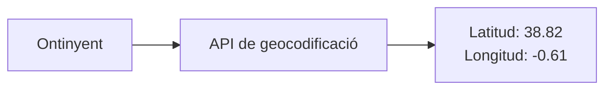

La resposta del servidor arribarà en format **JSON**.

De forma simplificada, podríem rebre informació similar a:

```json
{
  "name": "Ontinyent",
  "latitude": 38.82,
  "longitude": -0.61,
  "country": "Spain",
  "timezone": "Europe/Madrid"
}
```

A més del nom de la localitat, podem observar informació com:

```json
"latitude": 38.82,
"longitude": -0.61
```

que serà fonamental per a realitzar la següent petició.

També rebem altres dades que poden resultar útils, com:

```json
"country": "Spain",
"timezone": "Europe/Madrid"
```

Per tant, la nostra primera petició tindrà aproximadament el següent flux:

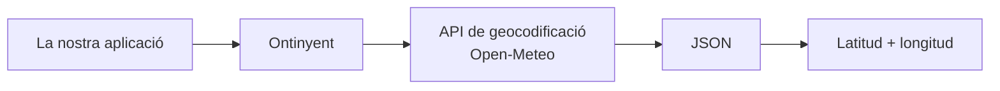

#### 2.3. Per què no consultem directament el temps de "Ontinyent"?

Podríem preguntar-nos per què necessitem realitzar este pas previ.

Per què no podem simplement demanar a l'API alguna cosa com?

```
dameElTiempo("Ontinyent")
```

El problema és que **els noms de les localitats no identifiquen necessàriament un únic lloc del planeta**.

Poden existir localitats amb noms iguals o molt similars en diferents països o regions.

Les coordenades geogràfiques, en canvi, permeten identificar d'una manera molt més precisa el punt per al qual volem obtindre la informació meteorològica.

Per això, separarem el procés en dos passos.

**Primer pas: localitzar Ontinyent.**

```
Ontinyent
      ↓
Geocodificació
      ↓
38.82, -0.61
```

**Segon pas: consultar el temps en eixes coordenades.**

```
38.82, -0.61
      ↓
API meteorològica
      ↓
Temperatura, vent, precipitació...
```

Esta separació també apareixerà reflectida en el nostre codi.

Tindrem una classe encarregada de realitzar les cerques geogràfiques:

```dart
GeocodingApi
```

i una altra classe encarregada de consultar la informació meteorològica:

```dart
WeatherApi
```

Cadascuna tindrà una responsabilitat concreta:

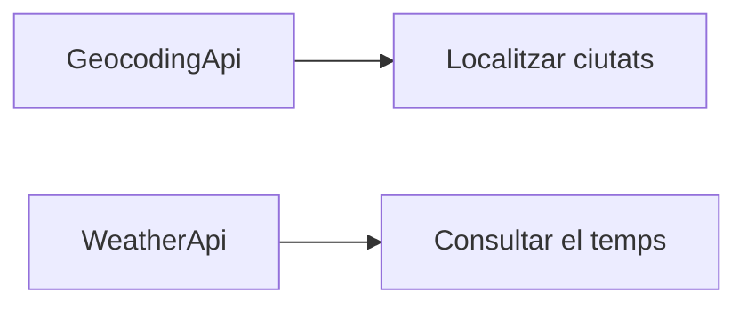

Esta separació de responsabilitats serà important quan estudiem l'organització del nostre projecte.

#### 2.4. Consultar la informació meteorològica

Després de realitzar la primera petició ja coneixem les coordenades aproximades d'Ontinyent:

```
Latitud:   38.82
Longitud:  -0.61
```

Ara sí que podem consultar l’**API meteorològica d'Open-Meteo**.

En esta segona petició ja no enviarem el nom:

```
Ontinyent
```

sinó les seues coordenades:

```
38.82, -0.61
```

Podem representar esta segona operació de la següent manera:

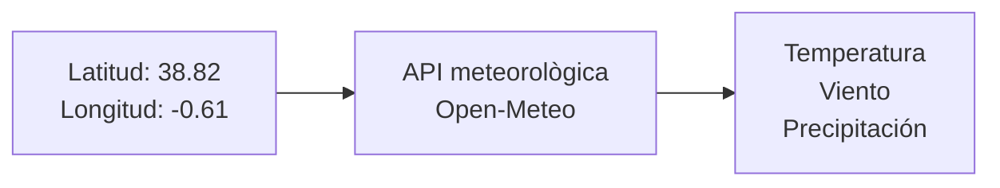

L'API meteorològica retornarà novament una resposta en format JSON.

De forma simplificada, podríem rebre dades similars a:

```json
{
  "temperature_2m": 24.3,
  "weather_code": 1,
  "wind_speed_10m": 8.7
}
```

Ací apareixen valors com:

* `temperature_2m`: temperatura;
* `weather_code`: codi que representa l'estat meteorològic;
* `wind_speed_10m`: velocitat del vent.

Més endavant sol·licitarem també informació horària i dades de precipitació.

#### 2.5. Del JSON a objectes Dart

Quan rebem la resposta d'Open-Meteo encara tenim un altre problema.

L'API ens retorna **JSON**, però nosaltres volem treballar en la nostra aplicació amb **objectes Dart**.

No volem que tota la nostra aplicació haja d'accedir constantment a estructures com:

```dart
json['temperature_2m']
```

o:

```dart
json['wind_speed_10m']
```

Preferim treballar amb objectes del nostre domini:

```dart
TiempoActual
```

o:

```dart
PrevisionHoraria
```

Per tant, haurem de realitzar una nova transformació:

```
JSON d'Open-Meteo
        ↓
Objectes Dart
```

Per exemple:

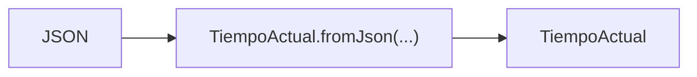

Una vegada realitzada esta transformació podrem escriure codi molt més expressiu.

En lloc de treballar contínuament amb:

```dart
json['temperature_2m']
```

podrem treballar amb:

```dart
tiempo.temperatura
```

Esta és una de les raons per les quals crearem les **entitats del nostre domini**.

#### 2.6. El procés complet

Ja podem observar el procés complet que haurà de realitzar la nostra aplicació.

Suposem que l'usuari executa:

```bash
dart run bin/meteo_cli.dart actual Ontinyent
```

Aparentment estem realitzant una única operació: consultar el temps d'Ontinyent.

No obstant això, internament succeiran diverses coses.

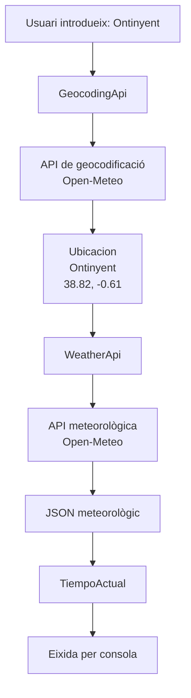

Observa a més que estem utilitzant diferents tipus d'informació durant el procés:

```
String
  ↓
JSON
  ↓
Ubicacion
  ↓
JSON
  ↓
TiempoActual
```

Entendre estes transformacions serà fonamental per a implementar correctament l'aplicació.

#### 2.7. Dues peticions que depenen entre si

Este exemple ens permet introduir a més un dels conceptes més importants de la pràctica: la **programació asíncrona**.

Les peticions HTTP no obtenen una resposta de manera immediata.

Quan la nostra aplicació pregunta a Open-Meteo:

```
On està Ontinyent?
```

ha d'esperar a rebre la resposta.

Solament llavors coneixerem:

```
38.82, -0.61
```

i podrem realitzar la següent petició:

```
Quin temps fa en 38.82, -0.61?
```

Per tant, **la segona petició depén del resultat de la primera**.

Podem representar-lo així:

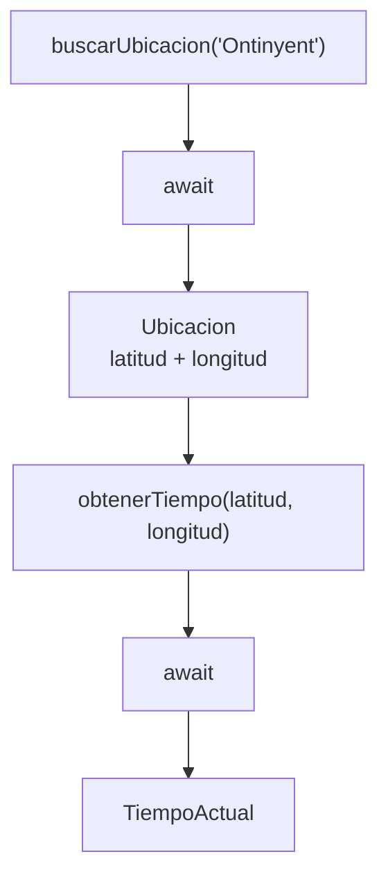

En Dart trobarem codi semblant a:

```dart
final ubicacion = await buscarUbicacion('Ontinyent');

final tiempo = await obtenerTiempo(
  ubicacion.latitud,
  ubicacion.longitud,
);
```

El primer `await` espera al fet que coneguem la ubicació.

El segon `await` espera al fet que rebem la informació meteorològica.

No podem invertir estes operacions perquè per a realitzar la segona necessitem les dades obtingudes en la primera.

Per tant, darrere d'una operació aparentment senzilla com:

```dart
obtenerTiempoActual('Ontinyent')
```

tenim realment una cadena d'operacions:

```
Ontinyent
    ↓
buscar ubicació
    ↓
esperar
    ↓
obtindre coordenades
    ↓
consultar temps
    ↓
esperar
    ↓
obtindre JSON
    ↓
crear TiempoActual
```

Este patró apareix constantment en aplicacions reals. Una operació pot requerir diverses tasques asíncrones consecutives, i el resultat d'una d'elles pot ser necessari per a poder executar la següent.

## 3. Arquitectura de l'aplicació

Encara que estem construint una xicoteta aplicació de terminal, organitzarem el projecte utilitzant una arquitectura similar a la que trobarem posteriorment en desenvolupar aplicacions Flutter.

El projecte proporcionat tindrà aproximadament esta estructura:

```
meteo_cli/
│
├── bin/
│   └── meteo_cli.dart
│
├── lib/
│   │
│   ├── domain/
│   │   ├── entities/
│   │   │   ├── ubicacion.dart
│   │   │   ├── lectura_meteorologica.dart
│   │   │   ├── temps_actual.dart
│   │   │   └── prevision_horària.dart
│   │   │
│   │   └── enums/
│   │       └── estat_cel.dart
│   │
│   ├── data/
│   │   ├── services/
│   │   │   ├── geocoding_api.dart
│   │   │   └── weather_api.dart
│   │   │
│   │   └── repositories/
│   │       └── weather_repository.dart
│   │
│   ├── exceptions/
│   │   ├── api_exception.dart
│   │   └── location_not_found_exception.dart
│   │
│   └── utils/
│       └── console_utils.dart
│
├── pubspec.yaml
└── Readme.md
```

Podem distingir tres parts principals:

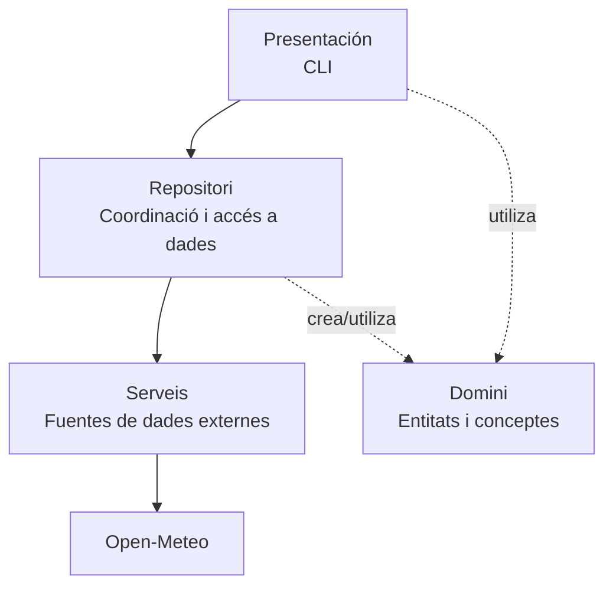

La **CLI** seria la capa de presentació: rep ordres de l'usuari i mostra resultats. Els **services** funcionen com *remote data sources*: coneixen HTTP, les URLs i el JSON d'Open-Meteo. El **repository** oculta eixos detalls a la resta de l'aplicació i ofereix operacions del domini com `obtenerTiempoActual()`. Finalment, `domain` conté les entitats amb les quals volem treballar (`Ubicacion`, `TiempoActual`, etc.).

El concepte central que estem aplicant és **separation of concerns**: cada part té una responsabilitat diferent. Esta separació pot semblar excessiva per a una aplicació xicoteta, però té un objectiu didàctic: **cada classe haurà de tindre una responsabilitat concreta**.

Això ens prepara a més per a l'arquitectura que utilitzarem posteriorment en Flutter.

## 4. Capa de domini

Fins ara hem vist que Open-Meteo ens proporciona la informació en format **JSON**. No obstant això, no volem que la resta de la nostra aplicació depenga directament de l'estructura utilitzada per una API externa.

Per exemple, podríem accedir a la temperatura directament des del JSON:

```dart
final temperatura = json['temperature_2m'];
```

però si treballàrem així en tota l'aplicació, el nostre codi acabaria ple d'accessos a claus com:

```dart
json['name']
json['latitude']
json['longitude']
json['weather_code']
json['wind_speed_10m']
```

A més de ser poc expressiu, estaríem fent que la nostra aplicació depenguera constantment del format concret utilitzat per Open-Meteo.

Per a evitar-ho utilitzarem la **capa de domini**.

La capa de domini conté les classes que representen els **conceptes amb els quals treballa la nostra aplicació**. En el nostre cas tindrem conceptes com una ubicació, el temps actual o una previsió meteorològica.

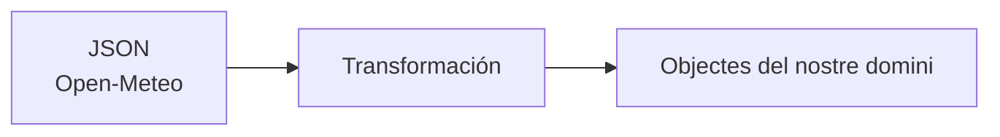

Per exemple, les dades rebudes des de l'API:

```json
{
  "name": "Ontinyent",
  "latitude": 38.82,
  "longitude": -0.61,
  "country": "Spain"
}
```

es transformaran en un objecte:

```dart
Ubicacion(...)
```

De la mateixa manera, la informació meteorològica rebuda com JSON acabarà convertint-se en objectes com:

```dart
TiempoActual
PrevisionHoraria
```

D'esta forma, una vegada realitzada la transformació, la resta de la nostra aplicació podrà treballar amb propietats d'objectes:

```dart
ubicacion.nombre
ubicacion.latitud
tiempo.temperatura
prevision.viento
```

en lloc d'haver de conéixer com estava organitzat originalment el JSON:

```dart
json['name']
json['latitude']
json['temperature_2m']
json['wind_speed_10m']
```

Podem resumir esta idea de la següent manera:

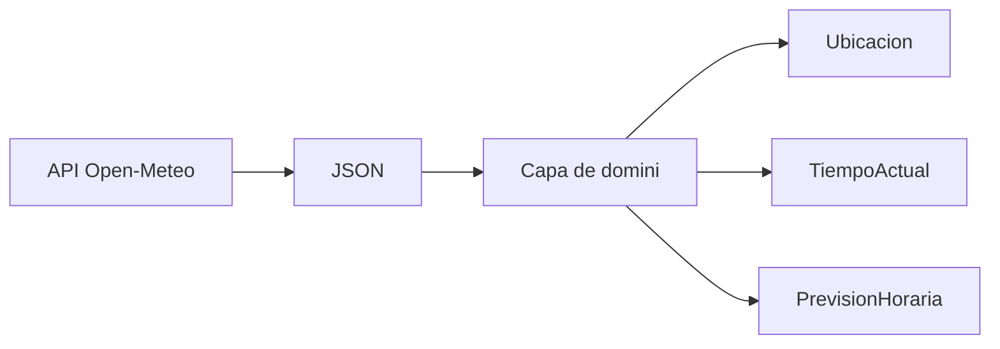

:::note

La capa de domini ens permet representar les dades externes mitjançant objectes que tenen sentit dins de la nostra aplicació.

:::

Això ens proporciona a més una separació important: **Open-Meteo parla en JSON; la nostra aplicació parla en objectes Dart**.

A continuació veurem les classes que formaran part d'esta capa i aprofitarem la seua implementació per a treballar conceptes de Programació Orientada a Objectes com a classes, propietats, constructors, herència, classes abstractes, enumeracions i sobreescriptura de mètodes.

### 4.1. La classe `Ubicacion`

Una ubicació tindrà propietats com:

```
Ubicacion
────────────────────────
String nombre
String pais
double latitud
double longitud
String timezone
```

Es proporcionarà part d'esta classe implementada.

L'alumne haurà de completar el seu constructor de factoria:

```dart
factory Ubicacion.fromJson(Map<String, dynamic> json)
```

#### Què és un constructor de factoria?

Un constructor `factory` pot utilitzar-se quan volem controlar com es crea un objecte.

En el nostre cas tindrem dades externes:

```json
{
  "name": "Valencia",
  "latitude": 39.46975,
  "longitude": -0.37739,
  "country": "Spain"
}
```

i volem obtindre:

```dart
Ubicacion(...)
```

D'esta forma, el coneixement sobre **com es transforma el JSON** queda encapsulat dins de la mateixa entitat.

#### TODO 1

Completa `Ubicacion.fromJson()`.

Hauràs de tindre en compte que alguns camps retornats per l'API podrien ser opcionals.

## 5. Herència: les lectures meteorològiques

Tant el temps actual com una previsió horària comparteixen informació.

Per exemple:

* moment del mesurament;
* temperatura;
* codi meteorològic;
* velocitat del vent.

En lloc de repetir eixes propietats crearem una abstracció comuna.

```
                 LecturaMeteorologica
                         ▲
                         │
              ┌──────────┴──────────┐
              │                     │
        TiempoActual        PrevisionHoraria
```

La classe base podria tindre la següent estructura:

```dart
abstract class LecturaMeteorologica {
  final DateTime fecha;
  final double temperatura;
  final int codigoTiempo;
  final double viento;

  ...
}
```

### Per què una classe abstracta?

Una `LecturaMeteorologica` representa una idea general.

En la nostra aplicació mai necessitarem crear:

```dart
LecturaMeteorologica(...)
```

Crearem realment objectes més concrets:

```dart
TiempoActual(...)
```

o:

```dart
PrevisionHoraria(...)
```

Per això té sentit que siga una classe `abstract`.

#### TODO 2

Implementa `PrevisionHoraria`.

Haurà de:

* estendre de `LecturaMeteorologica`;
* disposar del constructor corresponent;
* implementar un constructor `fromJson`;
* sobreescriure `toString()`.

## 6. Enumeracions

L'API meteorològica utilitza codis numèrics per a representar l'estat del cel.

El nostre codi seria poc expressiu si contínuament treballàrem amb números:

```dart
if (codigo == 0) {
  ...
}
```

Podem crear un enumerat:

```dart
enum EstadoCielo {
  despejado,
  parcialmenteNublado,
  nublado,
  niebla,
  lluvia,
  nieve,
  tormenta,
  desconocido
}
```

i una funció que transforme els codis de l'API en valors del nostre domini.

#### TODO 3

Implementa:

```dart
EstadoCielo obtenerEstadoCielo(int codigo)
```

Utilitza una estructura `switch`.

Amb això estarem transformant una dada tècnica proporcionada per una API en un concepte comprensible dins de la nostra aplicació.

## 7. Col·leccions

Les previsions meteorològiques constitueixen un bon exemple per a treballar amb col·leccions.

Una previsió de 24 hores pot representar-se com:

```dart
List<PrevisionHoraria>
```

Podrem realitzar operacions com:

```dart
previsiones.where(...)
```

```dart
previsiones.map(...)
```

```dart
previsiones.any(...)
```

```dart
previsiones.reduce(...)
```

Per exemple, per a buscar les prediccions posteriors a una determinada hora podrem filtrar la col·lecció.

#### TODO 4

Implementa una funció:

```dart
List<PrevisionHoraria> filtrarPorHoras(
  List<PrevisionHoraria> previsiones,
  int horaInicio,
  int horaFin,
)
```

Solament haurà de retornar les prediccions l'hora de les quals estiga dins de l'interval indicat.

Per exemple:

```
18 → 23
```

hauria de mostrar únicament:

```
18:00
19:00
20:00
21:00
22:00
23:00
```

## 8. La capa de serveis

Fins ara hem definit les classes del nostre **domini**, com `Ubicacion`, `TiempoActual` o `PrevisionHoraria`. Estes classes representen les dades amb les quals volem treballar dins de l'aplicació.

Però encara ens falta resoldre una qüestió fonamental: Qui s'encarrega de comunicar-se realment amb Open-Meteo?

Aqueixa serà la responsabilitat de la **capa de serveis**.

Els serveis seran les classes encarregades de comunicar-se amb sistemes externs a la nostra aplicació. En este projecte, la seua principal responsabilitat serà **realitzar peticions HTTP a Open-Meteo i processar les respostes rebudes**.

Estes classes estaran situades en:

```
lib/data/services/
```

Dins trobarem dos serveis:

```
GeocodingApi
WeatherApi
```

Cadascun es comunicarà amb una API diferent d'Open-Meteo:

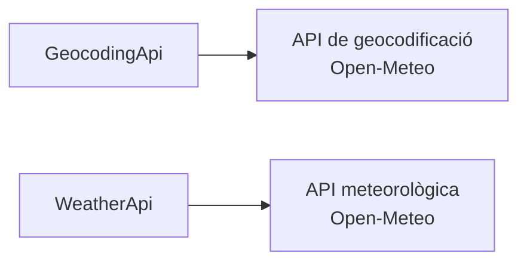

Encara que totes dues classes realitzen peticions HTTP, les seues responsabilitats són diferents.

`GeocodingApi` s'encarregarà de **buscar informació geogràfica sobre localitats**.

`WeatherApi` s'encarregarà d’**obtindre informació meteorològica utilitzant unes coordenades**.

#### 8.1. Què fa un servei?

Un servei actuarà com a intermediari entre la nostra aplicació i una API externa.

Per exemple, quan vulguem localitzar Ontinyent, `GeocodingApi` realitzarà aproximadament el següent procés:

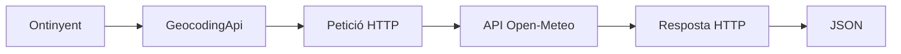

El servei haurà d'encarregar-se de tasques com:

1. construir la URL que necessita l'API;
2. realitzar la petició HTTP;
3. esperar la resposta;
4. comprovar si la petició ha acabat correctament;
5. decodificar el JSON rebut;
6. retornar les dades a la resta de l'aplicació;
7. informar mitjançant una excepció si es produeix algun problema.

Per tant, ací començarem a combinar diversos conceptes vistos durant el tema:

```
HTTP
JSON
Future
async / await
excepcions
```

#### 8.2. Què NO hauria de fer un servei?

Tan important com saber què fa una classe és saber **què no hauria de fer**.

Per exemple, `GeocodingApi` no hauria de preguntar a l'usuari quina localitat vol buscar:

```dart
stdin.readLineSync();
```

Tampoc hauria de mostrar el resultat per pantalla:

```dart
print('S\'ha trobat Ontinyent');
```

Ni hauria de decidir quin resultat de cerca ha d'utilitzar la nostra aplicació.

Estes responsabilitats pertanyen a altres parts del programa.

El servei únicament ha de saber:

```
Rebut unes dades
        ↓
Em comunique amb una API
        ↓
Retorne la resposta
```

Podem visualitzar la separació de responsabilitats d'esta forma:

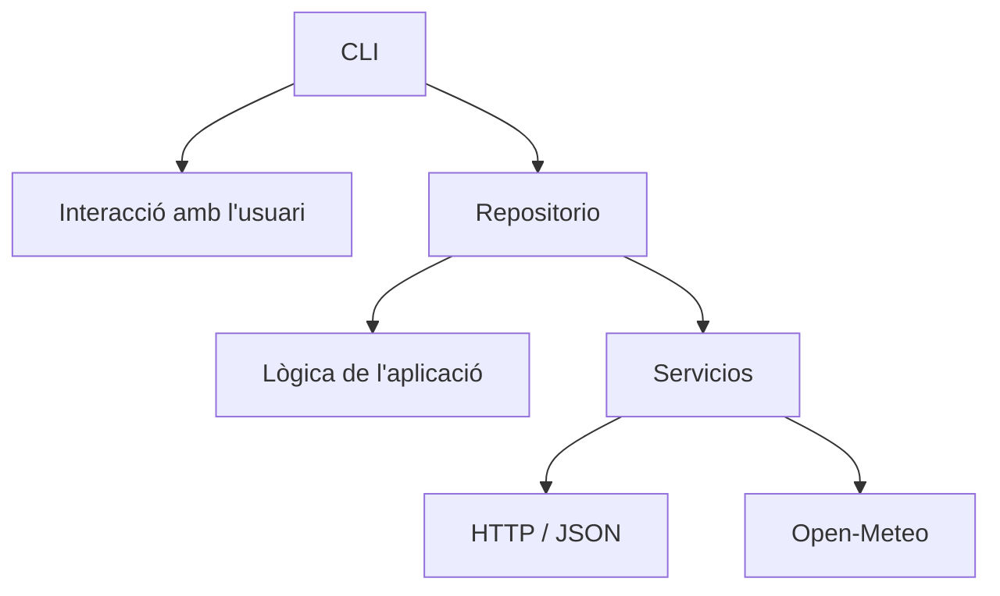

Esta separació farà que el nostre codi siga més senzill d'entendre, provar i modificar.

#### 8.3. `GeocodingApi`

Començarem amb el servei:

```dart
GeocodingApi
```

La seua responsabilitat serà comunicar-se amb l’**API de geocodificació d'Open-Meteo**.

Rebrà com a entrada el nom d'una localitat:

```
Ontinyent
```

i realitzarà una petició HTTP per a buscar localitats que coincidisquen amb eixe nom.

Conceptualment:

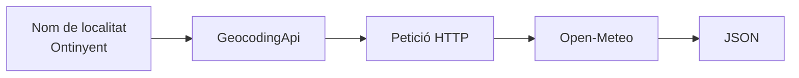

Per a això tindrem el mètode:

```dart
Future<List<dynamic>> buscar(String nombre) async {
  ...
}
```

Abans d'analitzar la seua implementació hem de fixar-nos en la seua signatura que podem dividir-la en diverses parts:

```dart
Future<List<dynamic>> buscar(String nombre) async
```

El mètode es diu:

```dart
buscar
```

i necessita rebre un:

```dart
String nombre
```

Per exemple:

```dart
buscar('Ontinyent')
```

La part més interessant és el tipus retornat:

```dart
Future<List<dynamic>>
```

Per què no retorna directament?

```dart
List<dynamic>
```

Perquè realitzar una petició a Internet requereix temps.

Quan cridem a Open-Meteo, la nostra aplicació ha d'enviar la petició i **esperar que el servidor responga**.

Per això el resultat no està disponible immediatament.

`Future` representa precisament un valor que estarà disponible **en el futur**.

En este cas:

```
Future<List<dynamic>>
```

significa: Esta operació proporcionarà una `List<dynamic>`, però el resultat no estarà disponible immediatament.

Per a esperar eixe resultat utilitzarem posteriorment:

```dart
await
```

Per exemple:

```dart
final resultados = await geocodingApi.buscar('Ontinyent');
```

#### 8.5. Del mètode a la petició HTTP

Internament, `buscar()` haurà de transformar:

```
Ontinyent
```

en una petició HTTP vàlida per a Open-Meteo.

El procés serà aproximadament:

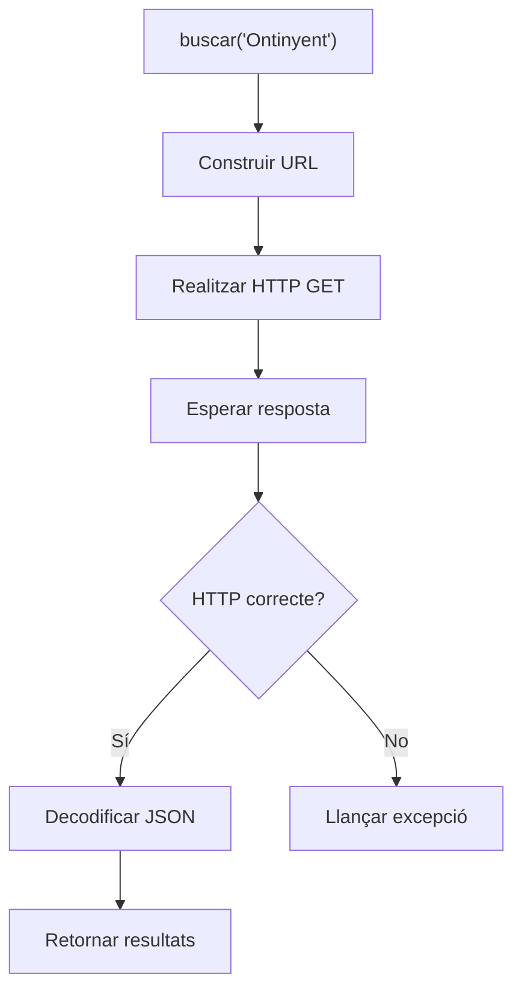

Ací podem observar una cosa important: realitzar una petició HTTP no consisteix únicament a "descarregar dades".

Hem de contemplar també la possibilitat que alguna cosa falle.

Per exemple:

* el servidor podria no estar disponible;
* podríem no tindre connexió;
* la URL podria ser incorrecta;
* Open-Meteo podria respondre amb un codi HTTP d'error;
* la resposta podria no contindre les dades esperades.

Més endavant veurem com gestionar estes situacions mitjançant **excepcions**.

#### 8.6. Una implementació com a referència

El mètode:

```dart
Future<List<dynamic>> buscar(String nombre) async
```

es proporcionarà **ja implementat** en el projecte inicial. Posteriorment hauràs d'aplicar el mateix patró per a implementar les peticions del servei:

```dart
WeatherApi
```

Per tant, abans de començar els següents `TODO`, és important que lliges i comprengues la implementació de `GeocodingApi.buscar()`.

En un projecte real és molt habitual que no hàgem de construir tot des de zero. Amb freqüència tindrem una funcionalitat ja implementada i haurem de comprendre la seua estructura per a desenvolupar una altra seguint el mateix patró.

## 9. Servei meteorològic

La classe:

```
WeatherApi
```

gestionarà les peticions contra l'API meteorològica.

Es proporcionarà implementat el mètode que obté el temps actual:

```dart
Future<Map<String, dynamic>> getCurrentWeather(
  double latitude,
  double longitude,
)
```

#### TODO 5

Implementa:

```dart
Future<Map<String, dynamic>> getForecast(
  double latitude,
  double longitude,
)
```

El mètode haurà de:

1. construir correctament la URL;
2. realitzar una petició HTTP `GET`;
3. comprovar el codi d'estat;
4. convertir el text JSON rebut;
5. retornar la informació;
6. llançar una excepció si ocorre un error.

## 10. Gestió d'errors

Fins ara els nostres programes probablement han treballat principalment sota la suposició que tot funciona correctament.

Una aplicació que utilitza Internet no pot fer-ho.

Poden ocórrer moltes situacions:

* l'usuari introdueix una localitat inexistent;
* no hi ha connexió;
* el servidor no respon;
* l'API retorna un codi d'error;
* el JSON conté un valor inesperat;
* l'usuari escriu una hora incorrecta.

Utilitzarem:

```dart
try {
  ...
} catch (e) {
  ...
}
```

Però també crearem excepcions pròpies.

Per exemple:

```dart
class LocationNotFoundException implements Exception {
  final String location;

  LocationNotFoundException(this.location);
}
```

#### TODO 6

Completa les excepcions:

```
ApiException
LocationNotFoundException
```

i modifica els serveis per a llançar-les quan corresponga.

La interfície de consola haurà de capturar-les i mostrar missatges comprensibles.

No volem mostrar a l'usuari:

```
Unhandled exception: ...
```

Volem mostrar alguna cosa com:

```
No s'ha trobat cap localitat anomenada "Valencai".
```

## 11. El repositori

Ja tenim uns **serveis** capaços de comunicar-se amb Open-Meteo. No obstant això, no volem que la nostra interfície de consola haja de conéixer com es realitzen les peticions HTTP ni com està organitzat el JSON rebut.

Per a separar estes responsabilitats utilitzarem:

```dart
WeatherRepository
```

El repositori actuarà com a **intermediari entre la nostra aplicació i la capa de serveis**.

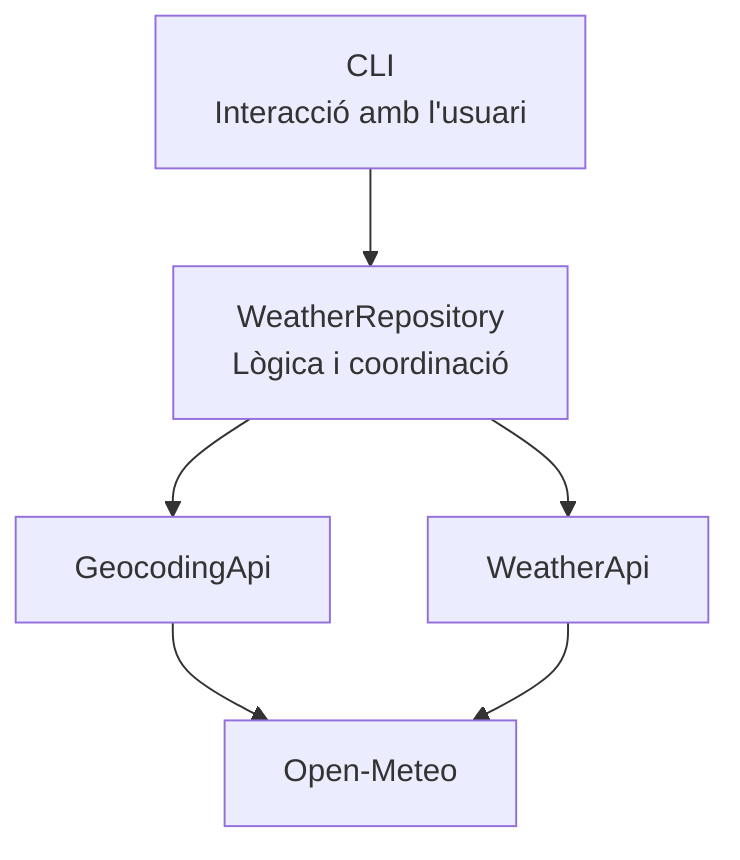

La seua funció principal serà **coordinar els serveis i transformar les dades externes en objectes del nostre domini**.

Per exemple, per a obtindre el temps actual d'Ontinyent, el repositori haurà de:

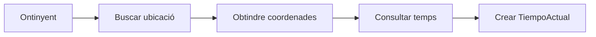

D'esta forma podrà oferir a la resta de l'aplicació mètodes senzills i expressius:

```dart
Future<Ubicacion> buscarUbicacion(String nombre)
Future<TiempoActual> obtenerTiempoActual(String ciudad)
Future<List<PrevisionHoraria>> obtenerPrevision(String ciudad)
```

#### Servei enfront de repositori

La diferència entre tots dos és important.

Un **servei** està prop de l'API i pot treballar directament amb el JSON rebut:

```dart
Map<String, dynamic>
```

El **repositori**, en canvi, transforma eixes dades i retorna objectes que tenen sentit per a la nostra aplicació:

```dart
TiempoActual
```

Podem resumir-ho així:

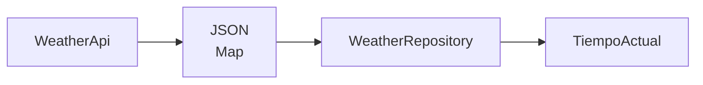

Gràcies a esta separació, la CLI pot treballar simplement amb:

```dart
final tiempo = await repository.obtenerTiempoActual('Ontinyent');
print(tiempo.temperatura);
```

sense necessitar saber **quina URL s'ha utilitzat, com s'ha realitzat la petició HTTP ni com estava estructurat el JSON d'Open-Meteo**.

:::note

Els serveis s'encarreguen de comunicar-se amb l'exterior; el repositori coordina eixes operacions i proporciona a la resta de l'aplicació objectes del nostre domini.

:::

#### TODO 7

Implementa:

```dart
Future<List<PrevisionHoraria>> obtenerPrevision(
  String ciudad,
)
```

Per a això hauràs de:

1. buscar la localitat;
2. obtindre les seues coordenades;
3. sol·licitar la previsió;
4. recórrer les col·leccions rebudes en el JSON;
5. crear els corresponents objectes `PrevisionHoraria`;
6. retornar un `List<PrevisionHoraria>`.

## 12. `DateTime`

Les dates proporcionades per una API solen rebre's com a cadenes de text.

Per exemple:

```
2026-03-12T18:00
```

Per a treballar correctament amb elles haurem de transformar-les:

```dart
final fecha = DateTime.parse(texto);
```

Una vegada tenim un `DateTime` podem consultar:

```dart
fecha.year
fecha.month
fecha.day
fecha.hour
fecha.minute
```

i també comparar dates.

Per exemple:

```dart
fecha.isAfter(otraFecha)
```

o calcular diferències:

```dart
fecha.difference(otraFecha)
```

#### TODO 8

Quan construïsques objectes `PrevisionHoraria`, converteix les dates rebudes per l'API en objectes `DateTime`.

Després utilitza estes dates per a implementar el filtrat horari.

## 13. I `TimeOfDay`?

Ací hem de realitzar una distinció important.

`DateTime` forma part de Dart.

`TimeOfDay`, en canvi, és una classe proporcionada per Flutter i està pensada per a representar exclusivament una hora i uns minuts:

```
18:30
```

sense associar-los necessàriament a una data.

Conceptualment:

```
DateTime
12/03/2026 18:30
```

enfront de:

```
TimeOfDay
18:30
```

Com esta aplicació és un projecte **Dart de consola**, no utilitzarem directament `TimeOfDay`.

En Flutter recuperarem este concepte quan treballem amb selectors d'hora i components d'interfície.

En esta pràctica utilitzarem:

```dart
fecha.hour
```

i:

```dart
fecha.minute
```

per a realitzar les operacions equivalents que necessitem.

***

## 14. Interfície de línia de ordes

El nostre punt d'entrada estarà en:

```
bin/meteo_cli.dart
```

La funció principal podrà rebre arguments:

```dart
void main(List<String> arguments) async {
  ...
}
```

Això ens permetrà executar:

```bash
dart run meteo_cli actual Valencia
```

Els arguments serien:

```dart
arguments[0] // actual
arguments[1] // València
```

Haurem de comprovar sempre que l'usuari haja introduït suficients arguments abans d'accedir a ells.

## 15. Estructures de control

Per a triar l'operació utilitzarem un `switch`.

Per exemple:

```dart
switch (comando) {
  case 'buscar':
    ...
  case 'actual':
    ...
  case 'hoy':
    ...
  default:
    ...
}
```

#### TODO 9

Completa el processament de ordes per a admetre:

```
buscar
actual
hoy
horas
comparar
ayuda
```

Els ordes `buscar` i `actual` es proporcionaran ja implementats com a referència.

## 16. Entrada interactiva

També volem practicar `stdin` i `stdout`.

Per això, si el programa s'executa sense arguments:

```bash
dart run meteo_cli
```

es mostrarà un xicotet menú:

```
══════════════════════════════════
          METEO CLI
══════════════════════════════════

1. Buscar localitat
2. Temps actual
3. Previsió de hui
4. Previsió per hores
5. Comparar dues ciutats
0. Eixir

Selecciona una opció:
>
```

Podrem obtindre l'entrada mitjançant:

```dart
stdin.readLineSync()
```

Recorda que este mètode pot retornar:

```dart
String?
```

i no simplement:

```dart
String
```

Per tant, apareixerà de nou un dels conceptes fonamentals de Dart:

**null safety**.

#### TODO 10

Completa el menú interactiu i valida les entrades de l'usuari.

El programa no haurà de tancar-se bruscament si s'introdueix:

```
hola
```

quan s'esperava un número.

## 17. Resum meteorològic

Afegirem ara una funcionalitat que requerix manipular una col·lecció.

Donada:

```dart
List<PrevisionHoraria>
```

volem obtindre:

```
Resum de València
─────────────────────────────
Temperatura mínima: 14.2 °C
Temperatura màxima: 22.7 °C
Temperatura mitjana: 18.4 °C
Hores analitzades: 24
Pluja prevista: Sí
```

#### TODO 11

Implementa una funció que calcule:

* temperatura mínima;
* temperatura màxima;
* temperatura mitjana;
* nombre de prediccions;
* si existeix alguna hora amb pluja.

Hauràs de resoldre-ho utilitzant les operacions disponibles sobre col·leccions.

## 18. Comparació de ciutats

El orde:

```bash
dart run meteo_cli comparar Valencia Madrid
```

haurà d'obtindre el temps actual de totes dues localitats.

Per exemple:

```
COMPARACIÓ

València
21.4 ºC

Madrid
17.8 ºC

València té actualment 3.6 °C més que Madrid.
```

Ací tenim dues operacions independents:

```dart
obtenerTiempoActual('Valencia')
obtenerTiempoActual('Madrid')
```

No necessitem necessàriament esperar que acabe una abans d'iniciar l'altra.

Podem utilitzar:

```dart
Future.wait(...)
```

per a executar totes dues operacions asíncrones.

#### TODO 12

Implementa la comparació de dues localitats utilitzant `Future.wait`.

Després determina mitjançant condicionals:

* quin té una temperatura major;
* quin té una temperatura menor;
* o si ambdues tenen la mateixa temperatura.

## 19. `Map` i `Set`

Ja hem utilitzat `List`, però volem practicar també altres col·leccions.

### Map

Utilitzarem un `Map` per a relacionar codis meteorològics amb missatges o símbols.

Conceptualment:

```dart
final Map<EstadoCielo, String> iconos = {
  EstadoCielo.despejado: '☀',
  EstadoCielo.nublado: '☁',
  EstadoCielo.lluvia: '🌧',
};
```

### Set

Durant l'execució mantindrem un conjunt amb les ciutats consultades:

```dart
final Set<String> historial = {};
```

Un `Set` no admet elements duplicats.

Per això, encara que consultem València cinc vegades:

```
València
València
Madrid
València
```

l'historial contindrà únicament:

```
València
Madrid
```

#### TODO 13

Implementa l'opció:

```
historial
```

per a mostrar les localitats consultades durant l'execució actual del programa.

## 20. Eixida dels objectes

Sobreescriurem:

```dart
toString()
```

per a obtindre representacions útils dels nostres objectes.

Per exemple:

```
18.00 | 19.3 °C | Parcialment ennuvolat | 10 km/h
```

Això ens permet fer:

```dart
print(prevision);
```

en lloc de construir contínuament cadenes des de la interfície.

#### TODO 14

Sobreescriu `toString()` en:

```
Ubicacion
TiempoActual
PrevisionHoraria
```

Utilitza interpolació de cadenes.

## 21. Flux complet d'una consulta

Vegem què succeeix quan executem:

```bash
dart run meteo_cli hoy Valencia
```

El flux serà:

```
Usuari
  │
  │ "hui València"
  ▼
meteo_cli.dart
  │
  │ obtenerPrevision("València")
  ▼
WeatherRepository
  │
  ├── buscarUbicacion("València")
  │          │
  │          ▼
  │     GeocodingApi
  │          │
  │          ▼
  │      Open-Meteo
  │
  │  rep latitud/longitud
  │
  ├── WeatherApi.getForecast(...)
  │          │
  │          ▼
  │      Open-Meteo
  │
  │  rep JSON
  │
  ▼
List<PrevisionHoraria>
  │
  ▼
meteo_cli.dart
  │
  ▼
Terminal
```

Observa que la interfície d'usuari **no realitza directament peticions HTTP**.

I el servei HTTP **no imprimeix res per pantalla**.

Cada capa té una responsabilitat determinada.

## 22. Gestió de valors nuls

Les dades externes no sempre són perfectes.

Un atribut podria no aparéixer:

```dart
json['country']
```

i retornar:

```dart
null
```

Haurem de decidir en cada cas quina estratègia utilitzar:

```dart
String?
```

l'operador:

```dart
??
```

comprovacions:

```dart
if (valor != null)
```

o altres eines proporcionades per null safety.

#### TODO 15

Revisa els constructors `fromJson()` i assegura't que una dada opcional no provoque innecessàriament la finalització del programa.

## 23. Resum de tasques

Per a completar l'aplicació hauràs de:

1. Completar el constructor `Ubicacion.fromJson`.
2. Implementar `PrevisionHoraria`.
3. Treballar amb herència des de `LecturaMeteorologica`.
4. Implementar l'enumerat `EstadoCielo`.
5. Transformar els codis meteorològics mitjançant `switch`.
6. Implementar la petició HTTP de previsió.
7. Gestionar respostes HTTP incorrectes.
8. Crear i utilitzar excepcions pròpies.
9. Implementar la transformació JSON → objectes.
10. Treballar amb `DateTime`.
11. Filtrar previsions mitjançant col·leccions.
12. Calcular estadístiques meteorològiques.
13. Implementar els ordes de la CLI.
14. Implementar l'entrada interactiva mitjançant `stdin`.
15. Utilitzar `List`, `Map` i `Set`.
16. Implementar la comparació asíncrona mitjançant `Future.wait`.
17. Aplicar null safety.
18. Sobreescriure `toString()`.
19. Mostrar missatges d'error comprensibles.
20. Mantindre correctament la separació entre les capes del projecte.

## 26. Exemple de funcionament

```
$ dart run meteo_cli hoy Valencia

Buscant València...

València, Spain
divendres 28/08/2026

────────────────────────────────────────
 HORA     TEMP.      ESTAT       VENT
────────────────────────────────────────
 09.00    24.1 °C    ☀ Buidat   7 km/h
 10.00    25.3 °C    ☀ Buidat   8 km/h
 11.00    26.7 °C    ☀ Buidat   9 km/h
 12.00    27.6 °C    ☀ Buidat  10 km/h
 ...
────────────────────────────────────────

Màxima: 30.2 °C
Mínima: 21.7 °C
Mitjana:  26.4 °C
```

Un altre exemple:

```
$ dart run meteo_cli horas Valencia 18 22

Previsió per a València

18.00 | 27.4 °C | ☀ Buidat
19.00 | 26.1 °C | ☀ Buidat
20.00 | 24.8 °C | ⛅ Parcialment ennuvolat
21.00 | 23.2 °C | ⛅ Parcialment ennuvolat
22.00 | 22.1 °C | ☁ Ennuvolat
```

I davant una entrada incorrecta:

```
$ dart run meteo_cli horas Valencia veinte treinta

Error: les hores han de ser valors enters entre 0 i 23.
```

Mai hauríem d'obtindre un error no controlat degut simplement a una entrada incorrecta de l'usuari.
