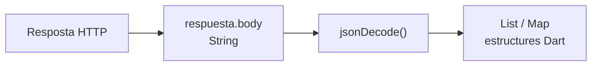
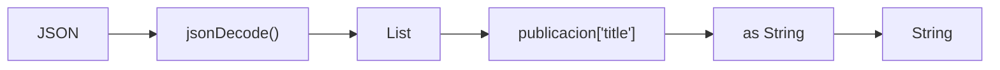

Una de les tasques més habituals en una aplicació moderna consisteix a **comunicar-se amb serveis externs a través d'Internet**. Per exemple, podem necessitar consultar una llista de productes, autenticar a un usuari, enviar un formulari o actualitzar informació emmagatzemada en un servidor.

Esta comunicació es realitza habitualment mitjançant el protocol **HTTP**, utilitzant diferents mètodes segons l'operació que vulguem realitzar, com `GET`, `POST`, `PUT` o `DELETE`.

En Dart podem realitzar este tipus de peticions mitjançant el paquet **`http`**, que ens proporciona les eines necessàries per a connectar-nos a una API, enviar dades i processar les respostes rebudes.

Com estes operacions depenen d'una comunicació externa i poden tardar un temps a completar-se, treballarem amb elles de manera **asíncrona**, utilitzant `Future`, `async` i `await`, conceptes que acabem d'estudiar.

Entre els mètodes HTTP més habituals trobem:

| Mètode   | Ús habitual               |
| -------- | -------------------------- |
| `GET`    | Obtindre informació        |
| `POST`   | Crear o enviar informació |
| `PUT`    | Actualitzar un recurs      |
| `DELETE` | Eliminar un recurs        |

Per a realitzar estes operacions utilitzarem el paquet `http`.

### Instal·lar el paquet `http`

En un projecte Dart podem afegir-lo mitjançant:

```bash
dart pub add http
```

Si estem treballant en un projecte Flutter:

```bash
flutter pub add http
```

Això afegirà automàticament la dependència corresponent a l'arxiu `pubspec.yaml`.

Després podrem importar-la:

```dart
import 'package:http/http.dart' as http;
```

També necessitarem habitualment:

```dart
import 'dart:convert';
```

per a treballar amb JSON.

## Sol·licitud GET

El mètode HTTP `GET` s'utilitza per a **obtindre informació d'un servidor**.

Utilitzarem com a exemple JSONPlaceholder, un servei que proporciona una API REST amb dades simulades per a realitzar proves.

Podem obtindre una publicació mitjançant:

```dart
import 'dart:convert';
import 'package:http/http.dart' as http;

Future<void> obtenerDatos() async {
  final url = Uri.parse(
    'https://jsonplaceholder.typicode.com/posts/1',
  );

  try {
    final respuesta = await http.get(url);

    if (respuesta.statusCode == 200) {
      final datos = jsonDecode(respuesta.body);

      print('Títol: ${datos['title']}');
      print('Contingut: ${datos['body']}');
    } else {
      print('Error HTTP: ${respuesta.statusCode}');
    }
  } catch (e) {
    print('Error en realitzar la petició: $e');
  }
}

Future<void> main() async {
  await obtenerDatos();
}
```

Observa especialment esta instrucció:

```dart
final respuesta = await http.get(url);
```

`http.get()` retorna:

```dart
Future<http.Response>
```

Com necessitem esperar que el servidor responga, utilitzem `await`.

Una vegada rebuda la resposta podem accedir a propietats com:

```dart
respuesta.statusCode
respuesta.body
```

`statusCode` conté el **codi d'estat HTTP**, mentre que `body` conté el cos de la resposta.

### Mini Task Manager: substituir la simulació per HTTP

Podem obtindre tasques del recurs `/todos` de [JSONPlaceholder](https://jsonplaceholder.typicode.com/), una API de proves amb dades simulades. Després d'instal·lar el paquet `http`, afig al principi de l'arxiu:

```dart
import 'dart:convert';
import 'package:http/http.dart' as http;
```

Conserva la classe `Tarea` amb el seu constructor amb paràmetres amb nom i substitueix la funció simulada `descargarTareas()` per esta versió:

```dart
Future<List<Tarea>> descargarTareas() async {
  final url = Uri.parse(
    'https://jsonplaceholder.typicode.com/todos?_limit=5',
  );
  final response = await http.get(url);

  if (response.statusCode != 200) {
    throw Exception('Error HTTP: ${response.statusCode}');
  }

  final datos = jsonDecode(response.body) as List<dynamic>;
  return datos.map((elemento) {
    final json = elemento as Map<String, dynamic>;
    return Tarea(
      titulo: json['title'] as String,
      completada: json['completed'] as bool,
      fechaLimite: DateTime.now(),
    );
  }).toList();
}
```

La petició retorna un `Future<Response>`. Amb `await` obtenim la resposta; `jsonDecode()` transforma el JSON en una llista de mapes i després construïm objectes `Tarea`. El `main()` amb `try`, `catch` i `finally` del capítol anterior pot mantindre's.

L'API proporciona `id`, `title` i `completed`, però **no proporciona dates límit**. Ara com ara assignem la data actual de manera local; en el capítol de dates establirem una data de lliurament d'exemple.

:::tip[Diagnostica una fallada]
Canvia temporalment la ruta `/todos` per `/ruta-inexistente`. Observa com una resposta HTTP d'error acaba en el `catch` del `main()`. Una fallada de connexió també pot llançar una excepció abans d'obtindre una resposta.
:::

## Codis d'estat HTTP

Els servidors utilitzen codis numèrics per a indicar el resultat d'una petició.

Estos codis s'agrupen en diferents famílies:

| Codi | Significat                                   |
| ------ | --------------------------------------------- |
| `1xx`  | Informació                                   |
| `2xx`  | Operació correcta                            |
| `3xx`  | Redirecció                                   |
| `4xx`  | Error relacionat amb la petició del client |
| `5xx`  | Error del servidor                            |

Alguns codis habituals són:

```
200 OK
201 Created
400 Bad Request
404 Not Found
500 Internal Server Error
```

Per exemple:

```dart
if (respuesta.statusCode == 200) {
  print('Petició realitzada correctament');
} else {
  print('Error: ${respuesta.statusCode}');
}Solicitud POST
```

El mètode `POST` s'utilitza habitualment per a **enviar informació al servidor i crear un nou recurs**.

Per exemple:

```dart
import 'dart:convert';
import 'package:http/http.dart' as http;

Future<void> crearPublicacion() async {
  final url = Uri.parse(
    'https://jsonplaceholder.typicode.com/posts',
  );

  final datos = {
    'title': 'La meua primera publicació',
    'body': 'Contingut de la publicació',
    'userId': 1,
  };

  try {
    final respuesta = await http.post(
      url,
      headers: {
        'Content-Type': 'application/json',
      },
      body: jsonEncode(datos),
    );

    if (respuesta.statusCode == 201) {
      final resultado = jsonDecode(respuesta.body);

      print('Publicació creada: $resultado');
    } else {
      print('Error HTTP: ${respuesta.statusCode}');
    }
  } catch (e) {
    print('Error en realitzar la petició: $e');
  }
}

Future<void> main() async {
  await crearPublicacion();
}
```

En este cas apareixen dos elements importants.

Les **capçaleres (`headers`)** proporcionen informació addicional sobre la petició. Mitjançant:

```dart
'Content-Type': 'application/json'
```

indiquem que estem enviant dades en format JSON.

D'altra banda, el **cos (`body`)** conté les dades que volem enviar:

```dart
body: jsonEncode(datos)
```

Utilitzem `jsonEncode()` per a convertir el nostre `Map` de Dart a JSON.

## Sol·licitud PUT

El mètode `PUT` s'utilitza habitualment per a **actualitzar un recurs existent**.

Per exemple:

```dart
import 'dart:convert';
import 'package:http/http.dart' as http;

Future<void> actualizarPublicacion() async {
  final url = Uri.parse(
    'https://jsonplaceholder.typicode.com/posts/1',
  );

  final datos = {
    'id': 1,
    'title': 'Títol actualitzat',
    'body': 'Contingut actualitzat',
    'userId': 1,
  };

  try {
    final respuesta = await http.put(
      url,
      headers: {
        'Content-Type': 'application/json',
      },
      body: jsonEncode(datos),
    );

    if (respuesta.statusCode == 200) {
      final resultado = jsonDecode(respuesta.body);

      print('Publicació actualitzada: $resultado');
    } else {
      print('Error HTTP: ${respuesta.statusCode}');
    }
  } catch (e) {
    print('Error en realitzar la petició: $e');
  }
}

Future<void> main() async {
  await actualizarPublicacion();
}
```

En este cas incloem l'identificador del recurs que volem modificar en la URL:

```
/posts/1
```

## Sol·licitud DELETE

Finalment, el mètode `DELETE` permet sol·licitar l’**eliminació d'un recurs**.

```dart
import 'package:http/http.dart' as http;

Future<void> eliminarPublicacion() async {
  final url = Uri.parse(
    'https://jsonplaceholder.typicode.com/posts/1',
  );

  try {
    final respuesta = await http.delete(url);

    if (respuesta.statusCode == 200) {
      print('Publicació eliminada correctament');
    } else {
      print('Error HTTP: ${respuesta.statusCode}');
    }
  } catch (e) {
    print('Error en realitzar la petició: $e');
  }
}

Future<void> main() async {
  await eliminarPublicacion();
}
```

En este cas únicament necessitem indicar mitjançant la URL quin recurs volem eliminar.

### Recórrer la resposta d'una API

Fins ara hem treballat amb respostes que contenen un únic objecte. No obstant això, és molt habitual que una API retorne **una col·lecció d'elements**.

Per exemple, una petició a:

`https://jsonplaceholder.typicode.com/posts`

retorna un array JSON similar a:

```json
[
  {
    "userId": 1,
    "id": 1,
    "title": "Primer título",
    "body": "Contenido..."
  },
  {
    "userId": 1,
    "id": 2,
    "title": "Segundo título",
    "body": "Contenido..."
  }
]
```

#### Convertir JSON a estructures de Dart

Quan realitzem una petició HTTP, el contingut de la resposta es troba en:

```dart
respuesta.body
```

Encara que visualment continga JSON, `body` és realment un **`String`**. Per tant, encara no podem recórrer-ho com una llista ni accedir als seus elements.

Per a convertir eixe text JSON en estructures que Dart puga manipular utilitzem la funció:

```dart
jsonDecode()
```

Esta funció es troba en la llibreria:

```dart
import 'dart:convert';
```

El procés que realitzem és el següent:



`jsonDecode()` analitza el contingut del `String` i crea les estructures de Dart equivalents.

Per exemple, un **array JSON**:

```json
[
  {"id": 1, "title": "Primero"},
  {"id": 2, "title": "Segundo"}
]
```

es converteix en una llista de Dart:

```dart
List<dynamic>
```

Mentre que un **objecte JSON**:

```json
{
  "id": 1,
  "title": "Primero"
}
```

es representa normalment mitjançant:

```dart
Map<String, dynamic>
```

Podem resumir les equivalències principals:

| JSON             | Dart                   |
| ---------------- | ---------------------- |
| `{ ... }`        | `Map<String, dynamic>` |
| `[ ... ]`        | `List<dynamic>`        |
| `"texto"`        | `String`               |
| `10`             | `int`                  |
| `10.5`           | `double`               |
| `true` / `false` | `bool`                 |
| `null`           | `null`                 |

#### Recórrer un array JSON

Després de realitzar la petició podem convertir el JSON rebut en una llista mitjançant `jsonDecode()`:

```dart
import 'dart:convert';
import 'package:http/http.dart' as http;

Future<void> obtenerPublicaciones() async {
  final url = Uri.parse(
    'https://jsonplaceholder.typicode.com/posts',
  );

  try {
    final respuesta = await http.get(url);

    if (respuesta.statusCode == 200) {
      final List<dynamic> publicaciones =
          jsonDecode(respuesta.body);

      for (var publicacion in publicaciones) {
        print('Títol: ${publicacion['title']}');
        print('Contingut: ${publicacion['body']}');
        print('---');
      }
    } else {
      print('Error HTTP: ${respuesta.statusCode}');
    }
  } catch (e) {
    print('Error en realitzar la petició: $e');
  }
}

Future<void> main() async {
  await obtenerPublicaciones();
}
```

La instrucció:

```dart
jsonDecode(respuesta.body)
```

realitza, per tant, esta transformació:

```
String amb JSON
       ↓
  jsonDecode()
       ↓
 List<dynamic>
```

Cada element de la llista representa una publicació. Com estos elements procedeixen de dades dinàmiques, podem accedir inicialment als seus valors mitjançant les claus del JSON:

```dart
publicacion['title']
publicacion['body']
```

Si volem indicar explícitament el tipus que esperem trobar, podem utilitzar l'operador `as` vist anteriorment:

```dart
final titulo = publicacion['title'] as String;
final contenido = publicacion['body'] as String;
```

D'esta forma connectem els conceptes que hem vist:



Esta aproximació resulta adequada per a comprendre com es reben i processen les dades d'una API.

> **Més endavant**, quan construïm aplicacions més completes, l'habitual serà transformar estos `Map<String, dynamic>` en **objectes de les nostres pròpies classes**, com `Usuario`, `Producto` o `Publicacion`. Això ens permetrà treballar amb dades tipades i estructurar millor les nostres aplicacions.

### Mini Task Manager: construir tasques amb `fromJson`

La transformació de JSON pertany al model. Per a centralitzar-la, substitueix la classe `Tarea` per esta versió; incorpora l'identificador de l'API i conserva la validació, l'encapsulació i els mètodes anteriors:

```dart
class Tarea {
  final int? id;
  final String titulo;
  final DateTime fechaLimite;
  bool _completada;

  Tarea({
    this.id,
    required this.titulo,
    required this.fechaLimite,
    bool completada = false,
  }) : _completada = completada {
    if (titulo.trim().isEmpty) {
      throw ArgumentError('El títol no pot estar buit');
    }
  }

  bool get completada => _completada;
  void completar() => _completada = true;

  String get descripcion =>
      '$titulo - ${completada ? "Completada" : "Pendent"}';

  void mostrar() => print(descripcion);

  factory Tarea.fromJson(Map<String, dynamic> json) {
    return Tarea(
      id: json['id'] as int,
      titulo: json['title'] as String,
      completada: json['completed'] as bool,
      fechaLimite: DateTime.now(),
    );
  }
}
```

El `id` és opcional per a poder continuar creant tasques locals amb les crides dels capítols anteriors. El constructor `factory` converteix els noms de l'API en els del nostre model i reutilitza el constructor que valida el títol.

En `descargarTareas()`, substitueix la conversió que ve després de comprovar el codi d'estat per:

```dart
final datos = jsonDecode(response.body) as List<dynamic>;
return datos
    .map((elemento) => Tarea.fromJson(elemento as Map<String, dynamic>))
    .toList();
```

Per a executar l'exemple necessites els dos imports, esta classe, la funció HTTP i el `main()` amb gestió d'errors del capítol anterior. Si conserves `TareaUrgente`, continuarà funcionant amb este constructor.

**Què ocorreria si `completed` fora una cadena en lloc d'un booleà?** Els `as` comproven els tipus en execució: un format inesperat provoca un error que arriba al `catch`. Esta API té una estructura coneguda; una aplicació que accepte altres formats necessitaria validar les dades abans de construir l'objecte.
