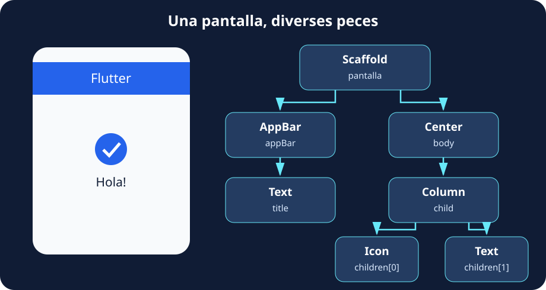
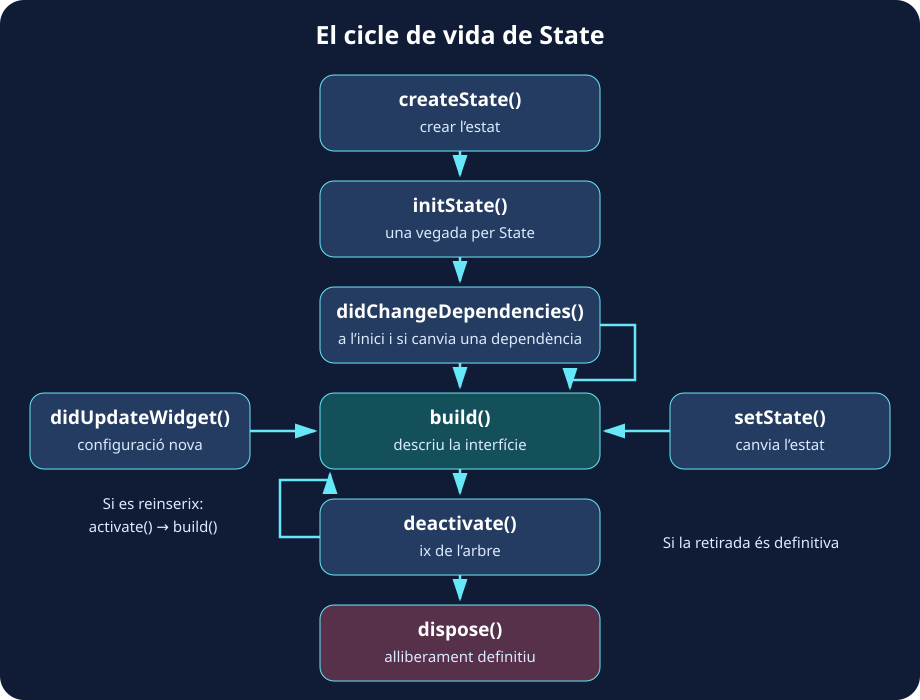
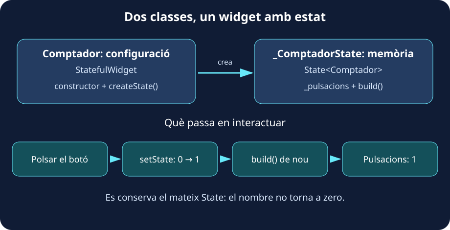

Obri qualsevol app que utilitzes cada dia i observa una de les seues pantalles. Potser té una imatge, diversos textos, un botó i una llista que pots desplaçar. Encara que ho percebem com un conjunt, podem separar eixa interfície en peces més menudes. **En Flutter, construïm i combinem eixes peces mitjançant widgets**.

Un widget és un objecte de Dart que **descriu una part de la interfície**: el contingut, l’aspecte, la disposició o el comportament. `Text` mostra text; `Icon`, una icona; `Center` centra un altre widget; i `Column` n’organitza diversos en vertical. Alguns es veuen directament i altres ajuden a col·locar o configurar els altres.

Pensa en els widgets com peces de construcció: una peça senzilla pot formar part d’una altra més gran, i eixa composició acaba donant forma a tota la pantalla.



La imatge mostra l’**arbre de widgets**. La seua arrel és el widget situat més amunt; d’ell ixen les branques que contenen altres widgets. Parlem de _pares_, _fills_ i _germans_ per a descriure estes relacions. En este exemple, `Column` és el pare d’`Icon` i `Text`, que són germans. El dibuix representa la pantalla; una aplicació completa inclouria altres widgets per damunt, com `MaterialApp`.

Esta pantalla es pot expressar amb el següent programa complet. Apega’l en `lib/main.dart` d’un projecte Flutter o en un exemple Flutter de [DartPad](https://dartpad.dev/):

```dart
import 'package:flutter/material.dart';

void main() {
  runApp(MaterialApp(
    home: Scaffold(
      appBar: AppBar(title: const Text('Flutter')),
      body: const Center(
        child: Column(
          mainAxisSize: MainAxisSize.min,
          children: [
            Icon(Icons.check_circle, size: 56),
            Text('Hola!'),
          ],
        ),
      ),
    ),
  ));
}
```

Llig el codi de fora cap a dins: una aplicació conté una pantalla; la pantalla té una barra i un cos; el cos centra una columna amb dos elements. `child` rep un widget i `children` una llista. Altres arguments, com `body` o `title`, donen nom a zones concretes. `mainAxisSize: MainAxisSize.min` fa que la columna ocupe l’altura del seu contingut i permet centrar el grup.

Ací apareix una altra idea fonamental: **Flutter utilitza programació declarativa**. Descrivim com ha de ser la interfície amb les dades actuals i deixem que Flutter gestione la seua representació. En un plantejament imperatiu donaríem ordres per a modificar elements existents: «busca eixe text i canvia’n el contingut». En un de declaratiu expressem el resultat: «amb este valor, el text ha de mostrar açò».

:::tip[La interfície depén de les dades]
Si una variable `punts` val `5`, `Text('Punts: $punts')` descriu un text que mostra «Punts: 5». En canviar les dades i sol·licitar una reconstrucció, s’obté una descripció nova. **No modifiquem l’objecte `Text`: construïm la configuració que correspon al valor nou.**
:::

Canviar una variable per si mateix no avisa Flutter. En els exemples amb estat veurem com fer-ho mitjançant `setState`.

## 🌱 El cicle de vida d’un widget

Una interfície no apareix una vegada i roman intacta per sempre. Entrem en una pantalla, canviem dades i n’eixim. Durant eixe recorregut es creen widgets, s’incorporen a l’arbre, es reconstrueix la interfície i es retiren els elements que deixen de ser necessaris.

Podem reconéixer tres moments: **creació, actualització i retirada**. És útil distingir la configuració del widget d’allò que Flutter manté en l’arbre: els widgets són immutables i poden substituir-se per instàncies noves. Quan hi ha estat propi, Flutter pot conservar l’objecte `State` durant eixes actualitzacions.

El següent esquema mostra el cicle del **`State` associat a un `StatefulWidget`**. Els widgets sense estat propi no tenen estos mètodes d’inicialització i neteja.



**En aparéixer**, `createState` crea l’estat i `initState` l’inicialitza una vegada. Després, `didChangeDependencies` permet atendre les dependències del context i `build` descriu la interfície.

**Mentre està present**, `build` pot repetir-se. `setState` sol·licita una reconstrucció; una configuració nova compatible del pare provoca `didUpdateWidget`; i els canvis en dependències heretades poden tornar a executar `didChangeDependencies`.

**En retirar-se**, es crida `deactivate`. Si l’element es reinserix, passa per `activate` i torna a construir-se. Si la retirada és definitiva, `dispose` allibera els seus recursos. El detall complet està en la [referència oficial de `State`](https://api.flutter.dev/flutter/widgets/State-class.html).

Per a relacionar estes fases amb alguna cosa concreta, pensa en un camp de text: el seu controlador ha de crear-se una vegada i alliberar-se en abandonar definitivament el component. Este exemple és independent de l’anterior:

```dart
import 'package:flutter/material.dart';

void main() => runApp(const MaterialApp(home: CampNom()));

class CampNom extends StatefulWidget {
  const CampNom({super.key});

  @override
  State<CampNom> createState() => _CampNomState();
}

class _CampNomState extends State<CampNom> {
  late final TextEditingController _controller;

  @override
  void initState() {
    super.initState();
    _controller = TextEditingController();
    debugPrint('Inicialitzem el camp');
  }

  @override
  Widget build(BuildContext context) {
    debugPrint('Construïm la interfície');
    return Scaffold(
      body: Center(
        child: Padding(
          padding: const EdgeInsets.all(24),
          child: TextField(controller: _controller),
        ),
      ),
    );
  }

  @override
  void dispose() {
    _controller.dispose();
    debugPrint('Alliberem el controlador');
    super.dispose();
  }
}
```

:::note[Observa la consola 🔎]
Prova hot reload: normalment conserva l’estat i no repetix `initState`. `build` sí que pot repetir-se, per la qual cosa no ha de crear controladors ni iniciar una petició de xarxa en cada execució. `dispose` s’executa quan es retira definitivament l’estat de l’arbre; hot reload no implica eixa retirada.
:::

## 🎛️ Tipus de widgets i els seus constructors

Fins ara hem combinat widgets que Flutter ja oferix. També podem crear els nostres: una targeta de perfil, una salutació o un comptador. Per a fer-ho escrivim una classe de Dart que descriu eixa part de la interfície mitjançant el seu mètode `build`. Abans de triar com escriure-la, necessitem entendre **quina informació utilitza i qui s’encarrega de guardar-la**.

Imagina dos components. Una salutació rep el nom «Alex» i el mostra. Un comptador comença en zero i augmenta cada vegada que polsem un botó. Els dos mostren dades, però el comptador necessita **recordar el resultat de les pulsacions anteriors** per a calcular el valor següent.

Anomenem **estat** les dades que poden canviar i que influïxen en la interfície. Un nombre de pulsacions, el text que estem escrivint o una opció seleccionada són exemples d’estat. Eixe estat pot gestionar-lo el mateix component o un widget situat per damunt d’ell en l’arbre.

Quan el component només necessita rebre informació i mostrar-la, podem crear-lo com un **`StatelessWidget`**, és a dir, sense estat propi. Quan necessita mantindre i actualitzar les seues pròpies dades entre interaccions, utilitzem un **`StatefulWidget`**, associat a un objecte **`State`** que les conserva.

:::tip[La pregunta que ajuda a triar 💭]
Este widget rep les dades que ha de mostrar o necessita guardar-ne i canviar-ne alguna per si mateix? Una salutació pot rebre el nom del seu pare; un comptador pot guardar el nombre de pulsacions en el seu propi `State`.
:::

En els dos casos, el **constructor** és la porta d’entrada de la configuració: indica quines dades podem proporcionar en crear el widget. Per exemple, `Salutacio(nom: 'Alex')` crea una salutació i li entrega el nom. Després, `build` utilitza eixa informació per a descriure el que veurem. **El constructor prepara l’objecte; `build` descriu la seua interfície.**

| Sense estat propi: `StatelessWidget`                          | Amb estat propi: `StatefulWidget`                         |
| ------------------------------------------------------------- | --------------------------------------------------------- |
| Rep la seua configuració i descriu la interfície en `build`.  | S’associa a una classe `State` que guarda dades mutables. |
| Adequat per a una salutació que rep un nom.                   | Adequat per a un comptador que canvia en polsar.          |
| Pot reconstruir-se en rebre dades noves o canviar el context. | Pot sol·licitar una reconstrucció mitjançant `setState`.  |

### StatelessWidget

**Una salutació sense estat propi.** Este programa rep un nom i el mostra. No té cap dada interna que haja de recordar entre interaccions:

```dart
import 'package:flutter/material.dart';

void main() => runApp(const MaterialApp(home: Salutacio(nom: 'Alex')));

class Salutacio extends StatelessWidget {
  final String nom;

  const Salutacio({super.key, this.nom = 'visitant'});

  @override
  Widget build(BuildContext context) {
    return Scaffold(
      body: Center(child: Text('Hola, $nom!')),
    );
  }
}
```

El constructor rep el nom que mostrarà la salutació; si l’ometem, utilitza «visitant». Més avall veurem les diferents formes de definir constructors.

### StatefulWidget

**Un comptador amb estat propi.** Ara necessitem una cosa que la salutació no feia: recordar una dada que canvia en interactuar. El comptador comença en zero i, després d’una pulsació, ha de recordar que el seu valor és u. Si guardàrem el nombre com una variable local de `build`, tornaria a inicialitzar-se cada vegada que Flutter executara eixe mètode.

Per això, un widget amb estat es dividix en **dos classes que treballen juntes**:

- **`Comptador`, que hereta de `StatefulWidget`:** representa el component i rep la seua configuració mitjançant el constructor. El seu mètode `createState` indica quin objecte gestionarà l’estat. Esta classe continua sent immutable.
- **`_ComptadorState`, que hereta de `State<Comptador>`:** guarda les dades que han de mantindre’s entre reconstruccions i la lògica per a modificar-les. En este exemple conté `_pulsacions` i el mètode `build` que descriu la interfície a partir del seu valor.



El següent programa és complet i independent de la salutació:

```dart
import 'package:flutter/material.dart';

void main() => runApp(const MaterialApp(home: Comptador()));

class Comptador extends StatefulWidget {
  const Comptador({super.key});

  @override
  State<Comptador> createState() => _ComptadorState();
}

class _ComptadorState extends State<Comptador> {
  int _pulsacions = 0;

  @override
  Widget build(BuildContext context) {
    return Scaffold(
      body: Center(
        child: FilledButton(
          onPressed: () {
            setState(() {
              _pulsacions++;
            });
          },
          child: Text('Pulsacions: $_pulsacions'),
        ),
      ),
    );
  }
}
```

Per a llegir-lo, distingix estes peces:

| Peça del codi | Què fa |
| --- | --- |
| `const Comptador({super.key})` | És el constructor del widget. En este exemple no rep dades pròpies, només la clau opcional. |
| `createState() => _ComptadorState()` | Flutter l’utilitza per a crear l’objecte que conservarà l’estat en incorporar el component a l’arbre. |
| `State<Comptador>` | Vincula la classe d’estat amb el tipus de widget al qual pertany. Si el widget rebera propietats, l’estat podria llegir-les mitjançant `widget.propietat`. |
| `int _pulsacions = 0` | És un camp de l’objecte `State`, no una variable local de `build`. Per això conserva el valor entre reconstruccions. |
| `build` | Llig el valor actual i retorna els widgets que han de mostrar-se. |
| `onPressed` i `setState` | Atenen la pulsació, modifiquen la dada i sol·liciten actualitzar la interfície. |

El guió baix de `_ComptadorState` i `_pulsacions` indica que eixos noms són privats de la biblioteca de Dart. És una convenció habitual per als detalls interns del component.

**Què passa en polsar?** Primer s’executa `onPressed`. Dins de `setState`, `_pulsacions++` augmenta el nombre. Després, Flutter programa una reconstrucció: `build` llig el valor nou i retorna un `Text` amb «Pulsacions: 1». La segona pulsació partix d’eixe u i produïx un dos.

`setState` no guarda el nombre per nosaltres: la dada viu en `_pulsacions`. La seua funció és executar el canvi i avisar Flutter que la descripció de la interfície pot haver canviat. Si incrementem la variable sense avisar, la dada canvia, però eixa assignació per si sola no sol·licita que el text s’actualitze.

:::tip[Reconstruir no és començar de zero 🔄]
Flutter torna a executar `build`, però conserva l’objecte `State` mentre mantinga la identitat del component en l’arbre. **No torna a executar `createState` ni `initState` en cada pulsació.** Si l’estat s’elimina definitivament i després es crea un altre comptador, eixe estat nou començarà en zero.
:::

:::caution[Dos idees que convé separar]
Els dos tipus de widget són **immutables**: les dades mutables es guarden en `State`. I «sense estat propi» no significa «sempre mostra el mateix»: la salutació pot mostrar un altre nom si el pare li proporciona una configuració nova.
:::

### Tipus de constructors

El constructor indica **com creem un widget i amb quines dades comença**. En els exemples següents utilitzarem una xicoteta `Etiqueta` que mostra un text. Cada versió és independent: utilitza una sola definició de la classe cada vegada i afig `import 'package:flutter/material.dart';` a l’arxiu. Les expressions d’ús poden col·locar-se com a `child` d’un widget contenidor.

Estes formes poden combinar-se: un constructor pot tindre nom, rebre paràmetres amb nom i ser `const` al mateix temps.

**1. Constructor per defecte (posicional)**

En esta primera versió escrivim un constructor sense nom addicional i passem el text per posició: el primer argument inicialitza `text`. `this.text` assigna directament el valor rebut al camp de la instància.

```dart
class Etiqueta extends StatelessWidget {
  final String text;

  Etiqueta(this.text, {super.key});

  @override
  Widget build(BuildContext context) => Text(text);
}
```

Ús:

```dart
Etiqueta('Hola');
```

:::note[Una precisió sobre «per defecte»]
Un constructor sense nom no ha d’utilitzar necessàriament paràmetres posicionals. En Dart, el constructor *per defecte* és, estrictament, el que es genera sense arguments quan no en declarem cap. Ací estem declarant explícitament un constructor sense nom amb un paràmetre posicional.
:::

**2. Constructor amb paràmetres amb nom**

Les claus `{}` indiquen paràmetres que es passen amb el seu nom. `required` obliga a proporcionar el text; escriure `text:` en la crida fa més clar quina dada estem entregant.

```dart
class Etiqueta extends StatelessWidget {
  final String text;

  Etiqueta({super.key, required this.text});

  @override
  Widget build(BuildContext context) => Text(text);
}
```

Ús:

```dart
Etiqueta(text: 'Hola');
```

**3. Constructors amb valors per defecte**

Si un paràmetre és opcional, podem donar-li un valor inicial. En este cas, si no proporcionem `text`, l’etiqueta mostrarà «Hola». Si el proporcionem, s’utilitzarà el nostre missatge.

```dart
class Etiqueta extends StatelessWidget {
  final String text;

  Etiqueta({super.key, this.text = 'Hola'});

  @override
  Widget build(BuildContext context) => Text(text);
}
```

Ús:

```dart
Etiqueta();
Etiqueta(text: 'Benvinguda');
```

**4. Constructors amb nom (*named constructors*)**

Podem oferir diferents formes de crear la mateixa classe. `Etiqueta.buida` és un constructor alternatiu que prepara una etiqueta amb el missatge «Sense dades». La part situada després de `:` inicialitza el camp abans de completar la construcció.

```dart
class Etiqueta extends StatelessWidget {
  final String text;

  Etiqueta({super.key, required this.text});

  Etiqueta.buida({super.key}) : text = 'Sense dades';

  @override
  Widget build(BuildContext context) => Text(text);
}
```

Ús:

```dart
Etiqueta(text: 'Hola');
Etiqueta.buida();
```

No confongues **`text:`**, un paràmetre amb nom, amb **`.buida()`**, el nom d’un constructor.

**5. Constructors de fàbrica (`factory`)**

Un `factory` pot preparar les dades i decidir quina instància retorna. Ací convertim un nombre en un missatge abans de crear l’etiqueta mitjançant un constructor privat. En altres casos podria retornar una instància existent; no ha de crear-ne sempre una de nova.

```dart
class Etiqueta extends StatelessWidget {
  final String text;

  Etiqueta._(this.text, {super.key});

  factory Etiqueta.desDeNombre(int nombre, {Key? key}) {
    final missatge = nombre > 0 ? 'Punts: $nombre' : 'Sense punts';
    return Etiqueta._(missatge, key: key);
  }

  @override
  Widget build(BuildContext context) => Text(text);
}
```

Ús:

```dart
Etiqueta.desDeNombre(5);
```

El guió baix d’`Etiqueta._` fa que eixe constructor siga privat de la biblioteca. El `factory` retorna la instància mitjançant `return`.

**6. Const constructors (`const`)**

Un constructor `const` permet crear instàncies constants quan els seus arguments també ho són. Els camps de la instància han de ser `final`. És habitual utilitzar-lo per a la configuració immutable dels widgets.

```dart
class Etiqueta extends StatelessWidget {
  final String text;

  const Etiqueta({super.key, required this.text});

  @override
  Widget build(BuildContext context) => Text(text);
}
```

Ús:

```dart
const Etiqueta(text: 'Hola');
```

El constructor també pot utilitzar-se sense `const` quan el missatge s’obté durant l’execució. **`const` no impedix que un `StatefulWidget` tinga estat mutable:** eixe estat es guarda en l’objecte `State`, separat de la configuració del widget.

:::tip[Què utilitzar en els teus primers widgets 🛠️]
Comença amb paràmetres amb nom: `required` per a dades obligatòries i valors per defecte per als opcionals. Afig `const` quan la classe ho permeta. Els constructors amb nom i `factory` són útils quan necessites oferir altres formes de crear el component.
:::

Pots consultar els detalls en la [documentació oficial de constructors de Dart](https://dart.dev/language/constructors).

## 🧭 El catàleg: trobar el widget que necessites

Flutter oferix moltes peces i no cal memoritzar-les. El [catàleg oficial de widgets](https://docs.flutter.dev/ui/widgets) és un bon punt de partida per a explorar per categories; l’[índex de widgets](https://docs.flutter.dev/ui/widgets/widgetindex) ajuda quan ja coneixes el nom.

La cerca resulta més senzilla si comences per la **necessitat de la interfície**:

| Vull…                                | Puc explorar…                     | Categoria orientativa            |
| ------------------------------------ | --------------------------------- | -------------------------------- |
| Mostrar un missatge o una fotografia | `Text`, `Image`                   | Text / Assets, images, and icons |
| Col·locar elements en fila o columna | `Row`, `Column`                   | Layout                           |
| Afegir espai al voltant              | `Padding`                         | Layout                           |
| Demanar un text o una elecció        | `TextField`, `Checkbox`, `Switch` | Input / Material                 |
| Mostrar una llista desplaçable       | `ListView`                        | Scrolling                        |
| Respondre a una pulsació             | `FilledButton`, `GestureDetector` | Material / Interaction models    |

Per exemple, «necessite molts elements i no caben en pantalla» apunta a una llista desplaçable. Busca `ListView`, obri la seua referència i comprova quin constructor encaixa. `ListView.builder` crea els elements sota demanda i és una opció habitual per a llistes llargues.

Abans d’incorporar una peça, seguix este recorregut:

1. **Llig la descripció:** comprova si resol la teua necessitat.
2. **Revisa el constructor i les propietats:** quines dades exigix, si admet `child` o `children` i quins esdeveniments oferix.
3. **Prova un exemple menut:** observa’n la mida, la disposició i el comportament abans de combinar-lo amb altres widgets.

:::tip[Una cerca per a practicar 🕵️]
Vols mostrar una foto de perfil circular. Busca `CircleAvatar` en la documentació i localitza la propietat que controla la mida i la que permet afegir una imatge. L’objectiu és aprendre a trobar i llegir la informació, no recordar cada propietat de memòria.
:::
