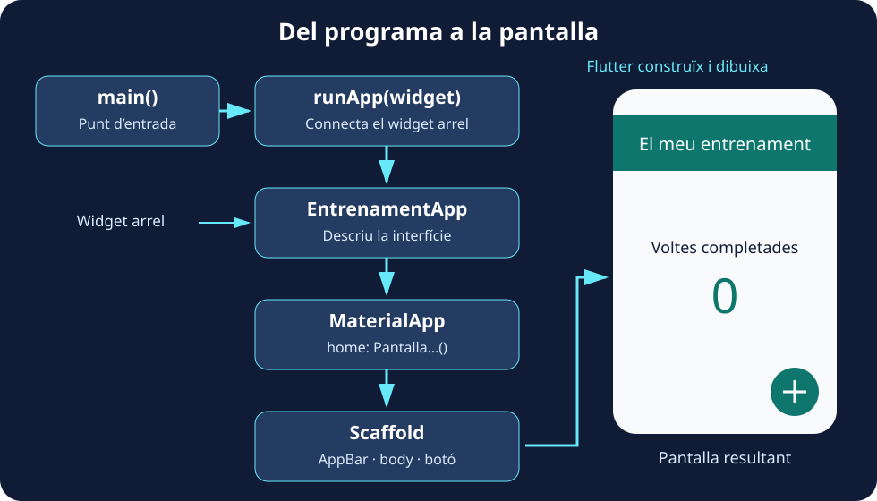

Posarem en pràctica el que hem vist en la introducció. Començarem mostrant **«Anem a entrenar!»** i acabarem amb una pantalla que registra les voltes completades en polsar un botó. Durant el recorregut aprendrem a crear el projecte, llegir l’arbre de widgets, separar una pantalla en el seu propi arxiu i actualitzar-ne el contingut.

No cal conéixer encara totes les propietats de cada widget. La idea és **fer un canvi, observar el resultat i entendre per què ocorre**. Cada bloc indica si has de substituir un arxiu complet o modificar només una part.

## 🚀 Prepara i executa el projecte

Necessites Flutter instal·lat i una destinació disponible: un navegador compatible, un emulador o un dispositiu configurat. Pots comprovar la instal·lació amb `flutter doctor`.

### Des de VS Code

Amb les extensions de Dart i Flutter instal·lades:

1. Obri la paleta d’ordres amb `Ctrl + Shift + P` i busca **Flutter: New Project**.
2. Tria la plantilla **Application**, una carpeta per als projectes i el nom **`contador_vueltas`**.
3. Obri el projecte generat, selecciona una destinació amb **Flutter: Select Device** i prem `F5` per a executar-lo.

El nom del projecte utilitza minúscules i guions baixos. No el confongues amb el títol que apareixerà en la interfície, que pot incloure espais i accents. Mantindrem el mateix nom de paquet que en la versió en castellà perquè les rutes dels imports coincidisquen.

### Des de la terminal

Situa’t en la carpeta on guardes els projectes i executa estes ordres, una per una:

```bash
flutter create contador_vueltas
cd contador_vueltas
flutter devices
flutter run
```

`flutter create` genera el projecte i resol les dependències. `flutter devices` mostra les destinacions disponibles; si en tens diverses, pots seleccionar-ne una mitjançant `flutter run -d ID`, substituint `ID` pel seu identificador real.

Per a consultar i arrancar un emulador configurat, utilitza `flutter emulators` i després `flutter emulators --launch ID`. Un navegador o un dispositiu físic no necessiten eixe pas.

:::note[Triar les plataformes 📱]
Si només necessites Android i web, pots crear el projecte amb `flutter create --platforms=android,web contador_vueltas`. Per a afegir Android a un projecte que no l’inclou, executa `flutter create --platforms=android .` des de l’arrel i revisa els arxius generats. Crear les carpetes d’una plataforma no instal·la les seues ferramentes de compilació.
:::

La primera execució pot tardar més perquè prepara i descarrega components. Para l’aplicació des de l’editor o prem `q` en la sessió de `flutter run`. La [referència de la ferramenta Flutter](https://docs.flutter.dev/reference/flutter-cli) reunix estes ordres.

Si Flutter anuncia una actualització, `flutter upgrade` actualitza l’SDK. No és necessari fer-ho per a seguir este exemple si la instal·lació ja funciona; a l’aula utilitza la versió acordada per al curs.

### Localitza el que modificarem

| Ruta | Per a què servix |
| --- | --- |
| `lib/main.dart` | Conté el punt d’entrada i el codi inicial de l’aplicació. |
| `pubspec.yaml` | Declara el nom del paquet, dependències i recursos. |
| `test/` | Conté les proves del projecte. |
| `android/`, `web/`, etc. | Contenen la configuració de les plataformes generades. |

Substituirem el codi de mostra de `lib/main.dart`. Si la plantilla inclou una prova del comptador original, eixa prova deixarà de correspondre a la nostra aplicació: hauràs d’adaptar-la abans d’utilitzar `flutter test` com a comprovació del nou projecte.

## 👋 Pas 1. Mostra una salutació

Reemplaça **tot `lib/main.dart`** per este programa:

```dart
import 'package:flutter/material.dart';

void main() {
  runApp(
    const Text(
      'Anem a entrenar!',
      textDirection: TextDirection.ltr,
    ),
  );
}
```

El programa és menut, però ja conté tres peces importants:

| Peça | Què fa |
| --- | --- |
| `import` | Permet utilitzar els components que exporta la biblioteca Material de Flutter. |
| `main` | És el punt d’entrada del programa Dart. |
| `runApp` | Rep un widget i l’establix com a arrel de la interfície. |

`Text` rep la cadena com a argument posicional. `textDirection` és un argument amb nom: `TextDirection.ltr` indica lectura d’esquerra a dreta. **En este exemple encara no hi ha un widget antecessor que proporcione la direcció**, per això la indiquem explícitament. Més avant, `MaterialApp` aportarà eixe context.

La salutació apareix sense l’estructura ni els estils habituals d’una pantalla Material i pot coincidir amb zones del sistema. És un primer experiment per a entendre l’arrancada, no la pantalla final. Pots consultar el comportament d’arrancada en la [referència de `runApp`](https://api.flutter.dev/flutter/widgets/runApp.html).

### Què fa runApp?

**`runApp` connecta el widget que li entreguem amb la vista de l’aplicació i posa en marxa la construcció de la interfície.** A partir d’eixe widget arrel, Flutter incorpora els descendents a l’arbre, calcula l’espai que necessiten i dibuixa el resultat en pantalla. En este primer programa l’arrel és `Text`; quan creem la nostra classe, serà `EntrenamentApp`.

Podem distingir les responsabilitats: **`main` inicia el programa Dart, `runApp` connecta la interfície amb Flutter i `build` descriu el contingut de cada widget propi**. `runApp` rep una instància de widget: en `runApp(const EntrenamentApp())`, `EntrenamentApp()` crida el constructor i el seu resultat s’entrega a la funció.

El següent esquema anticipa l’estructura que construirem en els pròxims passos. Les fletxes mostren l’arrancada i la composició de la interfície; no són crides a `runApp` en cada nivell.



:::note[Es crida en arrancar, no en polsar el botó]
En esta aplicació cridem `runApp` una vegada, des de `main`. Per a actualitzar el comptador utilitzarem `setState`: Flutter reconstruïx la part corresponent de l’arbre. **No necessitem tornar a cridar `runApp` per a mostrar cada valor nou.** Tampoc necessitem cridar manualment `build`; Flutter gestiona eixes crides.
:::

### Centra el text

Mantín l’`import` i substituïx `main` per:

```dart
void main() {
  runApp(
    const Center(
      child: Text(
        'Anem a entrenar!',
        textDirection: TextDirection.ltr,
      ),
    ),
  );
}
```

Ara `Center` és el pare del text i el col·loca al centre de l’espai disponible. **No canviem el text per a centrar-lo: el combinem amb un altre widget que resol la posició.**

:::tip[Què significa const 💡]
`const` crea una configuració constant quan el constructor i els arguments ho permeten. Dins de `const Center(...)`, el `Text` ja està en un context constant i no necessita repetir la paraula. Flutter pot reutilitzar eixes instàncies i evitar treball d’actualització, però això **no congela la pantalla ni impedix qualsevol reconstrucció**. Un `StatefulWidget` creat amb `const` també pot tindre un `State` mutable.
:::

## 🧱 Pas 2. Crea el teu propi widget

Podem donar un nom a esta composició. Substituïx **tot `lib/main.dart`** per:

```dart
import 'package:flutter/material.dart';

void main() => runApp(const EntrenamentApp());

class EntrenamentApp extends StatelessWidget {
  const EntrenamentApp({super.key});

  @override
  Widget build(BuildContext context) {
    return const Center(
      child: Text(
        'Anem a entrenar!',
        textDirection: TextDirection.ltr,
      ),
    );
  }
}
```

`EntrenamentApp` hereta de `StatelessWidget` perquè de moment només descriu una salutació. `build` retorna el widget que representa la interfície i `@override` indica que implementem un mètode de la classe base. La funció fletxa de `main` és una forma abreviada d’escriure una única expressió.

El constructor `const EntrenamentApp({super.key})` permet crear instàncies constants i passar la clau opcional al constructor de la classe base. **`key` ajuda Flutter a identificar elements en actualitzar l’arbre**; no és un identificador per a buscar controls com en HTML. Si l’omets, normalment el seu valor és `null`: Flutter no genera una `Key` per tu.

### Què representa BuildContext

`context` representa **la ubicació d’este widget en l’arbre**. Permet consultar informació proporcionada pels antecessors, com el tema mitjançant `Theme.of(context)`. No conté per si mateix totes les variables de l’aplicació.

Això explica una regla pràctica: un context pot consultar el que hi ha per damunt d’ell, però no un widget que acabem de retornar per davall. En separar l’aplicació i la pantalla en el següent pas, el context de la pantalla quedarà davall de `MaterialApp`.

### Ferramentes de l’editor

Amb el cursor sobre un widget, obri les accions de codi amb la bombeta o `Ctrl + .`:

| Acció | Què facilita |
| --- | --- |
| **Wrap with Center / Column** | Embolica una peça en un altre widget. |
| **Extract Widget** | Convertix una part de l’arbre en una classe amb nom. |
| **Convert to StatefulWidget** | Genera la separació entre widget i estat. |

Les extensions també oferixen plantilles en escriure prefixos com `stless` o `stful`; els noms disponibles depenen de les extensions instal·lades. Revisa el resultat generat: has d’entendre el constructor i completar `build`. Si apareix `throw UnimplementedError()`, encara falta implementar la interfície.

## 🎨 Pas 3. Dona-li estructura Material

Separarem **la configuració de l’aplicació** de **la pantalla d’entrenament**. Substituïx **tot `lib/main.dart`** per este codi:

```dart
import 'package:flutter/material.dart';

void main() => runApp(const EntrenamentApp());

class EntrenamentApp extends StatelessWidget {
  const EntrenamentApp({super.key});

  @override
  Widget build(BuildContext context) {
    return MaterialApp(
      title: 'Comptador de voltes',
      debugShowCheckedModeBanner: false,
      theme: ThemeData(
        colorScheme: ColorScheme.fromSeed(seedColor: Colors.teal),
      ),
      home: const PantallaEntrenament(),
    );
  }
}

class PantallaEntrenament extends StatelessWidget {
  const PantallaEntrenament({super.key});

  @override
  Widget build(BuildContext context) {
    return Scaffold(
      appBar: AppBar(title: const Text('El meu entrenament')),
      body: const Center(child: Text('Anem a entrenar!')),
    );
  }
}
```

**`MaterialApp` configura l’aplicació; `Scaffold` organitza una pantalla; `AppBar` descriu la barra superior.** Importar `material.dart` permet utilitzar les classes, però no crea per si sol esta estructura.

| Argument | Què configura |
| --- | --- |
| `MaterialApp.title` | Un títol que el sistema pot utilitzar, per exemple en la descripció de l’aplicació; no dibuixa la barra superior. |
| `debugShowCheckedModeBanner` | La visibilitat de l’etiqueta de depuració; ocultar-la no canvia el mode d’execució. |
| `theme` | Els estils comuns. Ací generem una paleta a partir d’un color llavor. |
| `home` | La pantalla inicial. |
| `Scaffold.appBar` | La barra superior, el `title` de la qual sí que es veu en pantalla. |
| `Scaffold.body` | El contingut principal. |

Ja no indiquem `textDirection` en cada text: l’estructura de l’aplicació proporciona una direcció mitjançant els widgets antecessors. El color llavor tampoc pren automàticament els colors del fons de pantalla del dispositiu. Consulta les opcions en la [referència de `MaterialApp`](https://api.flutter.dev/flutter/material/MaterialApp-class.html).

## 📁 Pas 4. Separa la pantalla en un arxiu

Crea `lib/presentation/screens/pantalla_entrenament.dart`. **Mou a eixe arxiu la classe `PantallaEntrenament` del pas anterior**, juntament amb este import al principi:

```dart
import 'package:flutter/material.dart';
```

En `lib/main.dart`, elimina la classe que has mogut i afig:

```dart
import 'package:contador_vueltas/presentation/screens/pantalla_entrenament.dart';
```

L’estructura queda així:

```text
lib/
├── main.dart
└── presentation/
    └── screens/
        └── pantalla_entrenament.dart
```

En un import `package:`, `contador_vueltas` és el nom declarat en `pubspec.yaml` i la ruta següent comença dins de `lib`, per això no escrivim `lib/`. Cada arxiu importa les biblioteques que utilitza.

**`main.dart` conserva `EntrenamentApp` i `MaterialApp`; la pantalla conserva `Scaffold`.** La carpeta `presentation/screens` agrupa la interfície, però crear-la per si sola no implementa una arquitectura completa. Executa de nou: el resultat visual ha de ser el mateix.

## 🔢 Pas 5. Prepara el comptador

En `pantalla_entrenament.dart`, substituïx el `body` per:

```dart
body: const Center(
  child: Column(
    mainAxisAlignment: MainAxisAlignment.center,
    children: [
      Text('Voltes completades'),
      SizedBox(height: 12),
      Text('0', style: TextStyle(fontSize: 56)),
    ],
  ),
),
```

`Center` rep un `child`; `Column` rep una llista `children` i col·loca els elements en vertical. `SizedBox` deixa una separació i `TextStyle` augmenta la mida del número en píxels lògics.

Per defecte, esta columna ocupa l’altura disponible i col·loca els fills al principi. **`mainAxisAlignment: MainAxisAlignment.center` centra els fills dins de la columna**. També existixen `start`, `end`, `spaceBetween`, `spaceAround` i `spaceEvenly`. Una altra solució és `mainAxisSize: MainAxisSize.min`, que reduïx l’altura de la columna al seu contingut i permet que el `Center` centre el grup.

Afig este argument al `Scaffold`, al mateix nivell que `body`:

```dart
floatingActionButton: FloatingActionButton(
  tooltip: 'Registrar una volta',
  onPressed: () {
    debugPrint('Has completat una volta');
  },
  child: const Icon(Icons.add),
),
```

`onPressed` rep una funció que Flutter executarà en polsar. La icona és constant, però el botó amb esta funció no pot declarar-se `const`. `debugPrint` escriu en la consola; encara no modifica el número de la pantalla.

:::tip[Format que ajuda a llegir l’arbre 🔎]
Utilitza **Format Document** en l’editor o `dart format lib` des de la terminal. Les comes finals faciliten afegir arguments i solen afavorir blocs llegibles; el format exacte depén de la versió del formatador i de les regles que aplique.
:::

## 🔄 Pas 6. Guarda la dada i actualitza la interfície

Podríem intentar declarar `int voltes = 0` dins de `build`, mostrar-lo amb `Text('$voltes')` i incrementar-lo en el botó. Això presenta **dos problemes distints**:

- Canviar una variable no sol·licita per si sol que Flutter reconstruïsca la interfície. La consola pot mostrar un número nou mentre el text continua mostrant l’anterior.
- Una variable local de `build` torna a inicialitzar-se quan s’executa eixe mètode. No és un lloc adequat per a conservar el comptador entre reconstruccions.

Necessitem guardar la dada en un objecte `State` i sol·licitar l’actualització amb `setState`. **Substituïx tot `lib/presentation/screens/pantalla_entrenament.dart`** per esta versió final:

```dart
import 'package:flutter/material.dart';

class PantallaEntrenament extends StatefulWidget {
  const PantallaEntrenament({super.key});

  @override
  State<PantallaEntrenament> createState() => _PantallaEntrenamentState();
}

class _PantallaEntrenamentState extends State<PantallaEntrenament> {
  int _voltes = 0;

  void _registrarVolta() {
    setState(() {
      _voltes++;
    });
    debugPrint('Voltes completades: $_voltes');
  }

  @override
  Widget build(BuildContext context) {
    return Scaffold(
      appBar: AppBar(title: const Text('El meu entrenament')),
      body: Center(
        child: Column(
          mainAxisAlignment: MainAxisAlignment.center,
          children: [
            const Text('Voltes completades'),
            const SizedBox(height: 12),
            Text('$_voltes', style: const TextStyle(fontSize: 56)),
          ],
        ),
      ),
      floatingActionButton: FloatingActionButton(
        tooltip: 'Registrar una volta',
        onPressed: _registrarVolta,
        child: const Icon(Icons.add),
      ),
    );
  }
}
```

En **`lib/main.dart`**, el contingut final ha de ser:

```dart
import 'package:flutter/material.dart';
import 'package:contador_vueltas/presentation/screens/pantalla_entrenament.dart';

void main() => runApp(const EntrenamentApp());

class EntrenamentApp extends StatelessWidget {
  const EntrenamentApp({super.key});

  @override
  Widget build(BuildContext context) {
    return MaterialApp(
      title: 'Comptador de voltes',
      debugShowCheckedModeBanner: false,
      theme: ThemeData(
        colorScheme: ColorScheme.fromSeed(seedColor: Colors.teal),
      ),
      home: const PantallaEntrenament(),
    );
  }
}
```

En canviar de `StatelessWidget` a `StatefulWidget`, fes un **hot restart** per a començar amb la nova estructura. Polsa tres vegades el botó: el número ha de passar per 1, 2 i 3 i coincidir amb els missatges de la consola.

### Què ocorre en cada pulsació

1. `onPressed: _registrarVolta` entrega la funció al botó, sense executar-la durant `build`.
2. La pulsació executa la funció, i el callback de `setState` incrementa `_voltes`.
3. `setState` sol·licita una reconstrucció; `build` llig la nova dada.
4. `Text('$_voltes')` convertix el número en text mitjançant interpolació.

`_voltes` pertany a l’objecte `State`, així que es conserva entre reconstruccions mentre Flutter mantinga eixe estat en l’arbre. El guió baix indica privacitat dins de la biblioteca de Dart. El comptador viu en memòria: no es guarda en tancar l’aplicació.

:::note[Què canvia i què continua sent constant]
`PantallaEntrenament` continua sent una configuració immutable, encara que tinga estat associat. El que és mutable és `_voltes` en `State`. El `Text` que mostra el número no pot ser `const`, però el seu `TextStyle` sí. `EntrenamentApp` pot continuar sent un `StatelessWidget`: no necessita gestionar el comptador.
:::

### Un widget propi que rep dades

També podem extraure el número a un component sense estat propi. Afig esta classe al final de l’arxiu de la pantalla:

```dart
class NumeroVoltes extends StatelessWidget {
  final int valor;

  const NumeroVoltes({super.key, required this.valor});

  @override
  Widget build(BuildContext context) {
    return Text('$valor', style: const TextStyle(fontSize: 56));
  }
}
```

Després substituïx `Text('$_voltes', style: const TextStyle(fontSize: 56))` per `NumeroVoltes(valor: _voltes)`.

`required` obliga a proporcionar el valor i `final` impedix reassignar-lo en eixa instància. **El component pot mostrar un altre número quan el pare li entrega una configuració nova**. No necessita estat propi per a reflectir dades que canvien. El constructor admet `const`, però esta crida utilitza `_voltes`, una dada d’execució, i per això no porta `const`.

## ⚡ Comprova els canvis durant el desenvolupament

| Operació | Què observaràs en este exemple |
| --- | --- |
| **Hot reload** | Aplica canvis compatibles en la interfície conservant el comptador. En `flutter run`, prem `r`. |
| **Hot restart** | Reinicia l’aplicació Dart i el comptador torna a zero. En `flutter run`, prem `R`. |
| **Parar i executar de nou** | Inicia una nova execució; també és necessari per a aplicar determinats canvis en codi natiu. |

Prova a registrar dos voltes i canviar el text «Voltes completades» per «Voltes de hui». Amb hot reload s’ha de mantindre el dos. Hot reload no torna a executar `main` ni `initState`; els canvis que necessiten repetir la inicialització requerixen un reinici. Consulta la [guia oficial de hot reload](https://docs.flutter.dev/tools/hot-reload).

:::caution[Si alguna cosa no funciona]
Si falla un import, comprova el nom del paquet i la ruta. Si apareix un error en utilitzar `const`, revisa si has inclòs una variable d’execució. Si el botó escriu en la consola però el número no canvia, comprova que modifies el camp de `State` i crides `setState`. Llig el primer error de la consola abans de fer més canvis.
:::

## 🎯 Practica amb la teua aplicació

1. Canvia el color llavor i el títol de la barra. Quines propietats has modificat?
2. Afig una acció en `AppBar` per a posar `_voltes` a zero mitjançant `setState`.
3. Afig un botó per a restar una volta i evita que el comptador siga negatiu.
4. Mostra «Encara no has començat» quan el valor siga zero i «Entrenament en marxa» quan siga major. Utilitza una expressió condicional en construir el text.
5. Extrau `NumeroVoltes` mitjançant **Extract Widget** i compara el resultat de l’editor amb la classe proposada.

:::tip[Abans de continuar ✅]
Has de poder seguir el recorregut des de `main` fins al text del comptador, distingir l’aplicació de la pantalla i explicar per què `_voltes` està fora de `build`. En **Bàsics** veurem amb més detall les propietats i variants de les peces que acabes d’utilitzar.
:::
