## MeteoCLI — Consulta meteorológica desde Dart

En esta tarea vamos a desarrollar **MeteoCLI**, una aplicación de consola escrita en Dart que permitirá consultar información meteorológica de diferentes localidades.

La aplicación utilizará una API pública para obtener datos reales y nos servirá como proyecto integrador de los principales conceptos vistos durante el tema de introducción a Dart.

A diferencia de ejercicios anteriores, **no partiremos de cero**. Se proporcionará un proyecto parcialmente implementado. Algunas funcionalidades estarán terminadas y servirán como ejemplo, mientras que otras contendrán diferentes marcas `TODO` que deberemos completar.

## 1. ¿Qué vamos a construir?

Nuestra aplicación permitirá consultar desde el terminal el tiempo de cualquier localidad.

Algunos ejemplos de uso serán:

```bash
dart run meteo_cli buscar Valencia
```

```bash
dart run meteo_cli actual Valencia
```

```bash
dart run meteo_cli hoy Valencia
```

```bash
dart run meteo_cli horas Valencia 18 23
```

```bash
dart run meteo_cli comparar Valencia Madrid
```

La aplicación deberá ser capaz de:

1. Buscar localidades por nombre.
2. Obtener las condiciones meteorológicas actuales.
3. Consultar la previsión horaria.
4. Filtrar la previsión por un intervalo horario.
5. Obtener un pequeño resumen meteorológico de un día.
6. Comparar el tiempo actual de dos localidades.
7. Gestionar correctamente errores de entrada, de red y de la API.

Las primeras funcionalidades se proporcionarán parcialmente implementadas para que sirvan como referencia para las siguientes.

### 2. La API de Open-Meteo

Nuestra aplicación necesita obtener **información meteorológica real**. Para ello utilizaremos **Open-Meteo**, un servicio web que proporciona diferentes APIs relacionadas con información geográfica y meteorológica.

Una de sus ventajas para esta práctica es que podemos realizar consultas sin necesidad de registrar una cuenta ni gestionar una API Key.

Antes de empezar a realizar peticiones HTTP debemos entender un detalle importante: Conocer el nombre de una localidad no es suficiente para consultar su información meteorológica.

Para obtener el tiempo de una localidad tendremos que realizar **dos operaciones**:

1. Localizar geográficamente la población.
2. Utilizar sus coordenadas para consultar la información meteorológica.

Veamos el proceso paso a paso.

#### 2.1. De una localidad a sus coordenadas

Imaginemos que el usuario quiere consultar el tiempo de:

```
Ontinyent
```

Nosotros sabemos perfectamente a qué localidad se refiere, pero la API meteorológica necesita una posición geográfica más precisa.

Concretamente, trabaja principalmente con dos valores:

* **latitud**: indica la posición norte-sur de un punto de la Tierra;
* **longitud**: indica la posición este-oeste.

Las coordenadas aproximadas de Ontinyent son:

```
Latitud:   38.82
Longitud:  -0.61
```

Por tanto, tenemos nuestro primer problema:

```
"Ontinyent" → ¿qué latitud y longitud tiene?
```

Para resolverlo utilizaremos la **API de geocodificación de Open-Meteo**.

#### 2.2. ¿Qué es la geocodificación?

La **geocodificación** consiste en transformar el nombre de un lugar en información geográfica que pueda ser utilizada por una aplicación.

En nuestro caso queremos realizar una transformación similar a esta:

```
Ontinyent
      ↓
Latitud: 38.82
Longitud: -0.61
```

Nuestra aplicación enviará el texto `Ontinyent` a la API de geocodificación.

La API buscará las localidades que coincidan con ese nombre y devolverá información sobre ellas.

Podemos representar el proceso de la siguiente manera:

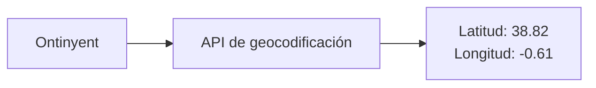

La respuesta del servidor llegará en formato **JSON**.

De forma simplificada, podríamos recibir información similar a:

```json
{
  "name": "Ontinyent",
  "latitude": 38.82,
  "longitude": -0.61,
  "country": "Spain",
  "timezone": "Europe/Madrid"
}
```

Además del nombre de la localidad, podemos observar información como:

```json
"latitude": 38.82,
"longitude": -0.61
```

que será fundamental para realizar la siguiente petición.

También recibimos otros datos que pueden resultar útiles, como:

```json
"country": "Spain",
"timezone": "Europe/Madrid"
```

Por tanto, nuestra primera petición tendrá aproximadamente el siguiente flujo:

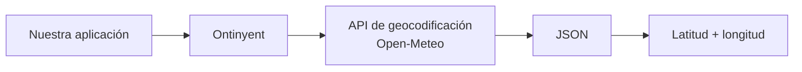

#### 2.3. ¿Por qué no consultamos directamente el tiempo de "Ontinyent"?

Podríamos preguntarnos por qué necesitamos realizar este paso previo.

¿Por qué no podemos simplemente pedir a la API algo como?

```
dameElTiempo("Ontinyent")
```

El problema es que **los nombres de las localidades no identifican necesariamente un único lugar del planeta**.

Pueden existir localidades con nombres iguales o muy similares en diferentes países o regiones.

Las coordenadas geográficas, en cambio, permiten identificar de una manera mucho más precisa el punto para el que queremos obtener la información meteorológica.

Por ello, separaremos el proceso en dos pasos.

**Primer paso: localizar Ontinyent.**

```
Ontinyent
      ↓
Geocodificación
      ↓
38.82, -0.61
```

**Segundo paso: consultar el tiempo en esas coordenadas.**

```
38.82, -0.61
      ↓
API meteorológica
      ↓
Temperatura, viento, precipitación...
```

Esta separación también aparecerá reflejada en nuestro código.

Tendremos una clase encargada de realizar las búsquedas geográficas:

```dart
GeocodingApi
```

y otra clase encargada de consultar la información meteorológica:

```dart
WeatherApi
```

Cada una tendrá una responsabilidad concreta:

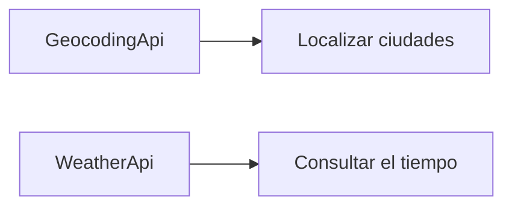

Esta separación de responsabilidades será importante cuando estudiemos la organización de nuestro proyecto.

#### 2.4. Consultar la información meteorológica

Después de realizar la primera petición ya conocemos las coordenadas aproximadas de Ontinyent:

```
Latitud:   38.82
Longitud:  -0.61
```

Ahora sí podemos consultar la **API meteorológica de Open-Meteo**.

En esta segunda petición ya no enviaremos el nombre:

```
Ontinyent
```

sino sus coordenadas:

```
38.82, -0.61
```

Podemos representar esta segunda operación de la siguiente manera:

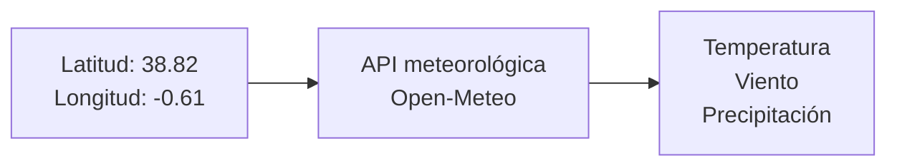

La API meteorológica devolverá nuevamente una respuesta en formato JSON.

De forma simplificada, podríamos recibir datos similares a:

```json
{
  "temperature_2m": 24.3,
  "weather_code": 1,
  "wind_speed_10m": 8.7
}
```

Aquí aparecen valores como:

* `temperature_2m`: temperatura;
* `weather_code`: código que representa el estado meteorológico;
* `wind_speed_10m`: velocidad del viento.

Más adelante solicitaremos también información horaria y datos de precipitación.

#### 2.5. Del JSON a objetos Dart

Cuando recibimos la respuesta de Open-Meteo todavía tenemos otro problema.

La API nos devuelve **JSON**, pero nosotros queremos trabajar en nuestra aplicación con **objetos Dart**.

No queremos que toda nuestra aplicación tenga que acceder constantemente a estructuras como:

```dart
json['temperature_2m']
```

o:

```dart
json['wind_speed_10m']
```

Preferimos trabajar con objetos de nuestro dominio:

```dart
TiempoActual
```

o:

```dart
PrevisionHoraria
```

Por tanto, tendremos que realizar una nueva transformación:

```
JSON de Open-Meteo
        ↓
Objetos Dart
```

Por ejemplo:

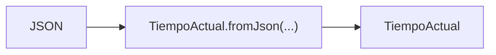

Una vez realizada esta transformación podremos escribir código mucho más expresivo.

En lugar de trabajar continuamente con:

```dart
json['temperature_2m']
```

podremos trabajar con:

```dart
tiempo.temperatura
```

Esta es una de las razones por las que crearemos las **entidades de nuestro dominio**.

#### 2.6. El proceso completo

Ya podemos observar el proceso completo que deberá realizar nuestra aplicación.

Supongamos que el usuario ejecuta:

```bash
dart run bin/meteo_cli.dart actual Ontinyent
```

Aparentemente estamos realizando una única operación: consultar el tiempo de Ontinyent.

Sin embargo, internamente sucederán varias cosas.

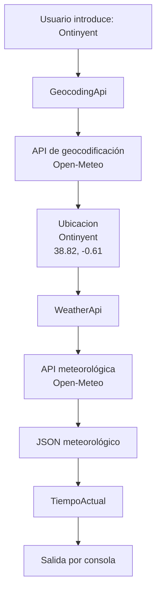

Observa además que estamos utilizando distintos tipos de información durante el proceso:

```
String
  ↓
JSON
  ↓
Ubicacion
  ↓
JSON
  ↓
TiempoActual
```

Entender estas transformaciones será fundamental para implementar correctamente la aplicación.

#### 2.7. Dos peticiones que dependen entre sí

Este ejemplo nos permite introducir además uno de los conceptos más importantes de la práctica: la **programación asíncrona**.

Las peticiones HTTP no obtienen una respuesta de forma inmediata.

Cuando nuestra aplicación pregunta a Open-Meteo:

```
¿Dónde está Ontinyent?
```

debe esperar a recibir la respuesta.

Solamente entonces conoceremos:

```
38.82, -0.61
```

y podremos realizar la siguiente petición:

```
¿Qué tiempo hace en 38.82, -0.61?
```

Por tanto, **la segunda petición depende del resultado de la primera**.

Podemos representarlo así:

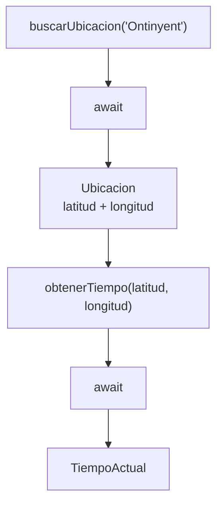

En Dart encontraremos código parecido a:

```dart
final ubicacion = await buscarUbicacion('Ontinyent');

final tiempo = await obtenerTiempo(
  ubicacion.latitud,
  ubicacion.longitud,
);
```

El primer `await` espera a que conozcamos la ubicación.

El segundo `await` espera a que recibamos la información meteorológica.

No podemos invertir estas operaciones porque para realizar la segunda necesitamos los datos obtenidos en la primera.

Por tanto, detrás de una operación aparentemente sencilla como:

```dart
obtenerTiempoActual('Ontinyent')
```

tenemos realmente una cadena de operaciones:

```
Ontinyent
    ↓
buscar ubicación
    ↓
esperar
    ↓
obtener coordenadas
    ↓
consultar tiempo
    ↓
esperar
    ↓
obtener JSON
    ↓
crear TiempoActual
```

Este patrón aparece constantemente en aplicaciones reales. Una operación puede requerir varias tareas asíncronas consecutivas, y el resultado de una de ellas puede ser necesario para poder ejecutar la siguiente.

## 3. Arquitectura de la aplicación

Aunque estamos construyendo una pequeña aplicación de terminal, organizaremos el proyecto utilizando una arquitectura similar a la que encontraremos posteriormente al desarrollar aplicaciones Flutter.

El proyecto proporcionado tendrá aproximadamente esta estructura:

```
meteo_cli/
│
├── bin/
│   └── meteo_cli.dart
│
├── lib/
│   │
│   ├── domain/
│   │   ├── entities/
│   │   │   ├── ubicacion.dart
│   │   │   ├── lectura_meteorologica.dart
│   │   │   ├── tiempo_actual.dart
│   │   │   └── prevision_horaria.dart
│   │   │
│   │   └── enums/
│   │       └── estado_cielo.dart
│   │
│   ├── data/
│   │   ├── services/
│   │   │   ├── geocoding_api.dart
│   │   │   └── weather_api.dart
│   │   │
│   │   └── repositories/
│   │       └── weather_repository.dart
│   │
│   ├── exceptions/
│   │   ├── api_exception.dart
│   │   └── location_not_found_exception.dart
│   │
│   └── utils/
│       └── console_utils.dart
│
├── pubspec.yaml
└── README.md
```

Podemos distinguir tres partes principales:

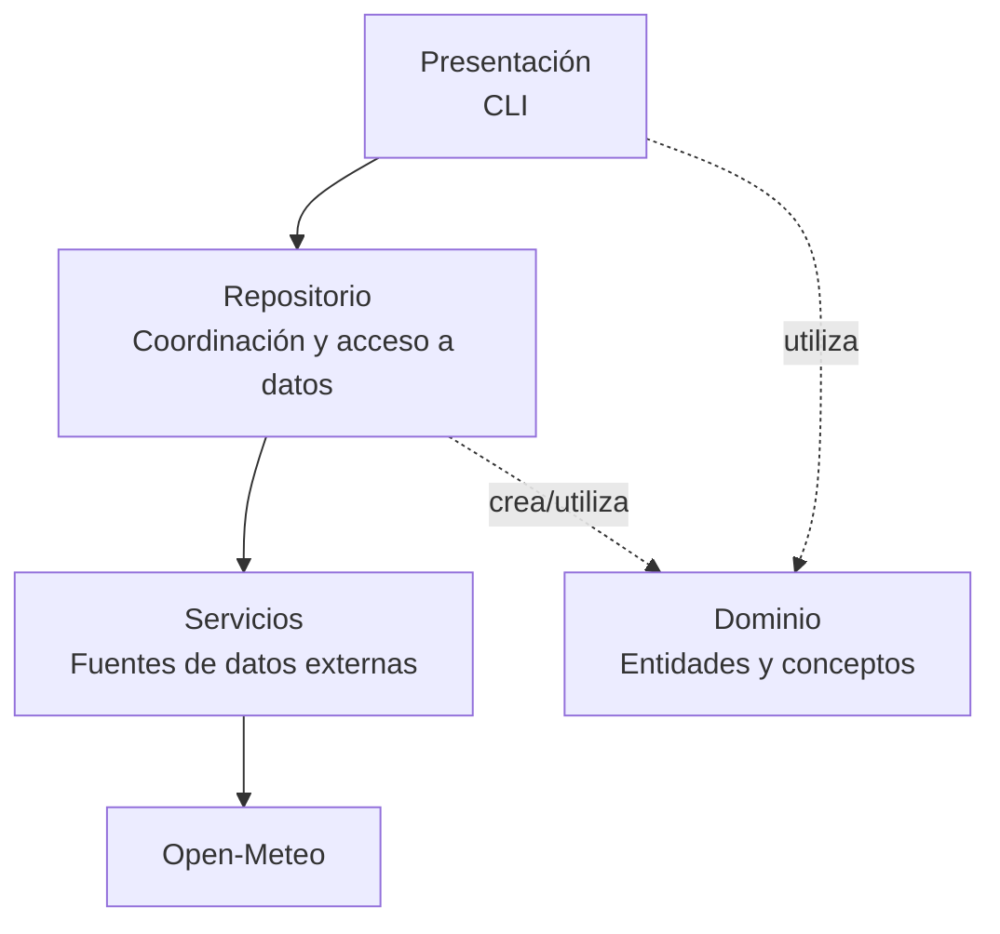

La **CLI** sería la capa de presentación: recibe órdenes del usuario y muestra resultados. Los **services** funcionan como *remote data sources*: conocen HTTP, las URLs y el JSON de Open-Meteo. El **repository** oculta esos detalles al resto de la aplicación y ofrece operaciones del dominio como `obtenerTiempoActual()`. Finalmente, `domain` contiene las entidades con las que queremos trabajar (`Ubicacion`, `TiempoActual`, etc.).

El concepto central que estamos aplicando es **separation of concerns**: cada parte tiene una responsabilidad diferente. Esta separación puede parecer excesiva para una aplicación pequeña, pero tiene un objetivo didáctico: **cada clase deberá tener una responsabilidad concreta**.

Esto nos prepara además para la arquitectura que utilizaremos posteriormente en Flutter.

## 4. Capa de dominio

Hasta ahora hemos visto que Open-Meteo nos proporciona la información en formato **JSON**. Sin embargo, no queremos que el resto de nuestra aplicación dependa directamente de la estructura utilizada por una API externa.

Por ejemplo, podríamos acceder a la temperatura directamente desde el JSON:

```dart
final temperatura = json['temperature_2m'];
```

pero si trabajásemos así en toda la aplicación, nuestro código acabaría lleno de accesos a claves como:

```dart
json['name']
json['latitude']
json['longitude']
json['weather_code']
json['wind_speed_10m']
```

Además de ser poco expresivo, estaríamos haciendo que nuestra aplicación dependiese constantemente del formato concreto utilizado por Open-Meteo.

Para evitarlo utilizaremos la **capa de dominio**.

La capa de dominio contiene las clases que representan los **conceptos con los que trabaja nuestra aplicación**. En nuestro caso tendremos conceptos como una ubicación, el tiempo actual o una previsión meteorológica.

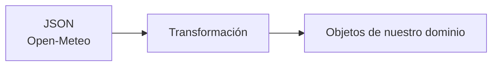

Por ejemplo, los datos recibidos desde la API:

```json
{
  "name": "Ontinyent",
  "latitude": 38.82,
  "longitude": -0.61,
  "country": "Spain"
}
```

se transformarán en un objeto:

```dart
Ubicacion(...)
```

Del mismo modo, la información meteorológica recibida como JSON terminará convirtiéndose en objetos como:

```dart
TiempoActual
PrevisionHoraria
```

De esta forma, una vez realizada la transformación, el resto de nuestra aplicación podrá trabajar con propiedades de objetos:

```dart
ubicacion.nombre
ubicacion.latitud
tiempo.temperatura
prevision.viento
```

en lugar de tener que conocer cómo estaba organizado originalmente el JSON:

```dart
json['name']
json['latitude']
json['temperature_2m']
json['wind_speed_10m']
```

Podemos resumir esta idea de la siguiente manera:

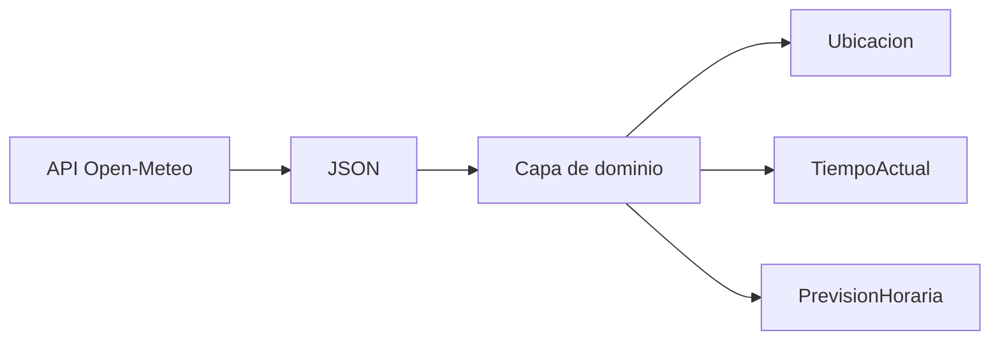

:::note

La capa de dominio nos permite representar los datos externos mediante objetos que tienen sentido dentro de nuestra aplicación.

:::

Esto nos proporciona además una separación importante: **Open-Meteo habla en JSON; nuestra aplicación habla en objetos Dart**.

A continuación veremos las clases que formarán parte de esta capa y aprovecharemos su implementación para trabajar conceptos de Programación Orientada a Objetos como clases, propiedades, constructores, herencia, clases abstractas, enumeraciones y sobrescritura de métodos.

### 4.1. La clase `Ubicacion`

Una ubicación tendrá propiedades como:

```
Ubicacion
────────────────────────
String nombre
String pais
double latitud
double longitud
String timezone
```

Se proporcionará parte de esta clase implementada.

El alumno deberá completar su constructor de factoría:

```dart
factory Ubicacion.fromJson(Map<String, dynamic> json)
```

#### ¿Qué es un constructor de factoría?

Un constructor `factory` puede utilizarse cuando queremos controlar cómo se crea un objeto.

En nuestro caso tendremos datos externos:

```json
{
  "name": "Valencia",
  "latitude": 39.46975,
  "longitude": -0.37739,
  "country": "Spain"
}
```

y queremos obtener:

```dart
Ubicacion(...)
```

De esta forma, el conocimiento sobre **cómo se transforma el JSON** queda encapsulado dentro de la propia entidad.

#### TODO 1

Completa `Ubicacion.fromJson()`.

Deberás tener en cuenta que algunos campos devueltos por la API podrían ser opcionales.

## 5. Herencia: las lecturas meteorológicas

Tanto el tiempo actual como una previsión horaria comparten información.

Por ejemplo:

* momento de la medición;
* temperatura;
* código meteorológico;
* velocidad del viento.

En lugar de repetir esas propiedades crearemos una abstracción común.

```
                 LecturaMeteorologica
                         ▲
                         │
              ┌──────────┴──────────┐
              │                     │
        TiempoActual        PrevisionHoraria
```

La clase base podría tener la siguiente estructura:

```dart
abstract class LecturaMeteorologica {
  final DateTime fecha;
  final double temperatura;
  final int codigoTiempo;
  final double viento;

  ...
}
```

### ¿Por qué una clase abstracta?

Una `LecturaMeteorologica` representa una idea general.

En nuestra aplicación nunca necesitaremos crear:

```dart
LecturaMeteorologica(...)
```

Crearemos realmente objetos más concretos:

```dart
TiempoActual(...)
```

o:

```dart
PrevisionHoraria(...)
```

Por eso tiene sentido que sea una clase `abstract`.

#### TODO 2

Implementa `PrevisionHoraria`.

Deberá:

* extender de `LecturaMeteorologica`;
* disponer del constructor correspondiente;
* implementar un constructor `fromJson`;
* sobrescribir `toString()`.

## 6. Enumeraciones

La API meteorológica utiliza códigos numéricos para representar el estado del cielo.

Nuestro código sería poco expresivo si continuamente trabajásemos con números:

```dart
if (codigo == 0) {
  ...
}
```

Podemos crear un enumerado:

```dart
enum EstadoCielo {
  despejado,
  parcialmenteNublado,
  nublado,
  niebla,
  lluvia,
  nieve,
  tormenta,
  desconocido
}
```

y una función que transforme los códigos de la API en valores de nuestro dominio.

#### TODO 3

Implementa:

```dart
EstadoCielo obtenerEstadoCielo(int codigo)
```

Utiliza una estructura `switch`.

Con ello estaremos transformando un dato técnico proporcionado por una API en un concepto comprensible dentro de nuestra aplicación.

## 7. Colecciones

Las previsiones meteorológicas constituyen un buen ejemplo para trabajar con colecciones.

Una previsión de 24 horas puede representarse como:

```dart
List<PrevisionHoraria>
```

Podremos realizar operaciones como:

```dart
previsiones.where(...)
```

```dart
previsiones.map(...)
```

```dart
previsiones.any(...)
```

```dart
previsiones.reduce(...)
```

Por ejemplo, para buscar las predicciones posteriores a una determinada hora podremos filtrar la colección.

#### TODO 4

Implementa una función:

```dart
List<PrevisionHoraria> filtrarPorHoras(
  List<PrevisionHoraria> previsiones,
  int horaInicio,
  int horaFin,
)
```

Solamente deberá devolver las predicciones cuya hora esté dentro del intervalo indicado.

Por ejemplo:

```
18 → 23
```

debería mostrar únicamente:

```
18:00
19:00
20:00
21:00
22:00
23:00
```

## 8. La capa de servicios

Hasta ahora hemos definido las clases de nuestro **dominio**, como `Ubicacion`, `TiempoActual` o `PrevisionHoraria`. Estas clases representan los datos con los que queremos trabajar dentro de la aplicación.

Pero todavía nos falta resolver una cuestión fundamental: ¿Quién se encarga de comunicarse realmente con Open-Meteo?

Esa será la responsabilidad de la **capa de servicios**.

Los servicios serán las clases encargadas de comunicarse con sistemas externos a nuestra aplicación. En este proyecto, su principal responsabilidad será **realizar peticiones HTTP a Open-Meteo y procesar las respuestas recibidas**.

Estas clases estarán situadas en:

```
lib/data/services/
```

Dentro encontraremos dos servicios:

```
GeocodingApi
WeatherApi
```

Cada uno se comunicará con una API diferente de Open-Meteo:

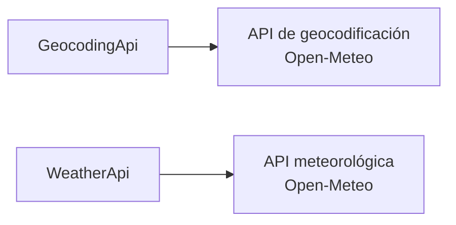

Aunque ambas clases realizan peticiones HTTP, sus responsabilidades son diferentes.

`GeocodingApi` se encargará de **buscar información geográfica sobre localidades**.

`WeatherApi` se encargará de **obtener información meteorológica utilizando unas coordenadas**.

#### 8.1. ¿Qué hace un servicio?

Un servicio actuará como intermediario entre nuestra aplicación y una API externa.

Por ejemplo, cuando queramos localizar Ontinyent, `GeocodingApi` realizará aproximadamente el siguiente proceso:


El servicio tendrá que encargarse de tareas como:

1. construir la URL que necesita la API;
2. realizar la petición HTTP;
3. esperar la respuesta;
4. comprobar si la petición ha terminado correctamente;
5. decodificar el JSON recibido;
6. devolver los datos al resto de la aplicación;
7. informar mediante una excepción si se produce algún problema.

Por tanto, aquí empezaremos a combinar varios conceptos vistos durante el tema:

```
HTTP
JSON
Future
async / await
excepciones
```

#### 8.2. ¿Qué NO debería hacer un servicio?

Tan importante como saber qué hace una clase es saber **qué no debería hacer**.

Por ejemplo, `GeocodingApi` no debería preguntar al usuario qué localidad quiere buscar:

```dart
stdin.readLineSync();
```

Tampoco debería mostrar el resultado por pantalla:

```dart
print('Se ha encontrado Ontinyent');
```

Ni debería decidir qué resultado de búsqueda debe utilizar nuestra aplicación.

Estas responsabilidades pertenecen a otras partes del programa.

El servicio únicamente debe saber:

```
Recibo unos datos
        ↓
Me comunico con una API
        ↓
Devuelvo la respuesta
```

Podemos visualizar la separación de responsabilidades de esta forma:

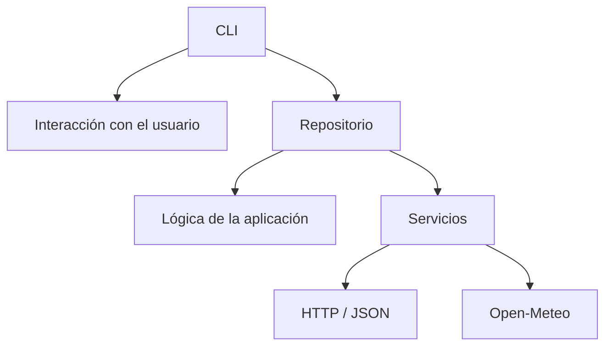

Esta separación hará que nuestro código sea más sencillo de entender, probar y modificar.

#### 8.3. `GeocodingApi`

Comenzaremos con el servicio:

```dart
GeocodingApi
```

Su responsabilidad será comunicarse con la **API de geocodificación de Open-Meteo**.

Recibirá como entrada el nombre de una localidad:

```
Ontinyent
```

y realizará una petición HTTP para buscar localidades que coincidan con ese nombre.

Conceptualmente:

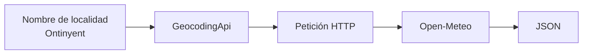

Para ello tendremos el método:

```dart
Future<List<dynamic>> buscar(String nombre) async {
  ...
}
```

Antes de analizar su implementación debemos fijarnos en su firma que podemos dividirla en varias partes:

```dart
Future<List<dynamic>> buscar(String nombre) async
```

El método se llama:

```dart
buscar
```

y necesita recibir un:

```dart
String nombre
```

Por ejemplo:

```dart
buscar('Ontinyent')
```

La parte más interesante es el tipo devuelto:

```dart
Future<List<dynamic>>
```

¿Por qué no devuelve directamente?

```dart
List<dynamic>
```

Porque realizar una petición a Internet requiere tiempo.

Cuando llamamos a Open-Meteo, nuestra aplicación tiene que enviar la petición y **esperar a que el servidor responda**.

Por ello el resultado no está disponible inmediatamente.

`Future` representa precisamente un valor que estará disponible **en el futuro**.

En este caso:

```
Future<List<dynamic>>
```

significa: Esta operación proporcionará una `List<dynamic>`, pero el resultado no estará disponible inmediatamente.

Para esperar ese resultado utilizaremos posteriormente:

```dart
await
```

Por ejemplo:

```dart
final resultados = await geocodingApi.buscar('Ontinyent');
```

#### 8.5. Del método a la petición HTTP

Internamente, `buscar()` tendrá que transformar:

```
Ontinyent
```

en una petición HTTP válida para Open-Meteo.

El proceso será aproximadamente:

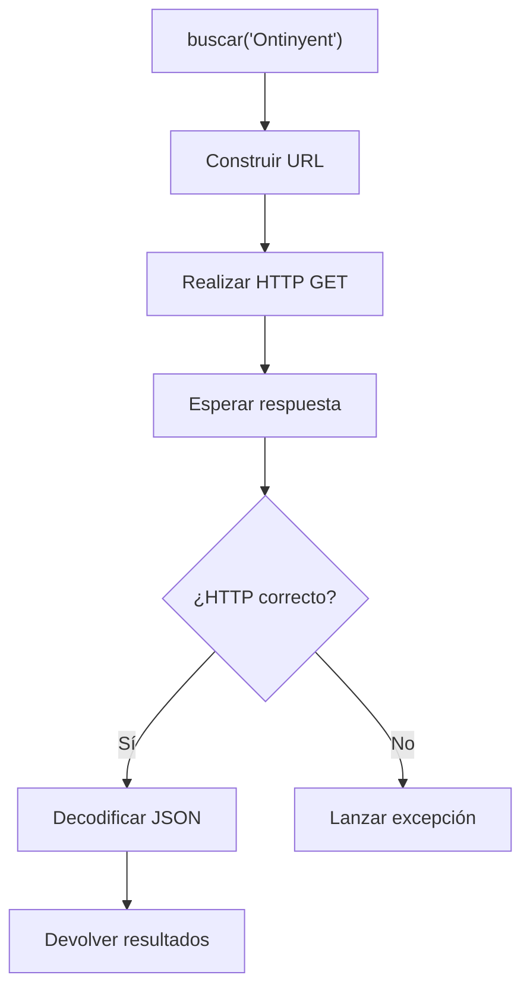

Aquí podemos observar algo importante: realizar una petición HTTP no consiste únicamente en "descargar datos".

Tenemos que contemplar también la posibilidad de que algo falle.

Por ejemplo:

* el servidor podría no estar disponible;
* podríamos no tener conexión;
* la URL podría ser incorrecta;
* Open-Meteo podría responder con un código HTTP de error;
* la respuesta podría no contener los datos esperados.

Más adelante veremos cómo gestionar estas situaciones mediante **excepciones**.

#### 8.6. Una implementación como referencia

El método:

```dart
Future<List<dynamic>> buscar(String nombre) async
```

se proporcionará **ya implementado** en el proyecto inicial. Posteriormente tendrás que aplicar el mismo patrón para implementar las peticiones del servicio:

```dart
WeatherApi
```

Por tanto, antes de comenzar los siguientes `TODO`, es importante que leas y comprendas la implementación de `GeocodingApi.buscar()`.

En un proyecto real es muy habitual que no tengamos que construir todo desde cero. Con frecuencia tendremos una funcionalidad ya implementada y deberemos comprender su estructura para desarrollar otra siguiendo el mismo patrón.

## 9. Servicio meteorológico

La clase:

```
WeatherApi
```

gestionará las peticiones contra la API meteorológica.

Se proporcionará implementado el método que obtiene el tiempo actual:

```dart
Future<Map<String, dynamic>> getCurrentWeather(
  double latitude,
  double longitude,
)
```

#### TODO 5

Implementa:

```dart
Future<Map<String, dynamic>> getForecast(
  double latitude,
  double longitude,
)
```

El método deberá:

1. construir correctamente la URL;
2. realizar una petición HTTP `GET`;
3. comprobar el código de estado;
4. convertir el texto JSON recibido;
5. devolver la información;
6. lanzar una excepción si ocurre un error.

## 10. Gestión de errores

Hasta ahora nuestros programas probablemente hayan trabajado principalmente bajo la suposición de que todo funciona correctamente.

Una aplicación que utiliza Internet no puede hacerlo.

Pueden ocurrir muchas situaciones:

* el usuario introduce una localidad inexistente;
* no hay conexión;
* el servidor no responde;
* la API devuelve un código de error;
* el JSON contiene un valor inesperado;
* el usuario escribe una hora incorrecta.

Utilizaremos:

```dart
try {
  ...
} catch (e) {
  ...
}
```

Pero también crearemos excepciones propias.

Por ejemplo:

```dart
class LocationNotFoundException implements Exception {
  final String location;

  LocationNotFoundException(this.location);
}
```

#### TODO 6

Completa las excepciones:

```
ApiException
LocationNotFoundException
```

y modifica los servicios para lanzarlas cuando corresponda.

La interfaz de consola deberá capturarlas y mostrar mensajes comprensibles.

No queremos mostrar al usuario:

```
Unhandled exception: ...
```

Queremos mostrar algo como:

```
No se ha encontrado ninguna localidad llamada "Valencai".
```

## 11. El repositorio

Ya tenemos unos **servicios** capaces de comunicarse con Open-Meteo. Sin embargo, no queremos que nuestra interfaz de consola tenga que conocer cómo se realizan las peticiones HTTP ni cómo está organizado el JSON recibido.

Para separar estas responsabilidades utilizaremos:

```dart
WeatherRepository
```

El repositorio actuará como **intermediario entre nuestra aplicación y la capa de servicios**.

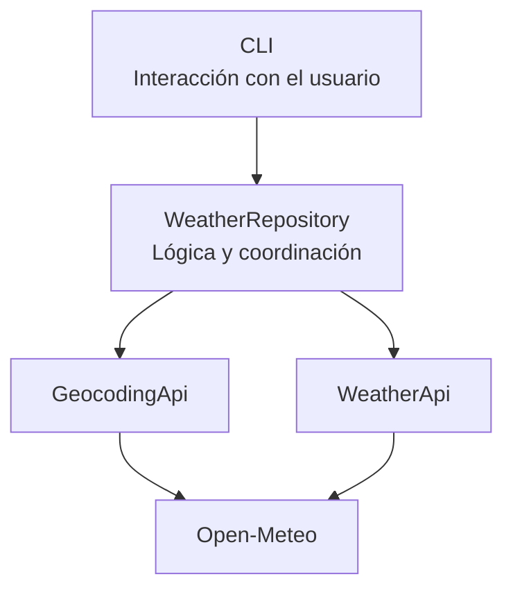

Su función principal será **coordinar los servicios y transformar los datos externos en objetos de nuestro dominio**.

Por ejemplo, para obtener el tiempo actual de Ontinyent, el repositorio tendrá que:

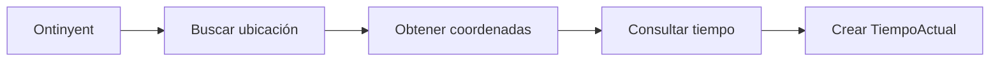

De esta forma podrá ofrecer al resto de la aplicación métodos sencillos y expresivos:

```dart
Future<Ubicacion> buscarUbicacion(String nombre)
Future<TiempoActual> obtenerTiempoActual(String ciudad)
Future<List<PrevisionHoraria>> obtenerPrevision(String ciudad)
```

#### Servicio frente a repositorio

La diferencia entre ambos es importante.

Un **servicio** está cerca de la API y puede trabajar directamente con el JSON recibido:

```dart
Map<String, dynamic>
```

El **repositorio**, en cambio, transforma esos datos y devuelve objetos que tienen sentido para nuestra aplicación:

```dart
TiempoActual
```

Podemos resumirlo así:

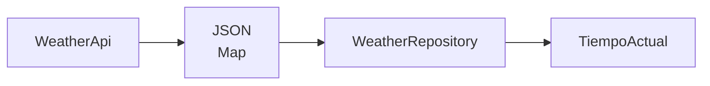

Gracias a esta separación, la CLI puede trabajar simplemente con:

```dart
final tiempo = await repository.obtenerTiempoActual('Ontinyent');
print(tiempo.temperatura);
```

sin necesitar saber **qué URL se ha utilizado, cómo se ha realizado la petición HTTP ni cómo estaba estructurado el JSON de Open-Meteo**.

:::note

Los servicios se encargan de comunicarse con el exterior; el repositorio coordina esas operaciones y proporciona al resto de la aplicación objetos de nuestro dominio.

:::

#### TODO 7

Implementa:

```dart
Future<List<PrevisionHoraria>> obtenerPrevision(
  String ciudad,
)
```

Para ello deberás:

1. buscar la localidad;
2. obtener sus coordenadas;
3. solicitar la previsión;
4. recorrer las colecciones recibidas en el JSON;
5. crear los correspondientes objetos `PrevisionHoraria`;
6. devolver un `List<PrevisionHoraria>`.

## 12. `DateTime`

Las fechas proporcionadas por una API suelen recibirse como cadenas de texto.

Por ejemplo:

```
2026-03-12T18:00
```

Para trabajar correctamente con ellas deberemos transformarlas:

```dart
final fecha = DateTime.parse(texto);
```

Una vez tenemos un `DateTime` podemos consultar:

```dart
fecha.year
fecha.month
fecha.day
fecha.hour
fecha.minute
```

y también comparar fechas.

Por ejemplo:

```dart
fecha.isAfter(otraFecha)
```

o calcular diferencias:

```dart
fecha.difference(otraFecha)
```

#### TODO 8

Cuando construyas objetos `PrevisionHoraria`, convierte las fechas recibidas por la API en objetos `DateTime`.

Después utiliza estas fechas para implementar el filtrado horario.

## 13. ¿Y `TimeOfDay`?

Aquí debemos realizar una distinción importante.

`DateTime` forma parte de Dart.

`TimeOfDay`, en cambio, es una clase proporcionada por Flutter y está pensada para representar exclusivamente una hora y unos minutos:

```
18:30
```

sin asociarlos necesariamente a una fecha.

Conceptualmente:

```
DateTime
12/03/2026 18:30
```

frente a:

```
TimeOfDay
18:30
```

Como esta aplicación es un proyecto **Dart de consola**, no utilizaremos directamente `TimeOfDay`.

En Flutter recuperaremos este concepto cuando trabajemos con selectores de hora y componentes de interfaz.

En esta práctica utilizaremos:

```dart
fecha.hour
```

y:

```dart
fecha.minute
```

para realizar las operaciones equivalentes que necesitamos.

***

## 14. Interfaz de línea de comandos

Nuestro punto de entrada estará en:

```
bin/meteo_cli.dart
```

La función principal podrá recibir argumentos:

```dart
void main(List<String> arguments) async {
  ...
}
```

Esto nos permitirá ejecutar:

```bash
dart run meteo_cli actual Valencia
```

Los argumentos serían:

```dart
arguments[0] // actual
arguments[1] // Valencia
```

Deberemos comprobar siempre que el usuario haya introducido suficientes argumentos antes de acceder a ellos.

## 15. Estructuras de control

Para elegir la operación utilizaremos un `switch`.

Por ejemplo:

```dart
switch (comando) {
  case 'buscar':
    ...
  case 'actual':
    ...
  case 'hoy':
    ...
  default:
    ...
}
```

#### TODO 9

Completa el procesamiento de comandos para admitir:

```
buscar
actual
hoy
horas
comparar
ayuda
```

Los comandos `buscar` y `actual` se proporcionarán ya implementados como referencia.

## 16. Entrada interactiva

También queremos practicar `stdin` y `stdout`.

Por ello, si el programa se ejecuta sin argumentos:

```bash
dart run meteo_cli
```

se mostrará un pequeño menú:

```
══════════════════════════════════
          METEO CLI
══════════════════════════════════

1. Buscar localidad
2. Tiempo actual
3. Previsión de hoy
4. Previsión por horas
5. Comparar dos ciudades
0. Salir

Selecciona una opción:
>
```

Podremos obtener la entrada mediante:

```dart
stdin.readLineSync()
```

Recuerda que este método puede devolver:

```dart
String?
```

y no simplemente:

```dart
String
```

Por tanto, aparecerá de nuevo uno de los conceptos fundamentales de Dart:

**null safety**.

#### TODO 10

Completa el menú interactivo y valida las entradas del usuario.

El programa no deberá cerrarse bruscamente si se introduce:

```
hola
```

cuando se esperaba un número.

## 17. Resumen meteorológico

Añadiremos ahora una funcionalidad que requiera manipular una colección.

Dada:

```dart
List<PrevisionHoraria>
```

queremos obtener:

```
Resumen de Valencia
─────────────────────────────
Temperatura mínima: 14.2 ºC
Temperatura máxima: 22.7 ºC
Temperatura media: 18.4 ºC
Horas analizadas: 24
Lluvia prevista: Sí
```

#### TODO 11

Implementa una función que calcule:

* temperatura mínima;
* temperatura máxima;
* temperatura media;
* número de predicciones;
* si existe alguna hora con lluvia.

Deberás resolverlo utilizando las operaciones disponibles sobre colecciones.

## 18. Comparación de ciudades

El comando:

```bash
dart run meteo_cli comparar Valencia Madrid
```

deberá obtener el tiempo actual de ambas localidades.

Por ejemplo:

```
COMPARACIÓN

Valencia
21.4 ºC

Madrid
17.8 ºC

Valencia tiene actualmente 3.6 ºC más que Madrid.
```

Aquí tenemos dos operaciones independientes:

```dart
obtenerTiempoActual('Valencia')
obtenerTiempoActual('Madrid')
```

No necesitamos necesariamente esperar a que termine una antes de iniciar la otra.

Podemos utilizar:

```dart
Future.wait(...)
```

para ejecutar ambas operaciones asíncronas.

#### TODO 12

Implementa la comparación de dos localidades utilizando `Future.wait`.

Después determina mediante condicionales:

* cuál tiene una temperatura mayor;
* cuál tiene una temperatura menor;
* o si ambas tienen la misma temperatura.

## 19. `Map` y `Set`

Ya hemos utilizado `List`, pero queremos practicar también otras colecciones.

### Map

Utilizaremos un `Map` para relacionar códigos meteorológicos con mensajes o símbolos.

Conceptualmente:

```dart
final Map<EstadoCielo, String> iconos = {
  EstadoCielo.despejado: '☀',
  EstadoCielo.nublado: '☁',
  EstadoCielo.lluvia: '🌧',
};
```

### Set

Durante la ejecución mantendremos un conjunto con las ciudades consultadas:

```dart
final Set<String> historial = {};
```

Un `Set` no admite elementos duplicados.

Por ello, aunque consultemos Valencia cinco veces:

```
Valencia
Valencia
Madrid
Valencia
```

el historial contendrá únicamente:

```
Valencia
Madrid
```

#### TODO 13

Implementa la opción:

```
historial
```

para mostrar las localidades consultadas durante la ejecución actual del programa.

## 20. Salida de los objetos

Sobrescribiremos:

```dart
toString()
```

para obtener representaciones útiles de nuestros objetos.

Por ejemplo:

```
18:00 | 19.3 ºC | Parcialmente nublado | 10 km/h
```

Esto nos permite hacer:

```dart
print(prevision);
```

en lugar de construir continuamente cadenas desde la interfaz.

#### TODO 14

Sobrescribe `toString()` en:

```
Ubicacion
TiempoActual
PrevisionHoraria
```

Utiliza interpolación de cadenas.

## 21. Flujo completo de una consulta

Veamos qué sucede cuando ejecutamos:

```bash
dart run meteo_cli hoy Valencia
```

El flujo será:

```
Usuario
  │
  │ "hoy Valencia"
  ▼
meteo_cli.dart
  │
  │ obtenerPrevision("Valencia")
  ▼
WeatherRepository
  │
  ├── buscarUbicacion("Valencia")
  │          │
  │          ▼
  │     GeocodingApi
  │          │
  │          ▼
  │      Open-Meteo
  │
  │  recibe latitud/longitud
  │
  ├── WeatherApi.getForecast(...)
  │          │
  │          ▼
  │      Open-Meteo
  │
  │  recibe JSON
  │
  ▼
List<PrevisionHoraria>
  │
  ▼
meteo_cli.dart
  │
  ▼
Terminal
```

Observa que la interfaz de usuario **no realiza directamente peticiones HTTP**.

Y el servicio HTTP **no imprime nada por pantalla**.

Cada capa tiene una responsabilidad determinada.

## 22. Gestión de valores nulos

Los datos externos no siempre son perfectos.

Un atributo podría no aparecer:

```dart
json['country']
```

y devolver:

```dart
null
```

Deberemos decidir en cada caso qué estrategia utilizar:

```dart
String?
```

el operador:

```dart
??
```

comprobaciones:

```dart
if (valor != null)
```

u otras herramientas proporcionadas por null safety.

#### TODO 15

Revisa los constructores `fromJson()` y asegúrate de que un dato opcional no provoque innecesariamente la finalización del programa.

## 23. Resumen de tareas

Para completar la aplicación deberás:

1. Completar el constructor `Ubicacion.fromJson`.
2. Implementar `PrevisionHoraria`.
3. Trabajar con herencia desde `LecturaMeteorologica`.
4. Implementar el enumerado `EstadoCielo`.
5. Transformar los códigos meteorológicos mediante `switch`.
6. Implementar la petición HTTP de previsión.
7. Gestionar respuestas HTTP incorrectas.
8. Crear y utilizar excepciones propias.
9. Implementar la transformación JSON → objetos.
10. Trabajar con `DateTime`.
11. Filtrar previsiones mediante colecciones.
12. Calcular estadísticas meteorológicas.
13. Implementar los comandos de la CLI.
14. Implementar la entrada interactiva mediante `stdin`.
15. Utilizar `List`, `Map` y `Set`.
16. Implementar la comparación asíncrona mediante `Future.wait`.
17. Aplicar null safety.
18. Sobrescribir `toString()`.
19. Mostrar mensajes de error comprensibles.
20. Mantener correctamente la separación entre las capas del proyecto.

## 26. Ejemplo de funcionamiento

```
$ dart run meteo_cli hoy Valencia

Buscando Valencia...

Valencia, Spain
viernes 28/08/2026

────────────────────────────────────────
 HORA     TEMP.      ESTADO       VIENTO
────────────────────────────────────────
 09:00    24.1 ºC    ☀ Despejado   7 km/h
 10:00    25.3 ºC    ☀ Despejado   8 km/h
 11:00    26.7 ºC    ☀ Despejado   9 km/h
 12:00    27.6 ºC    ☀ Despejado  10 km/h
 ...
────────────────────────────────────────

Máxima: 30.2 ºC
Mínima: 21.7 ºC
Media:  26.4 ºC
```

Otro ejemplo:

```
$ dart run meteo_cli horas Valencia 18 22

Previsión para Valencia

18:00 | 27.4 ºC | ☀ Despejado
19:00 | 26.1 ºC | ☀ Despejado
20:00 | 24.8 ºC | ⛅ Parcialmente nublado
21:00 | 23.2 ºC | ⛅ Parcialmente nublado
22:00 | 22.1 ºC | ☁ Nublado
```

Y ante una entrada incorrecta:

```
$ dart run meteo_cli horas Valencia veinte treinta

Error: las horas deben ser valores enteros entre 0 y 23.
```

Nunca deberíamos obtener un error no controlado debido simplemente a una entrada incorrecta del usuario.
