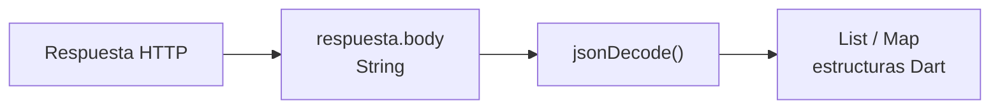

Una de las tareas más habituales en una aplicación moderna consiste en **comunicarse con servicios externos a través de Internet**. Por ejemplo, podemos necesitar consultar una lista de productos, autenticar a un usuario, enviar un formulario o actualizar información almacenada en un servidor.

Esta comunicación se realiza habitualmente mediante el protocolo **HTTP**, utilizando distintos métodos según la operación que queramos realizar, como `GET`, `POST`, `PUT` o `DELETE`.

En Dart podemos realizar este tipo de peticiones mediante el paquete **`http`**, que nos proporciona las herramientas necesarias para conectarnos a una API, enviar datos y procesar las respuestas recibidas.

Como estas operaciones dependen de una comunicación externa y pueden tardar un tiempo en completarse, trabajaremos con ellas de forma **asíncrona**, utilizando `Future`, `async` y `await`, conceptos que acabamos de estudiar.

Entre los métodos HTTP más habituales encontramos:

| Método   | Uso habitual               |
| -------- | -------------------------- |
| `GET`    | Obtener información        |
| `POST`   | Crear o enviar información |
| `PUT`    | Actualizar un recurso      |
| `DELETE` | Eliminar un recurso        |

Para realizar estas operaciones utilizaremos el paquete `http`.

### Instalar el paquete `http`

En un proyecto Dart podemos añadirlo mediante:

```bash
dart pub add http
```

Si estamos trabajando en un proyecto Flutter:

```bash
flutter pub add http
```

Esto añadirá automáticamente la dependencia correspondiente al archivo `pubspec.yaml`.

Después podremos importarla:

```dart
import 'package:http/http.dart' as http;
```

También necesitaremos habitualmente:

```dart
import 'dart:convert';
```

para trabajar con JSON.

## Solicitud GET

El método HTTP `GET` se utiliza para **obtener información de un servidor**.

Utilizaremos como ejemplo JSONPlaceholder, un servicio que proporciona una API REST con datos simulados para realizar pruebas.

Podemos obtener una publicación mediante:

```dart
import 'dart:convert';
import 'package:http/http.dart' as http;

Future<void> obtenerDatos() async {
  final url = Uri.parse(
    'https://jsonplaceholder.typicode.com/posts/1',
  );

  try {
    final respuesta = await http.get(url);

    if (respuesta.statusCode == 200) {
      final datos = jsonDecode(respuesta.body);

      print('Título: ${datos['title']}');
      print('Contenido: ${datos['body']}');
    } else {
      print('Error HTTP: ${respuesta.statusCode}');
    }
  } catch (e) {
    print('Error al realizar la petición: $e');
  }
}

Future<void> main() async {
  await obtenerDatos();
}
```

Observa especialmente esta instrucción:

```dart
final respuesta = await http.get(url);
```

`http.get()` devuelve:

```dart
Future<http.Response>
```

Como necesitamos esperar a que el servidor responda, utilizamos `await`.

Una vez recibida la respuesta podemos acceder a propiedades como:

```dart
respuesta.statusCode
respuesta.body
```

`statusCode` contiene el **código de estado HTTP**, mientras que `body` contiene el cuerpo de la respuesta.

### Mini Task Manager: sustituir la simulación por HTTP

Podemos obtener tareas del recurso `/todos` de [JSONPlaceholder](https://jsonplaceholder.typicode.com/), una API de pruebas con datos simulados. Tras instalar el paquete `http`, añade al principio del archivo:

```dart
import 'dart:convert';
import 'package:http/http.dart' as http;
```

Conserva la clase `Tarea` con su constructor nombrado y sustituye la función simulada `descargarTareas()` por esta versión:

```dart
Future<List<Tarea>> descargarTareas() async {
  final url = Uri.parse(
    'https://jsonplaceholder.typicode.com/todos?_limit=5',
  );
  final response = await http.get(url);

  if (response.statusCode != 200) {
    throw Exception('Error HTTP: ${response.statusCode}');
  }

  final datos = jsonDecode(response.body) as List<dynamic>;
  return datos.map((elemento) {
    final json = elemento as Map<String, dynamic>;
    return Tarea(
      titulo: json['title'] as String,
      completada: json['completed'] as bool,
      fechaLimite: DateTime.now(),
    );
  }).toList();
}
```

La petición devuelve un `Future<Response>`. Con `await` obtenemos la respuesta; `jsonDecode()` transforma el JSON en una lista de mapas y después construimos objetos `Tarea`. El `main()` con `try`, `catch` y `finally` del capítulo anterior puede mantenerse.

La API proporciona `id`, `title` y `completed`, pero **no proporciona fechas límite**. Por ahora asignamos la fecha actual de forma local; en el capítulo de fechas estableceremos una fecha de entrega de ejemplo.

:::tip[Diagnostica un fallo]
Cambia temporalmente la ruta `/todos` por `/ruta-inexistente`. Observa cómo una respuesta HTTP de error termina en el `catch` del `main()`. Un fallo de conexión también puede lanzar una excepción antes de obtener una respuesta.
:::

## Códigos de estado HTTP

Los servidores utilizan códigos numéricos para indicar el resultado de una petición.

Estos códigos se agrupan en diferentes familias:

| Código | Significado                                   |
| ------ | --------------------------------------------- |
| `1xx`  | Información                                   |
| `2xx`  | Operación correcta                            |
| `3xx`  | Redirección                                   |
| `4xx`  | Error relacionado con la petición del cliente |
| `5xx`  | Error del servidor                            |

Algunos códigos habituales son:

```
200 OK
201 Created
400 Bad Request
404 Not Found
500 Internal Server Error
```

Por ejemplo:

```dart
if (respuesta.statusCode == 200) {
  print('Petición realizada correctamente');
} else {
  print('Error: ${respuesta.statusCode}');
}Solicitud POST
```

El método `POST` se utiliza habitualmente para **enviar información al servidor y crear un nuevo recurso**.

Por ejemplo:

```dart
import 'dart:convert';
import 'package:http/http.dart' as http;

Future<void> crearPublicacion() async {
  final url = Uri.parse(
    'https://jsonplaceholder.typicode.com/posts',
  );

  final datos = {
    'title': 'Mi primera publicación',
    'body': 'Contenido de la publicación',
    'userId': 1,
  };

  try {
    final respuesta = await http.post(
      url,
      headers: {
        'Content-Type': 'application/json',
      },
      body: jsonEncode(datos),
    );

    if (respuesta.statusCode == 201) {
      final resultado = jsonDecode(respuesta.body);

      print('Publicación creada: $resultado');
    } else {
      print('Error HTTP: ${respuesta.statusCode}');
    }
  } catch (e) {
    print('Error al realizar la petición: $e');
  }
}

Future<void> main() async {
  await crearPublicacion();
}
```

En este caso aparecen dos elementos importantes.

Las **cabeceras (`headers`)** proporcionan información adicional sobre la petición. Mediante:

```dart
'Content-Type': 'application/json'
```

indicamos que estamos enviando datos en formato JSON.

Por otro lado, el **cuerpo (`body`)** contiene los datos que queremos enviar:

```dart
body: jsonEncode(datos)
```

Utilizamos `jsonEncode()` para convertir nuestro `Map` de Dart a JSON.

## Solicitud PUT

El método `PUT` se utiliza habitualmente para **actualizar un recurso existente**.

Por ejemplo:

```dart
import 'dart:convert';
import 'package:http/http.dart' as http;

Future<void> actualizarPublicacion() async {
  final url = Uri.parse(
    'https://jsonplaceholder.typicode.com/posts/1',
  );

  final datos = {
    'id': 1,
    'title': 'Título actualizado',
    'body': 'Contenido actualizado',
    'userId': 1,
  };

  try {
    final respuesta = await http.put(
      url,
      headers: {
        'Content-Type': 'application/json',
      },
      body: jsonEncode(datos),
    );

    if (respuesta.statusCode == 200) {
      final resultado = jsonDecode(respuesta.body);

      print('Publicación actualizada: $resultado');
    } else {
      print('Error HTTP: ${respuesta.statusCode}');
    }
  } catch (e) {
    print('Error al realizar la petición: $e');
  }
}

Future<void> main() async {
  await actualizarPublicacion();
}
```

En este caso incluimos el identificador del recurso que queremos modificar en la URL:

```
/posts/1
```

## Solicitud DELETE

Finalmente, el método `DELETE` permite solicitar la **eliminación de un recurso**.

```dart
import 'package:http/http.dart' as http;

Future<void> eliminarPublicacion() async {
  final url = Uri.parse(
    'https://jsonplaceholder.typicode.com/posts/1',
  );

  try {
    final respuesta = await http.delete(url);

    if (respuesta.statusCode == 200) {
      print('Publicación eliminada correctamente');
    } else {
      print('Error HTTP: ${respuesta.statusCode}');
    }
  } catch (e) {
    print('Error al realizar la petición: $e');
  }
}

Future<void> main() async {
  await eliminarPublicacion();
}
```

En este caso únicamente necesitamos indicar mediante la URL qué recurso queremos eliminar.

### Recorrer la respuesta de una API

Hasta ahora hemos trabajado con respuestas que contienen un único objeto. Sin embargo, es muy habitual que una API devuelva **una colección de elementos**.

Por ejemplo, una petición a:

`https://jsonplaceholder.typicode.com/posts`

devuelve un array JSON similar a:

```json
[
  {
    "userId": 1,
    "id": 1,
    "title": "Primer título",
    "body": "Contenido..."
  },
  {
    "userId": 1,
    "id": 2,
    "title": "Segundo título",
    "body": "Contenido..."
  }
]
```

#### Convertir JSON a estructuras de Dart

Cuando realizamos una petición HTTP, el contenido de la respuesta se encuentra en:

```dart
respuesta.body
```

Aunque visualmente contenga JSON, `body` es realmente un **`String`**. Por tanto, todavía no podemos recorrerlo como una lista ni acceder a sus elementos.

Para convertir ese texto JSON en estructuras que Dart pueda manipular utilizamos la función:

```dart
jsonDecode()
```

Esta función se encuentra en la librería:

```dart
import 'dart:convert';
```

El proceso que realizamos es el siguiente:



`jsonDecode()` analiza el contenido del `String` y crea las estructuras de Dart equivalentes.

Por ejemplo, un **array JSON**:

```json
[
  {"id": 1, "title": "Primero"},
  {"id": 2, "title": "Segundo"}
]
```

se convierte en una lista de Dart:

```dart
List<dynamic>
```

Mientras que un **objeto JSON**:

```json
{
  "id": 1,
  "title": "Primero"
}
```

se representa normalmente mediante:

```dart
Map<String, dynamic>
```

Podemos resumir las equivalencias principales:

| JSON             | Dart                   |
| ---------------- | ---------------------- |
| `{ ... }`        | `Map<String, dynamic>` |
| `[ ... ]`        | `List<dynamic>`        |
| `"texto"`        | `String`               |
| `10`             | `int`                  |
| `10.5`           | `double`               |
| `true` / `false` | `bool`                 |
| `null`           | `null`                 |

#### Recorrer un array JSON

Después de realizar la petición podemos convertir el JSON recibido en una lista mediante `jsonDecode()`:

```dart
import 'dart:convert';
import 'package:http/http.dart' as http;

Future<void> obtenerPublicaciones() async {
  final url = Uri.parse(
    'https://jsonplaceholder.typicode.com/posts',
  );

  try {
    final respuesta = await http.get(url);

    if (respuesta.statusCode == 200) {
      final List<dynamic> publicaciones =
          jsonDecode(respuesta.body);

      for (var publicacion in publicaciones) {
        print('Título: ${publicacion['title']}');
        print('Contenido: ${publicacion['body']}');
        print('---');
      }
    } else {
      print('Error HTTP: ${respuesta.statusCode}');
    }
  } catch (e) {
    print('Error al realizar la petición: $e');
  }
}

Future<void> main() async {
  await obtenerPublicaciones();
}
```

La instrucción:

```dart
jsonDecode(respuesta.body)
```

realiza, por tanto, esta transformación:

```
String con JSON
       ↓
  jsonDecode()
       ↓
 List<dynamic>
```

Cada elemento de la lista representa una publicación. Como estos elementos proceden de datos dinámicos, podemos acceder inicialmente a sus valores mediante las claves del JSON:

```dart
publicacion['title']
publicacion['body']
```

Si queremos indicar explícitamente el tipo que esperamos encontrar, podemos utilizar el operador `as` visto anteriormente:

```dart
final titulo = publicacion['title'] as String;
final contenido = publicacion['body'] as String;
```

De esta forma conectamos los conceptos que hemos visto:


Esta aproximación resulta adecuada para comprender cómo se reciben y procesan los datos de una API.

> **Más adelante**, cuando construyamos aplicaciones más completas, lo habitual será transformar estos `Map<String, dynamic>` en **objetos de nuestras propias clases**, como `Usuario`, `Producto` o `Publicacion`. Esto nos permitirá trabajar con datos tipados y estructurar mejor nuestras aplicaciones.

### Mini Task Manager: construir tareas con `fromJson`

La transformación de JSON pertenece al modelo. Para centralizarla, sustituye la clase `Tarea` por esta versión; incorpora el identificador de la API y conserva la validación, la encapsulación y los métodos anteriores:

```dart
class Tarea {
  final int? id;
  final String titulo;
  final DateTime fechaLimite;
  bool _completada;

  Tarea({
    this.id,
    required this.titulo,
    required this.fechaLimite,
    bool completada = false,
  }) : _completada = completada {
    if (titulo.trim().isEmpty) {
      throw ArgumentError('El título no puede estar vacío');
    }
  }

  bool get completada => _completada;
  void completar() => _completada = true;

  String get descripcion =>
      '$titulo - ${completada ? "Completada" : "Pendiente"}';

  void mostrar() => print(descripcion);

  factory Tarea.fromJson(Map<String, dynamic> json) {
    return Tarea(
      id: json['id'] as int,
      titulo: json['title'] as String,
      completada: json['completed'] as bool,
      fechaLimite: DateTime.now(),
    );
  }
}
```

El `id` es opcional para poder seguir creando tareas locales con las llamadas de los capítulos anteriores. El constructor `factory` convierte los nombres de la API en los de nuestro modelo y reutiliza el constructor que valida el título.

En `descargarTareas()`, sustituye la conversión que viene después de comprobar el código de estado por:

```dart
final datos = jsonDecode(response.body) as List<dynamic>;
return datos
    .map((elemento) => Tarea.fromJson(elemento as Map<String, dynamic>))
    .toList();
```

Para ejecutar el ejemplo necesitas los dos imports, esta clase, la función HTTP y el `main()` con gestión de errores del capítulo anterior. Si conservas `TareaUrgente`, seguirá funcionando con este constructor.

**¿Qué ocurriría si `completed` fuese una cadena en lugar de un booleano?** Los `as` comprueban los tipos en ejecución: un formato inesperado provoca un error que llega al `catch`. Esta API tiene una estructura conocida; una aplicación que acepte otros formatos necesitaría validar los datos antes de construir el objeto.
