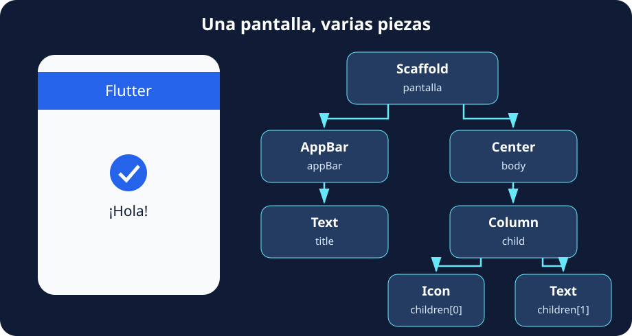
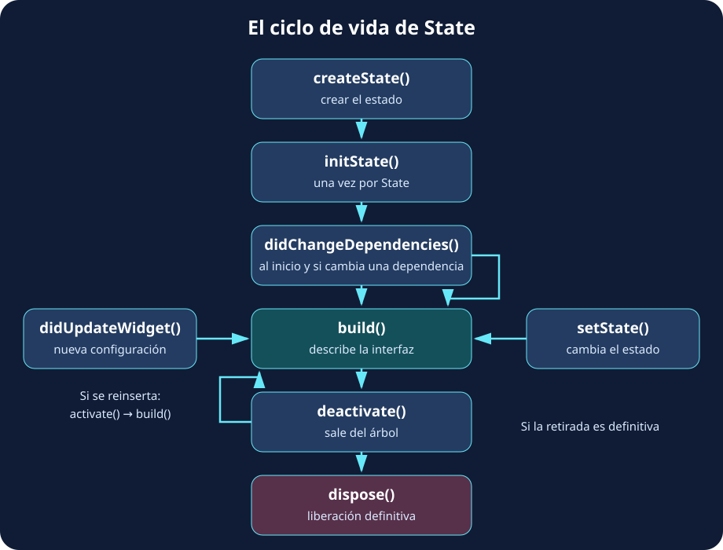
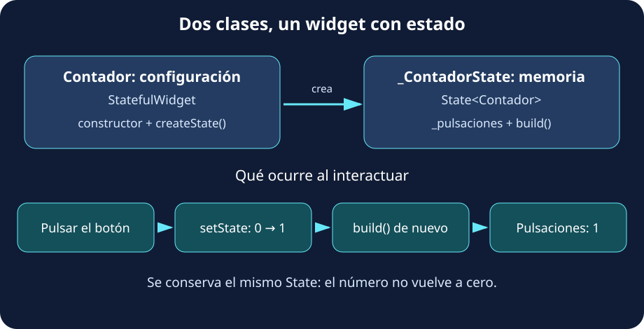

Abre cualquier app que utilices a diario y observa una de sus pantallas. Quizá tenga una imagen, varios textos, un botón y una lista que puedes desplazar. Aunque lo percibimos como un conjunto, podemos separar esa interfaz en piezas más pequeñas. **En Flutter, construimos y combinamos esas piezas mediante widgets**.

Un widget es un objeto de Dart que **describe una parte de la interfaz**: su contenido, su aspecto, su disposición o su comportamiento. `Text` muestra texto; `Icon`, un icono; `Center` centra otro widget; y `Column` organiza varios en vertical. Algunos se ven directamente y otros ayudan a colocar o configurar los demás.

Piensa en los widgets como piezas de construcción: una pieza sencilla puede formar parte de otra más grande, y esa composición termina dando forma a toda la pantalla.



La imagen muestra el **árbol de widgets**. Su raíz es el widget situado más arriba; de él salen las ramas que contienen otros widgets. Hablamos de _padres_, _hijos_ y _hermanos_ para describir estas relaciones. En este ejemplo, `Column` es el padre de `Icon` y `Text`, que son hermanos. El dibujo representa la pantalla; una aplicación completa incluiría otros widgets por encima, como `MaterialApp`.

Esta pantalla se puede expresar con el siguiente programa completo. Pégalo en `lib/main.dart` de un proyecto Flutter o en un ejemplo Flutter de [DartPad](https://dartpad.dev/):

```dart
import 'package:flutter/material.dart';

void main() {
  runApp(MaterialApp(
    home: Scaffold(
      appBar: AppBar(title: const Text('Flutter')),
      body: const Center(
        child: Column(
          mainAxisSize: MainAxisSize.min,
          children: [
            Icon(Icons.check_circle, size: 56),
            Text('¡Hola!'),
          ],
        ),
      ),
    ),
  ));
}
```

Lee el código de fuera hacia dentro: una aplicación contiene una pantalla; la pantalla tiene una barra y un cuerpo; el cuerpo centra una columna con dos elementos. `child` recibe un widget y `children` una lista. Otros argumentos, como `body` o `title`, dan nombre a zonas concretas. `mainAxisSize: MainAxisSize.min` hace que la columna ocupe la altura de su contenido y permite centrar el grupo.

Aquí aparece otra idea fundamental: **Flutter utiliza programación declarativa**. Describimos cómo debe ser la interfaz con los datos actuales y dejamos que Flutter gestione su representación. En un planteamiento imperativo daríamos órdenes para modificar elementos existentes: «busca ese texto y cambia su contenido». En uno declarativo expresamos el resultado: «con este valor, el texto debe mostrar esto».

:::tip[La interfaz depende de los datos]
Si una variable `puntos` vale `5`, `Text('Puntos: $puntos')` describe un texto que muestra «Puntos: 5». Al cambiar los datos y solicitar una reconstrucción, se obtiene una nueva descripción. **No modificamos el objeto `Text`: construimos la configuración que corresponde al nuevo valor.**
:::

Cambiar una variable por sí solo no avisa a Flutter. En los ejemplos con estado veremos cómo hacerlo mediante `setState`.

## 🌱 El ciclo de vida de un widget

Una interfaz no aparece una vez y permanece intacta para siempre. Entramos en una pantalla, cambiamos datos y salimos de ella. Durante ese recorrido se crean widgets, se incorporan al árbol, se reconstruye la interfaz y se retiran los elementos que dejan de ser necesarios.

Podemos reconocer tres momentos: **creación, actualización y retirada**. Es útil distinguir la configuración del widget de lo que Flutter mantiene en el árbol: los widgets son inmutables y pueden reemplazarse por nuevas instancias. Cuando hay estado propio, Flutter puede conservar el objeto `State` durante esas actualizaciones.

El siguiente esquema muestra el ciclo del **`State` asociado a un `StatefulWidget`**. Los widgets sin estado propio no tienen estos métodos de inicialización y limpieza.



**Al aparecer**, `createState` crea el estado e `initState` lo inicializa una vez. Después, `didChangeDependencies` permite atender las dependencias del contexto y `build` describe la interfaz.

**Mientras está presente**, `build` puede repetirse. `setState` solicita una reconstrucción; una nueva configuración compatible del padre provoca `didUpdateWidget`; y los cambios en dependencias heredadas pueden volver a ejecutar `didChangeDependencies`.

**Al retirarse**, se llama a `deactivate`. Si el elemento se reinserta, pasa por `activate` y vuelve a construirse. Si la retirada es definitiva, `dispose` libera sus recursos. El detalle completo está en la [referencia oficial de `State`](https://api.flutter.dev/flutter/widgets/State-class.html).

Para relacionar estas fases con algo concreto, piensa en un campo de texto: su controlador debe crearse una vez y liberarse al abandonar definitivamente el componente. Este ejemplo es independiente del anterior:

```dart
import 'package:flutter/material.dart';

void main() => runApp(const MaterialApp(home: CampoNombre()));

class CampoNombre extends StatefulWidget {
  const CampoNombre({super.key});

  @override
  State<CampoNombre> createState() => _CampoNombreState();
}

class _CampoNombreState extends State<CampoNombre> {
  late final TextEditingController _controller;

  @override
  void initState() {
    super.initState();
    _controller = TextEditingController();
    debugPrint('Inicializamos el campo');
  }

  @override
  Widget build(BuildContext context) {
    debugPrint('Construimos la interfaz');
    return Scaffold(
      body: Center(
        child: Padding(
          padding: const EdgeInsets.all(24),
          child: TextField(controller: _controller),
        ),
      ),
    );
  }

  @override
  void dispose() {
    _controller.dispose();
    debugPrint('Liberamos el controlador');
    super.dispose();
  }
}
```

:::note[Observa la consola 🔎]
Prueba hot reload: normalmente conserva el estado y no repite `initState`. `build` sí puede repetirse, por lo que no debe crear controladores ni iniciar una petición de red en cada ejecución. `dispose` se ejecuta cuando se retira definitivamente el estado del árbol; hot reload no implica esa retirada.
:::

## 🎛️ Tipos de widgets y sus constructores

Hasta ahora hemos combinado widgets que Flutter ya ofrece. También podemos crear los nuestros: una tarjeta de perfil, un saludo o un contador. Para ello escribimos una clase de Dart que describe esa parte de la interfaz mediante su método `build`. Antes de elegir cómo escribirla, necesitamos entender **qué información utiliza y quién se encarga de guardarla**.

Imagina dos componentes. Un saludo recibe el nombre «Alex» y lo muestra. Un contador empieza en cero y aumenta cada vez que pulsamos un botón. Ambos muestran datos, pero el contador necesita **recordar el resultado de las pulsaciones anteriores** para calcular el siguiente valor.

Llamamos **estado** a los datos que pueden cambiar y que influyen en la interfaz. Un número de pulsaciones, el texto que estamos escribiendo o una opción seleccionada son ejemplos de estado. Ese estado puede gestionarlo el propio componente o un widget situado por encima de él en el árbol.

Cuando el componente solo necesita recibir información y mostrarla, podemos crearlo como un **`StatelessWidget`**, es decir, sin estado propio. Cuando necesita mantener y actualizar sus propios datos entre interacciones, utilizamos un **`StatefulWidget`**, asociado a un objeto **`State`** que los conserva.

:::tip[La pregunta que ayuda a elegir 💭]
¿Este widget recibe los datos que debe mostrar o necesita guardar y cambiar alguno por sí mismo? Un saludo puede recibir el nombre de su padre; un contador puede guardar su número de pulsaciones en su propio `State`.
:::

En ambos casos, el **constructor** es la puerta de entrada de la configuración: indica qué datos podemos proporcionar al crear el widget. Por ejemplo, `Saludo(nombre: 'Alex')` crea un saludo y le entrega el nombre. Después, `build` utiliza esa información para describir lo que veremos. **El constructor prepara el objeto; `build` describe su interfaz.**

| Sin estado propio: `StatelessWidget`                               | Con estado propio: `StatefulWidget`                      |
| ------------------------------------------------------------------ | -------------------------------------------------------- |
| Recibe su configuración y describe la interfaz en `build`.         | Se asocia a una clase `State` que guarda datos mutables. |
| Adecuado para un saludo que recibe un nombre.                      | Adecuado para un contador que cambia al pulsar.          |
| Puede reconstruirse al recibir datos nuevos o cambiar su contexto. | Puede solicitar una reconstrucción mediante `setState`.  |

### StatelessWidget

**Un saludo sin estado propio.** Este programa recibe un nombre y lo muestra. No tiene ningún dato interno que deba recordar entre interacciones:

```dart
import 'package:flutter/material.dart';

void main() => runApp(const MaterialApp(home: Saludo(nombre: 'Alex')));

class Saludo extends StatelessWidget {
  final String nombre;

  const Saludo({super.key, this.nombre = 'visitante'});

  @override
  Widget build(BuildContext context) {
    return Scaffold(
      body: Center(child: Text('¡Hola, $nombre!')),
    );
  }
}
```

El constructor recibe el nombre que mostrará el saludo; si lo omitimos, utiliza «visitante». Más abajo veremos las distintas formas de definir constructores.

### StatefulWidget

**Un contador con estado propio.** Ahora necesitamos algo que el saludo no hacía: recordar un dato que cambia al interactuar. El contador empieza en cero y, después de una pulsación, debe recordar que su valor es uno. Si guardásemos el número como una variable local de `build`, volvería a inicializarse cada vez que Flutter ejecutase ese método.

Por eso, un widget con estado se divide en **dos clases que trabajan juntas**:

- **`Contador`, que hereda de `StatefulWidget`:** representa el componente y recibe su configuración mediante el constructor. Su método `createState` indica qué objeto gestionará el estado. Esta clase sigue siendo inmutable.
- **`_ContadorState`, que hereda de `State<Contador>`:** guarda los datos que deben mantenerse entre reconstrucciones y la lógica para modificarlos. En este ejemplo contiene `_pulsaciones` y el método `build` que describe la interfaz a partir de su valor.



El siguiente programa es completo e independiente del saludo:

```dart
import 'package:flutter/material.dart';

void main() => runApp(const MaterialApp(home: Contador()));

class Contador extends StatefulWidget {
  const Contador({super.key});

  @override
  State<Contador> createState() => _ContadorState();
}

class _ContadorState extends State<Contador> {
  int _pulsaciones = 0;

  @override
  Widget build(BuildContext context) {
    return Scaffold(
      body: Center(
        child: FilledButton(
          onPressed: () {
            setState(() {
              _pulsaciones++;
            });
          },
          child: Text('Pulsaciones: $_pulsaciones'),
        ),
      ),
    );
  }
}
```

Para leerlo, distingue estas piezas:

| Pieza del código | Qué hace |
| --- | --- |
| `const Contador({super.key})` | Es el constructor del widget. En este ejemplo no recibe datos propios, solo la clave opcional. |
| `createState() => _ContadorState()` | Flutter lo utiliza para crear el objeto que conservará el estado al incorporar el componente al árbol. |
| `State<Contador>` | Vincula la clase de estado con el tipo de widget al que pertenece. Si el widget recibiera propiedades, el estado podría leerlas mediante `widget.propiedad`. |
| `int _pulsaciones = 0` | Es un campo del objeto `State`, no una variable local de `build`. Por eso conserva su valor entre reconstrucciones. |
| `build` | Lee el valor actual y devuelve los widgets que deben mostrarse. |
| `onPressed` y `setState` | Atienden la pulsación, modifican el dato y solicitan actualizar la interfaz. |

El guion bajo de `_ContadorState` y `_pulsaciones` indica que esos nombres son privados de la biblioteca de Dart. Es una convención habitual para los detalles internos del componente.

**¿Qué sucede al pulsar?** Primero se ejecuta `onPressed`. Dentro de `setState`, `_pulsaciones++` aumenta el número. Después, Flutter programa una reconstrucción: `build` lee el nuevo valor y devuelve un `Text` con «Pulsaciones: 1». La segunda pulsación parte de ese uno y produce un dos.

`setState` no guarda el número por nosotros: el dato vive en `_pulsaciones`. Su función es ejecutar el cambio y avisar a Flutter de que la descripción de la interfaz puede haber cambiado. Si incrementamos la variable sin avisar, el dato cambia, pero esa asignación por sí sola no solicita que el texto se actualice.

:::tip[Reconstruir no es empezar de cero 🔄]
Flutter vuelve a ejecutar `build`, pero conserva el objeto `State` mientras mantenga la identidad del componente en el árbol. **No vuelve a ejecutar `createState` ni `initState` en cada pulsación.** Si el estado se elimina definitivamente y después se crea otro contador, ese nuevo estado comenzará en cero.
:::

:::caution[Dos ideas que conviene separar]
Los dos tipos de widget son **inmutables**: los datos mutables se guardan en `State`. Y «sin estado propio» no significa «siempre muestra lo mismo»: el saludo puede mostrar otro nombre si su padre le proporciona una nueva configuración.
:::

### Tipos de constructores

El constructor indica **cómo creamos un widget y con qué datos empieza**. En los ejemplos siguientes utilizaremos una pequeña `Etiqueta` que muestra un texto. Cada versión es independiente: utiliza una sola definición de la clase a la vez y añade `import 'package:flutter/material.dart';` al archivo. Las expresiones de uso pueden colocarse como `child` de un widget contenedor.

Estas formas pueden combinarse: un constructor puede tener nombre, recibir parámetros nombrados y ser `const` al mismo tiempo.

**1. Constructor por defecto (posicional)**

En esta primera versión escribimos un constructor sin nombre adicional y pasamos el texto por posición: el primer argumento inicializa `texto`. `this.texto` asigna directamente el valor recibido al campo de la instancia.

```dart
class Etiqueta extends StatelessWidget {
  final String texto;

  Etiqueta(this.texto, {super.key});

  @override
  Widget build(BuildContext context) => Text(texto);
}
```

Uso:

```dart
Etiqueta('Hola');
```

:::note[Una precisión sobre «por defecto»]
Un constructor sin nombre no tiene por qué usar parámetros posicionales. En Dart, el constructor *por defecto* es, estrictamente, el que se genera sin argumentos cuando no declaramos ninguno. Aquí estamos declarando explícitamente un constructor sin nombre con un parámetro posicional.
:::

**2. Constructor con parámetros nombrados**

Las llaves `{}` indican parámetros que se pasan con su nombre. `required` obliga a proporcionar el texto; escribir `texto:` en la llamada hace más claro qué dato estamos entregando.

```dart
class Etiqueta extends StatelessWidget {
  final String texto;

  Etiqueta({super.key, required this.texto});

  @override
  Widget build(BuildContext context) => Text(texto);
}
```

Uso:

```dart
Etiqueta(texto: 'Hola');
```

**3. Constructores con valores por defecto**

Si un parámetro es opcional, podemos darle un valor inicial. En este caso, si no proporcionamos `texto`, la etiqueta mostrará «Hola». Si lo proporcionamos, se utilizará nuestro mensaje.

```dart
class Etiqueta extends StatelessWidget {
  final String texto;

  Etiqueta({super.key, this.texto = 'Hola'});

  @override
  Widget build(BuildContext context) => Text(texto);
}
```

Uso:

```dart
Etiqueta();
Etiqueta(texto: 'Bienvenida');
```

**4. Constructores con nombre (*named constructors*)**

Podemos ofrecer distintas formas de crear la misma clase. `Etiqueta.vacia` es un constructor alternativo que prepara una etiqueta con el mensaje «Sin datos». La parte situada después de `:` inicializa el campo antes de completar la construcción.

```dart
class Etiqueta extends StatelessWidget {
  final String texto;

  Etiqueta({super.key, required this.texto});

  Etiqueta.vacia({super.key}) : texto = 'Sin datos';

  @override
  Widget build(BuildContext context) => Text(texto);
}
```

Uso:

```dart
Etiqueta(texto: 'Hola');
Etiqueta.vacia();
```

No confundas **`texto:`**, un parámetro nombrado, con **`.vacia()`**, el nombre de un constructor.

**5. Constructores de fábrica (`factory`)**

Un `factory` puede preparar los datos y decidir qué instancia devolver. Aquí convertimos un número en un mensaje antes de crear la etiqueta mediante un constructor privado. En otros casos podría devolver una instancia existente; no tiene que crear siempre una nueva.

```dart
class Etiqueta extends StatelessWidget {
  final String texto;

  Etiqueta._(this.texto, {super.key});

  factory Etiqueta.desdeNumero(int numero, {Key? key}) {
    final mensaje = numero > 0 ? 'Puntos: $numero' : 'Sin puntos';
    return Etiqueta._(mensaje, key: key);
  }

  @override
  Widget build(BuildContext context) => Text(texto);
}
```

Uso:

```dart
Etiqueta.desdeNumero(5);
```

El guion bajo de `Etiqueta._` hace que ese constructor sea privado de la biblioteca. El `factory` devuelve la instancia mediante `return`.

**6. Const constructors (`const`)**

Un constructor `const` permite crear instancias constantes cuando sus argumentos también lo son. Los campos de la instancia deben ser `final`. Es habitual utilizarlo para la configuración inmutable de los widgets.

```dart
class Etiqueta extends StatelessWidget {
  final String texto;

  const Etiqueta({super.key, required this.texto});

  @override
  Widget build(BuildContext context) => Text(texto);
}
```

Uso:

```dart
const Etiqueta(texto: 'Hola');
```

El constructor también puede utilizarse sin `const` cuando el mensaje se obtiene durante la ejecución. **`const` no impide que un `StatefulWidget` tenga estado mutable:** ese estado se guarda en el objeto `State`, separado de la configuración del widget.

:::tip[Qué usar en tus primeros widgets 🛠️]
Empieza con parámetros nombrados: `required` para datos obligatorios y valores por defecto para los opcionales. Añade `const` cuando la clase lo permita. Los constructores con nombre y `factory` son útiles cuando necesitas ofrecer otras formas de crear el componente.
:::

Puedes consultar los detalles en la [documentación oficial de constructores de Dart](https://dart.dev/language/constructors).

## 🧭 El catálogo: encontrar el widget que necesitas

Flutter ofrece muchas piezas y no hace falta memorizarlas. El [catálogo oficial de widgets](https://docs.flutter.dev/ui/widgets) es un buen punto de partida para explorar por categorías; el [índice de widgets](https://docs.flutter.dev/ui/widgets/widgetindex) ayuda cuando ya conoces el nombre.

La búsqueda resulta más sencilla si empiezas por la **necesidad de la interfaz**:

| Quiero…                             | Puedo explorar…                   | Categoría orientativa            |
| ----------------------------------- | --------------------------------- | -------------------------------- |
| Mostrar un mensaje o una fotografía | `Text`, `Image`                   | Text / Assets, images, and icons |
| Colocar elementos en fila o columna | `Row`, `Column`                   | Layout                           |
| Añadir espacio alrededor            | `Padding`                         | Layout                           |
| Pedir un texto o una elección       | `TextField`, `Checkbox`, `Switch` | Input / Material                 |
| Mostrar una lista desplazable       | `ListView`                        | Scrolling                        |
| Responder a una pulsación           | `FilledButton`, `GestureDetector` | Material / Interaction models    |

Por ejemplo, «necesito muchos elementos y no caben en pantalla» apunta a una lista desplazable. Busca `ListView`, abre su referencia y comprueba qué constructor encaja. `ListView.builder` crea los elementos bajo demanda y es una opción habitual para listas largas.

Antes de incorporar una pieza, sigue este recorrido:

1. **Lee su descripción:** comprueba si resuelve tu necesidad.
2. **Revisa el constructor y las propiedades:** qué datos exige, si admite `child` o `children` y qué eventos ofrece.
3. **Prueba un ejemplo pequeño:** observa su tamaño, su disposición y su comportamiento antes de combinarlo con otros widgets.

:::tip[Una búsqueda para practicar 🕵️]
Quieres mostrar una foto de perfil circular. Busca `CircleAvatar` en la documentación y localiza la propiedad que controla su tamaño y la que permite añadir una imagen. El objetivo es aprender a encontrar y leer la información, no recordar cada propiedad de memoria.
:::
