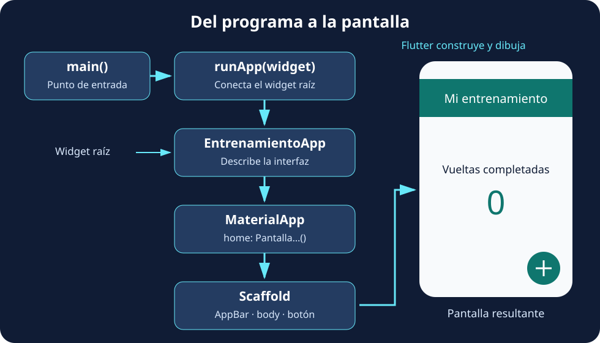

Vamos a poner en práctica lo que hemos visto en la introducción. Empezaremos mostrando **«¡Vamos a entrenar!»** y terminaremos con una pantalla que registra las vueltas completadas al pulsar un botón. Durante el recorrido aprenderemos a crear el proyecto, leer el árbol de widgets, separar una pantalla en su propio archivo y actualizar su contenido.

No hace falta conocer todavía todas las propiedades de cada widget. La idea es **hacer un cambio, observar el resultado y entender por qué ocurre**. Cada bloque indica si debes sustituir un archivo completo o modificar solo una parte.

## 🚀 Prepara y ejecuta el proyecto

Necesitas Flutter instalado y un destino disponible: un navegador compatible, un emulador o un dispositivo configurado. Puedes comprobar la instalación con `flutter doctor`.

### Desde VS Code

Con las extensiones de Dart y Flutter instaladas:

1. Abre la paleta de comandos con `Ctrl + Shift + P` y busca **Flutter: New Project**.
2. Elige la plantilla **Application**, una carpeta para tus proyectos y el nombre **`contador_vueltas`**.
3. Abre el proyecto generado, selecciona un destino con **Flutter: Select Device** y pulsa `F5` para ejecutarlo.

El nombre del proyecto utiliza minúsculas y guiones bajos. No lo confundas con el título que aparecerá en la interfaz, que puede incluir espacios y tildes.

### Desde la terminal

Sitúate en la carpeta donde guardas tus proyectos y ejecuta estas órdenes, una por una:

```bash
flutter create contador_vueltas
cd contador_vueltas
flutter devices
flutter run
```

`flutter create` genera el proyecto y resuelve sus dependencias. `flutter devices` muestra los destinos disponibles; si tienes varios, puedes seleccionar uno mediante `flutter run -d ID`, sustituyendo `ID` por su identificador real.

Para consultar y arrancar un emulador configurado, utiliza `flutter emulators` y después `flutter emulators --launch ID`. Un navegador o un dispositivo físico no necesitan ese paso.

:::note[Elegir las plataformas 📱]
Si solo necesitas Android y web, puedes crear el proyecto con `flutter create --platforms=android,web contador_vueltas`. Para añadir Android a un proyecto que no lo incluye, ejecuta `flutter create --platforms=android .` desde su raíz y revisa los archivos generados. Crear las carpetas de una plataforma no instala sus herramientas de compilación.
:::

La primera ejecución puede tardar más porque prepara y descarga componentes. Detén la aplicación desde el editor o pulsa `q` en la sesión de `flutter run`. La [referencia de la herramienta Flutter](https://docs.flutter.dev/reference/flutter-cli) reúne estas órdenes.

Si Flutter anuncia una actualización, `flutter upgrade` actualiza el SDK. No es necesario hacerlo para seguir este ejemplo si tu instalación ya funciona; en el aula utiliza la versión acordada para el curso.

### Localiza lo que vamos a modificar

| Ruta | Para qué sirve |
| --- | --- |
| `lib/main.dart` | Contiene el punto de entrada y el código inicial de la aplicación. |
| `pubspec.yaml` | Declara el nombre del paquete, dependencias y recursos. |
| `test/` | Contiene las pruebas del proyecto. |
| `android/`, `web/`, etc. | Contienen la configuración de las plataformas generadas. |

Vamos a sustituir el código de muestra de `lib/main.dart`. Si la plantilla incluye una prueba del contador original, esa prueba dejará de corresponder a nuestra aplicación: tendrás que adaptarla antes de utilizar `flutter test` como comprobación del nuevo proyecto.

## 👋 Paso 1. Muestra un saludo

Reemplaza **todo `lib/main.dart`** por este programa:

```dart
import 'package:flutter/material.dart';

void main() {
  runApp(
    const Text(
      '¡Vamos a entrenar!',
      textDirection: TextDirection.ltr,
    ),
  );
}
```

El programa es pequeño, pero ya contiene tres piezas importantes:

| Pieza | Qué hace |
| --- | --- |
| `import` | Permite utilizar los componentes que exporta la biblioteca Material de Flutter. |
| `main` | Es el punto de entrada del programa Dart. |
| `runApp` | Recibe un widget y lo establece como raíz de la interfaz. |

`Text` recibe la cadena como argumento posicional. `textDirection` es un argumento con nombre: `TextDirection.ltr` indica lectura de izquierda a derecha. **En este ejemplo aún no hay un widget antecesor que proporcione la dirección**, por lo que la indicamos explícitamente. Más adelante, `MaterialApp` aportará ese contexto.

El saludo aparece sin la estructura ni los estilos habituales de una pantalla Material y puede coincidir con zonas del sistema. Es un primer experimento para entender el arranque, no la pantalla final. Puedes consultar el comportamiento de arranque en la [referencia de `runApp`](https://api.flutter.dev/flutter/widgets/runApp.html).

### ¿Qué hace runApp?

**`runApp` conecta el widget que le entregamos con la vista de la aplicación y pone en marcha la construcción de su interfaz.** A partir de ese widget raíz, Flutter incorpora sus descendientes al árbol, calcula el espacio que necesitan y dibuja el resultado en pantalla. En este primer programa la raíz es `Text`; cuando creemos nuestra clase, será `EntrenamientoApp`.

Podemos distinguir las responsabilidades: **`main` inicia el programa Dart, `runApp` conecta su interfaz con Flutter y `build` describe el contenido de cada widget propio**. `runApp` recibe una instancia de widget: en `runApp(const EntrenamientoApp())`, `EntrenamientoApp()` llama al constructor y su resultado se entrega a la función.

El siguiente esquema anticipa la estructura que construiremos en los próximos pasos. Las flechas muestran el arranque y la composición de la interfaz; no son llamadas a `runApp` en cada nivel.



:::note[Se llama al arrancar, no al pulsar el botón]
En esta aplicación llamamos a `runApp` una vez, desde `main`. Para actualizar el contador utilizaremos `setState`: Flutter reconstruye la parte correspondiente del árbol. **No necesitamos volver a llamar a `runApp` para mostrar cada nuevo valor.** Tampoco necesitamos llamar manualmente a `build`; Flutter gestiona esas llamadas.
:::

### Centra el texto

Mantén el `import` y sustituye `main` por:

```dart
void main() {
  runApp(
    const Center(
      child: Text(
        '¡Vamos a entrenar!',
        textDirection: TextDirection.ltr,
      ),
    ),
  );
}
```

Ahora `Center` es el padre del texto y lo coloca en el centro del espacio disponible. **No cambiamos el texto para centrarlo: lo combinamos con otro widget que resuelve la posición.**

:::tip[Qué significa const 💡]
`const` crea una configuración constante cuando el constructor y sus argumentos lo permiten. Dentro de `const Center(...)`, el `Text` ya está en un contexto constante y no necesita repetir la palabra. Flutter puede reutilizar esas instancias y evitar trabajo de actualización, pero esto **no congela la pantalla ni impide cualquier reconstrucción**. Un `StatefulWidget` creado con `const` también puede tener un `State` mutable.
:::

## 🧱 Paso 2. Crea tu propio widget

Podemos dar un nombre a esta composición. Sustituye **todo `lib/main.dart`** por:

```dart
import 'package:flutter/material.dart';

void main() => runApp(const EntrenamientoApp());

class EntrenamientoApp extends StatelessWidget {
  const EntrenamientoApp({super.key});

  @override
  Widget build(BuildContext context) {
    return const Center(
      child: Text(
        '¡Vamos a entrenar!',
        textDirection: TextDirection.ltr,
      ),
    );
  }
}
```

`EntrenamientoApp` hereda de `StatelessWidget` porque por ahora solo describe un saludo. `build` devuelve el widget que representa su interfaz y `@override` indica que implementamos un método de la clase base. La función flecha de `main` es una forma abreviada de escribir una única expresión.

El constructor `const EntrenamientoApp({super.key})` permite crear instancias constantes y pasar la clave opcional al constructor de la clase base. **`key` ayuda a Flutter a identificar elementos al actualizar el árbol**; no es un identificador para buscar controles como en HTML. Si la omites, normalmente su valor es `null`: Flutter no genera una `Key` por ti.

### Qué representa BuildContext

`context` representa **la ubicación de este widget en el árbol**. Permite consultar información proporcionada por sus antecesores, como el tema mediante `Theme.of(context)`. No contiene por sí mismo todas las variables de la aplicación.

Esto explica una regla práctica: un contexto puede consultar lo que hay por encima de él, pero no un widget que acabamos de devolver por debajo. Al separar la aplicación y su pantalla en el siguiente paso, el contexto de la pantalla quedará bajo `MaterialApp`.

### Herramientas del editor

Con el cursor sobre un widget, abre las acciones de código con la bombilla o `Ctrl + .`:

| Acción | Qué facilita |
| --- | --- |
| **Wrap with Center / Column** | Envuelve una pieza en otro widget. |
| **Extract Widget** | Convierte una parte del árbol en una clase con nombre. |
| **Convert to StatefulWidget** | Genera la separación entre widget y estado. |

Las extensiones también ofrecen plantillas al escribir prefijos como `stless` o `stful`; los nombres disponibles dependen de las extensiones instaladas. Revisa el resultado generado: debes entender el constructor y completar `build`. Si aparece `throw UnimplementedError()`, todavía falta implementar la interfaz.

## 🎨 Paso 3. Dale estructura Material

Vamos a separar **la configuración de la aplicación** de **la pantalla de entrenamiento**. Sustituye **todo `lib/main.dart`** por este código:

```dart
import 'package:flutter/material.dart';

void main() => runApp(const EntrenamientoApp());

class EntrenamientoApp extends StatelessWidget {
  const EntrenamientoApp({super.key});

  @override
  Widget build(BuildContext context) {
    return MaterialApp(
      title: 'Contador de vueltas',
      debugShowCheckedModeBanner: false,
      theme: ThemeData(
        colorScheme: ColorScheme.fromSeed(seedColor: Colors.teal),
      ),
      home: const PantallaEntrenamiento(),
    );
  }
}

class PantallaEntrenamiento extends StatelessWidget {
  const PantallaEntrenamiento({super.key});

  @override
  Widget build(BuildContext context) {
    return Scaffold(
      appBar: AppBar(title: const Text('Mi entrenamiento')),
      body: const Center(child: Text('¡Vamos a entrenar!')),
    );
  }
}
```

**`MaterialApp` configura la aplicación; `Scaffold` organiza una pantalla; `AppBar` describe su barra superior.** Importar `material.dart` permite utilizar sus clases, pero no crea por sí solo esta estructura.

| Argumento | Qué configura |
| --- | --- |
| `MaterialApp.title` | Un título que el sistema puede utilizar, por ejemplo en la descripción de la aplicación; no dibuja la barra superior. |
| `debugShowCheckedModeBanner` | La visibilidad de la etiqueta de depuración; ocultarla no cambia el modo de ejecución. |
| `theme` | Los estilos comunes. Aquí generamos una paleta a partir de un color semilla. |
| `home` | La pantalla inicial. |
| `Scaffold.appBar` | La barra superior, cuyo `title` sí se ve en pantalla. |
| `Scaffold.body` | El contenido principal. |

Ya no indicamos `textDirection` en cada texto: la estructura de la aplicación proporciona una dirección mediante sus widgets antecesores. El color semilla tampoco toma automáticamente los colores del fondo de pantalla del dispositivo. Consulta las opciones en la [referencia de `MaterialApp`](https://api.flutter.dev/flutter/material/MaterialApp-class.html).

## 📁 Paso 4. Separa la pantalla en un archivo

Crea `lib/presentation/screens/pantalla_entrenamiento.dart`. **Mueve a ese archivo la clase `PantallaEntrenamiento` del paso anterior**, junto con este import al principio:

```dart
import 'package:flutter/material.dart';
```

En `lib/main.dart`, elimina la clase que has movido y añade:

```dart
import 'package:contador_vueltas/presentation/screens/pantalla_entrenamiento.dart';
```

La estructura queda así:

```text
lib/
├── main.dart
└── presentation/
    └── screens/
        └── pantalla_entrenamiento.dart
```

En un import `package:`, `contador_vueltas` es el nombre declarado en `pubspec.yaml` y la ruta siguiente comienza dentro de `lib`, por eso no escribimos `lib/`. Cada archivo importa las bibliotecas que utiliza.

**`main.dart` conserva `EntrenamientoApp` y `MaterialApp`; la pantalla conserva `Scaffold`.** La carpeta `presentation/screens` agrupa la interfaz, pero crearla por sí sola no implementa una arquitectura completa. Ejecuta de nuevo: el resultado visual debe ser el mismo.

## 🔢 Paso 5. Prepara el contador

En `pantalla_entrenamiento.dart`, sustituye el `body` por:

```dart
body: const Center(
  child: Column(
    mainAxisAlignment: MainAxisAlignment.center,
    children: [
      Text('Vueltas completadas'),
      SizedBox(height: 12),
      Text('0', style: TextStyle(fontSize: 56)),
    ],
  ),
),
```

`Center` recibe un `child`; `Column` recibe una lista `children` y coloca sus elementos en vertical. `SizedBox` deja una separación y `TextStyle` aumenta el tamaño del número en píxeles lógicos.

Por defecto, esta columna ocupa la altura disponible y coloca los hijos al principio. **`mainAxisAlignment: MainAxisAlignment.center` centra los hijos dentro de la columna**. También existen `start`, `end`, `spaceBetween`, `spaceAround` y `spaceEvenly`. Otra solución es `mainAxisSize: MainAxisSize.min`, que reduce la altura de la columna a su contenido y permite que el `Center` centre el grupo.

Añade este argumento al `Scaffold`, al mismo nivel que `body`:

```dart
floatingActionButton: FloatingActionButton(
  tooltip: 'Registrar una vuelta',
  onPressed: () {
    debugPrint('Has completado una vuelta');
  },
  child: const Icon(Icons.add),
),
```

`onPressed` recibe una función que Flutter ejecutará al pulsar. El icono es constante, pero el botón con esta función no puede declararse `const`. `debugPrint` escribe en la consola; todavía no modifica el número de la pantalla.

:::tip[Formato que ayuda a leer el árbol 🔎]
Utiliza **Format Document** en el editor o `dart format lib` desde la terminal. Las comas finales facilitan añadir argumentos y suelen favorecer bloques legibles; el formato exacto depende de la versión del formateador y de las reglas que aplique.
:::

## 🔄 Paso 6. Guarda el dato y actualiza la interfaz

Podríamos intentar declarar `int vueltas = 0` dentro de `build`, mostrarlo con `Text('$vueltas')` e incrementarlo en el botón. Esto presenta **dos problemas distintos**:

- Cambiar una variable no solicita por sí solo que Flutter reconstruya la interfaz. La consola puede mostrar un número nuevo mientras el texto sigue mostrando el anterior.
- Una variable local de `build` vuelve a inicializarse cuando se ejecuta ese método. No es un lugar adecuado para conservar el contador entre reconstrucciones.

Necesitamos guardar el dato en un objeto `State` y solicitar la actualización con `setState`. **Sustituye todo `lib/presentation/screens/pantalla_entrenamiento.dart`** por esta versión final:

```dart
import 'package:flutter/material.dart';

class PantallaEntrenamiento extends StatefulWidget {
  const PantallaEntrenamiento({super.key});

  @override
  State<PantallaEntrenamiento> createState() => _PantallaEntrenamientoState();
}

class _PantallaEntrenamientoState extends State<PantallaEntrenamiento> {
  int _vueltas = 0;

  void _registrarVuelta() {
    setState(() {
      _vueltas++;
    });
    debugPrint('Vueltas completadas: $_vueltas');
  }

  @override
  Widget build(BuildContext context) {
    return Scaffold(
      appBar: AppBar(title: const Text('Mi entrenamiento')),
      body: Center(
        child: Column(
          mainAxisAlignment: MainAxisAlignment.center,
          children: [
            const Text('Vueltas completadas'),
            const SizedBox(height: 12),
            Text('$_vueltas', style: const TextStyle(fontSize: 56)),
          ],
        ),
      ),
      floatingActionButton: FloatingActionButton(
        tooltip: 'Registrar una vuelta',
        onPressed: _registrarVuelta,
        child: const Icon(Icons.add),
      ),
    );
  }
}
```

En **`lib/main.dart`**, el contenido final debe ser:

```dart
import 'package:flutter/material.dart';
import 'package:contador_vueltas/presentation/screens/pantalla_entrenamiento.dart';

void main() => runApp(const EntrenamientoApp());

class EntrenamientoApp extends StatelessWidget {
  const EntrenamientoApp({super.key});

  @override
  Widget build(BuildContext context) {
    return MaterialApp(
      title: 'Contador de vueltas',
      debugShowCheckedModeBanner: false,
      theme: ThemeData(
        colorScheme: ColorScheme.fromSeed(seedColor: Colors.teal),
      ),
      home: const PantallaEntrenamiento(),
    );
  }
}
```

Al cambiar de `StatelessWidget` a `StatefulWidget`, haz un **hot restart** para empezar con la nueva estructura. Pulsa tres veces el botón: el número debe pasar por 1, 2 y 3 y coincidir con los mensajes de la consola.

### Qué ocurre en cada pulsación

1. `onPressed: _registrarVuelta` entrega la función al botón, sin ejecutarla durante `build`.
2. La pulsación ejecuta la función, y el callback de `setState` incrementa `_vueltas`.
3. `setState` solicita una reconstrucción; `build` lee el nuevo dato.
4. `Text('$_vueltas')` convierte el número en texto mediante interpolación.

`_vueltas` pertenece al objeto `State`, así que se conserva entre reconstrucciones mientras Flutter mantenga ese estado en el árbol. El guion bajo indica privacidad dentro de la biblioteca de Dart. El contador vive en memoria: no se guarda al cerrar la aplicación.

:::note[Qué cambia y qué sigue siendo constante]
`PantallaEntrenamiento` sigue siendo una configuración inmutable, aunque tenga estado asociado. Lo mutable es `_vueltas` en `State`. El `Text` que muestra el número no puede ser `const`, pero su `TextStyle` sí. `EntrenamientoApp` puede continuar siendo un `StatelessWidget`: no necesita gestionar el contador.
:::

### Un widget propio que recibe datos

También podemos extraer el número a un componente sin estado propio. Añade esta clase al final del archivo de la pantalla:

```dart
class NumeroVueltas extends StatelessWidget {
  final int valor;

  const NumeroVueltas({super.key, required this.valor});

  @override
  Widget build(BuildContext context) {
    return Text('$valor', style: const TextStyle(fontSize: 56));
  }
}
```

Después sustituye `Text('$_vueltas', style: const TextStyle(fontSize: 56))` por `NumeroVueltas(valor: _vueltas)`.

`required` obliga a proporcionar el valor y `final` impide reasignarlo en esa instancia. **El componente puede mostrar otro número cuando el padre le entrega una nueva configuración**. No necesita estado propio para reflejar datos que cambian. Su constructor admite `const`, pero esta llamada utiliza `_vueltas`, un dato de ejecución, y por eso no lleva `const`.

## ⚡ Comprueba los cambios durante el desarrollo

| Operación | Qué observarás en este ejemplo |
| --- | --- |
| **Hot reload** | Aplica cambios compatibles en la interfaz conservando el contador. En `flutter run`, pulsa `r`. |
| **Hot restart** | Reinicia la aplicación Dart y el contador vuelve a cero. En `flutter run`, pulsa `R`. |
| **Detener y ejecutar de nuevo** | Inicia una nueva ejecución; también es necesario para aplicar determinados cambios en código nativo. |

Prueba a registrar dos vueltas y cambiar el texto «Vueltas completadas» por «Vueltas de hoy». Con hot reload debe mantenerse el dos. Hot reload no vuelve a ejecutar `main` ni `initState`; los cambios que necesitan repetir la inicialización requieren un reinicio. Consulta la [guía oficial de hot reload](https://docs.flutter.dev/tools/hot-reload).

:::caution[Si algo no funciona]
Si falla un import, comprueba el nombre del paquete y la ruta. Si aparece un error al utilizar `const`, revisa si has incluido una variable de ejecución. Si el botón escribe en la consola pero el número no cambia, comprueba que modificas el campo de `State` y llamas a `setState`. Lee el primer error de la consola antes de hacer más cambios.
:::

## 🎯 Practica con tu aplicación

1. Cambia el color semilla y el título de la barra. ¿Qué propiedades has modificado?
2. Añade una acción en `AppBar` para poner `_vueltas` a cero mediante `setState`.
3. Añade un botón para restar una vuelta y evita que el contador sea negativo.
4. Muestra «Todavía no has empezado» cuando el valor sea cero y «Entrenamiento en marcha» cuando sea mayor. Utiliza una expresión condicional al construir el texto.
5. Extrae `NumeroVueltas` mediante **Extract Widget** y compara el resultado del editor con la clase propuesta.

:::tip[Antes de continuar ✅]
Debes poder seguir el recorrido desde `main` hasta el texto del contador, distinguir la aplicación de su pantalla y explicar por qué `_vueltas` está fuera de `build`. En **Básicos** veremos con más detalle las propiedades y variantes de las piezas que acabas de utilizar.
:::
